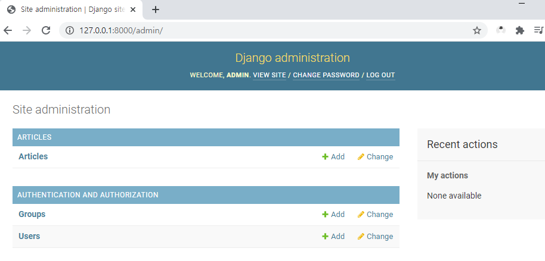

# 0310 TIL

## Model 클래스 사용하기

models.py에서 Model이라는 거대한 클래스를 상속받아 사용하는 것.
django에서 사용하라고 다 만들어준 걸 우린 감사하게 쓰기만 하면 된다.

## Migrations Commands

#### makemigrations (중요!!!!!!!)

- model을 변경한 것에 기반한 새로운 마이그레이션(like 설계도)을 만들 때 사용

`python manage.py makemigrations`를 했더니 articles 안에 원래 migrations는 있었는데 거기에 0001_initial.py가 생겼다. 설계도를 만들어 준 것. 
fields에서 id라는 필드를 새로 만들어주었고, title과 content는 우리가 원래 썼던 그대로 만들어졌다. 이게 바로 ORM! 이 덕분에 sql을 잘 몰라서 db로 만들어준다. 여기는 절대 수정하지 말기!

#### migrate(중요!!!!!!!)

- 마이그레이션을 db에 반영하기 위해 사용
- 설계도를 실제 db에 반영하는 과정
- 모델에서의 변경 사항들과 db의 스키마가 동기화를 이룸

`python manage.py migrate`를 하면 이제 설계도를 바탕으로 테이블를 만들어주는 단계! 
확장프로그램 설치하기! SQLite 설치!
db.sqlite3 오른쪽 클릭 오픈 데이터베이스를 누르면 좌하단에 SQLITE EXPLORER가 뜬다.
그거 누르면 테이블이 뜬다!

```
$ python manage.py migrate
Operations to perform:
  Apply all migrations: admin, articles, auth, contenttypes, sessions
Running migrations:
  Applying contenttypes.0001_initial... OK
  Applying auth.0001_initial... OK
  Applying admin.0001_initial... OK
  Applying admin.0002_logentry_remove_auto_add... OK
  Applying admin.0003_logentry_add_action_flag_choices... OK
  Applying articles.0001_initial... OK
  Applying contenttypes.0002_remove_content_type_name... OK
  Applying auth.0002_alter_permission_name_max_length... OK
  Applying auth.0003_alter_user_email_max_length... OK
  Applying auth.0004_alter_user_username_opts... OK
  Applying auth.0005_alter_user_last_login_null... OK
  Applying auth.0006_require_contenttypes_0002... OK
  Applying auth.0007_alter_validators_add_error_messages... OK
  Applying auth.0008_alter_user_username_max_length... OK
  Applying auth.0009_alter_user_last_name_max_length... OK
  Applying auth.0010_alter_group_name_max_length... OK
  Applying auth.0011_update_proxy_permissions... OK
  Applying auth.0012_alter_user_first_name_max_length... OK
  Applying sessions.0001_initial... OK
```

:question: 뭐가 이렇게 많지...? : 처음 장고를 만들 때 이미 내장되어있던 앱들의 설계도도 같이 migrate되었던 것. 그래서 테이블 목록이 많다.


여기서 우리가 만든 건 맨 위에 articles_article. 

테이블의 이름은 '앱 이름_모델 이름' 식으로 만들어진다.


눌러보면 이렇게 스키마가 만들어져있다.

#### sqlmigrate

- 마이그레이션에 대한 sql 구문을 보기 위해 사용

```
$ python manage.py sqlmigrate articles 0001
BEGIN;
--
-- Create model Article
--
CREATE TABLE "articles_article" ("id" integer NOT NULL PRIMARY KEY AUTOINCREMENT, "title" varchar(10) NOT 
NULL, "content" text NOT NULL);
COMMIT;
```

파이썬 언어를 db가 못 읽으니 이렇게 sql언어로 ORM이 바꿔주는 것이다. 이렇게 sql에 요청을 보낸다.

#### showmigrations

- 프로젝트 전체의 마이그레이션 상태를 확인하기 위해 사용
- 마이그레이션 파일들이 migrate 됐는지 안 됐는지 여부를 확인할 수 있음

```
$ python manage.py showmigrations
admin
 [X] 0001_initial
 [X] 0002_logentry_remove_auto_add
 [X] 0003_logentry_add_action_flag_choices
articles
 [X] 0001_initial
auth
 [X] 0001_initial
 [X] 0002_alter_permission_name_max_length
 [X] 0003_alter_user_email_max_length
 [X] 0004_alter_user_username_opts
 [X] 0005_alter_user_last_login_null
 [X] 0006_require_contenttypes_0002
 [X] 0007_alter_validators_add_error_messages
 [X] 0008_alter_user_username_max_length
 [X] 0009_alter_user_last_name_max_length
 [X] 0010_alter_group_name_max_length
 [X] 0011_update_proxy_permissions
 [X] 0012_alter_user_first_name_max_length
contenttypes
 [X] 0001_initial
 [X] 0002_remove_content_type_name
sessions
 [X] 0001_initial
```

각각의 테이블이 migrate가 잘 되었는지 체크가 된 것. X가 체크되었다는 뜻.

---

models.py에 새로운 필드를 추가하게 되면 다시 설계도를 만들기 위해 makemigrations를 해줘야한다.

```
$ python manage.py makemigrations
You are trying to add the field 'created_at' with 'auto_now_add=True' to article without a default; the database needs something to populate existing rows.

 1) Provide a one-off default now (will be set on all existing rows)
 2) Quit, and let me add a default in models.py
Select an option: 1
Please enter the default value now, as valid Python
You can accept the default 'timezone.now' by pressing 'Enter' or you can provide another value.
The datetime and django.utils.timezone modules are available, so you can do e.g. timezone.now
Type 'exit' to exit this prompt
[default: timezone.now] >>>
Migrations for 'articles':
  articles\migrations\0002_auto_20210310_1034.py
    - Add field created_at to article
    - Add field updated_at to article
```

그렇게 했더니 아까와는 다른 이런 글자가 나온다...!
원래 완성되어있던 설계도에서 아예 새로운 필드를 추가하는데 아무런 값을 안 넣었기 때문에 물어보는 것.
1) 기본값을 넣을 것인가
2) 여기서 나가서 직접 코드에 작성할 것인가

우리는 여기서 1번을 적을 것

엔터를 누르면 알아서 해준다고 해서 엔터를 눌러서 알아서 만들어주었다!


그랬더니 0002 설계도를 만들어주었다.

:question: 여기서 계속 과거의 설계도도 쌓여있는 이유는? : 우리가 잘못했을 때 다시 돌아가기 위함!


makemigrations를 한 후 마지막으로 migrate해준다.


두 개의 컬럼이 더 생긴 스키마로 변경이 되었다.

:exclamation: 반드시 기억해야 할 3단계 (오늘 한 것 중 제일 중요!)

1. models.py 
   - model 변경사항 발생
2. python manage.py makemigrations
   - migrations 파일 생성
3. python manage.py migrate
   - DB 적용

우리는 오늘 이 사이클을 2번 돌았음!!

## DB API

- DB를 조작하기 위한 도구(우리가 db에게 명령하기 위한)

#### 문법

Article.objects.all()  -  all()이 핵심 명령어이다.
클래스네임.매니저.쿼리셋API

- 매니저 
  - 장고 모델에 쿼리 작업이 제공되는 인터페이스. (중간다리 역할)
  - 기본적으로 db를 조작하기 위한 도구들을 매니저가 들고있는 것.
  - 그냥 중간에 objects가 붙는다고만 생각하고 그 이상 의미부여 X
- 쿼리셋 
  - db로부터 전달받은 객체 목록들.  위의 명령어로 주면 db가 다시 줄 때 쿼리셋으로 준다.
  - 0개, 1개 혹은 여러개일수도 있다.(쿼리셋은 리스트로 오는데 그게 빈 리스트면 0개) 
  - 종류가 엄청 많음.. django queryset api를 검색해서 공식문서 확인하기!

이 모든 것이 다 db와 소통하기 위한 것이다.


## CRUD

- 대부분의 컴퓨터 소프트웨어가 가지는 기본적인 데이터 처리 기능인 
  Create(생성), Read(읽기), Update(갱신), Delete(삭제)를 묶어서 일컫는 말
  all.()은 Read에 해당!

확장프로그램인 django extensions을 설치해야함. `pip install django-extensions`
그 다음 settings.py에 INSTALLED_APPS에 `'django_extensions',` 추가하기

shell_plus하기 (그냥 shell을 하면 이렇게 안 뜨고 그냥 간단하게 뜬다..ㅎ)
장고에 파이선 shell을 추가해주는 것.

```
$ python manage.py shell_plus
# Shell Plus Model Imports
from articles.models import Article
from django.contrib.admin.models import LogEntry
from django.contrib.auth.models import Group, Permission, User
from django.contrib.contenttypes.models import ContentType
from django.contrib.sessions.models import Session
# Shell Plus Django Imports
from django.core.cache import cache
from django.conf import settings
from django.contrib.auth import get_user_model
from django.db import transaction
from django.db.models import Avg, Case, Count, F, Max, Min, Prefetch, Q, Sum, When
from django.utils import timezone
from django.urls import reverse
from django.db.models import Exists, OuterRef, Subquery
Python 3.8.7 (tags/v3.8.7:6503f05, Dec 21 2020, 17:59:51) [MSC v.1928 64 bit (AMD64)]
Type 'copyright', 'credits' or 'license' for more information
IPython 7.19.0 -- An enhanced Interactive Python. Type '?' for help.

In [1]: 
```

shell이 켜지기 전에 우리가 쓰는 것 말고도 사용할만한 기본적인걸 추가적으로 다 import 해줬다.

```
In [1]: Article
Out[1]: articles.models.Article
```

이런식으로 Article을 입력하면 Article 형식이 나온다.

```
In [2]: Article.objects.all()
Out[2]: <QuerySet []>
```

우린 아직 아무것도 입력을 안해서 빈 리스트로 온다.
대괄호로 왔으니까 우리가 사용할 때 리스트처럼 조작 가능

#### C (db생성하기!)

:one: 첫번째 방법

```
In [3]: article = Article()
# OOP와 똑같다. 객체 만들기

In [4]: article
Out[4]: <Article: Article object (None)>
# 아직은 article에 아무 값이 없다.

In [5]: article.title = 'first'
# 제목을 'first'로 입력

In [6]: article.title
Out[6]: 'first'
# 확인했더니 제목이 잘 적혀있음

In [7]: article.content = 'django!'
# 내용을 'django!'로 입력

In [8]: article.content
Out[8]: 'django!'
# 역시 확인하니 잘 적혀있음

In [9]: article
Out[9]: <Article: Article object (None)>
# 근데 아직 article은 아무 값이 없단다.. 왜? 적기만 하고 저장을 안했기 때문!

In [10]: Article.objects.all()
Out[10]: <QuerySet []>
# 그래서 현재 api 문법대로 적어보면 아직은 빈 리스트이다.

In [11]: article.save()
# 저장버튼! 카페 같은데 글 쓰고 작성버튼 누른거랑 같다.

In [12]: article
Out[12]: <Article: Article object (1)>
# 그제서야 하나의 데이터가 저장됨
```


이렇게 사진과 같이 저장되었다.

:question: 여기서 .save()는 인스턴스, 클래스, 스태틱 메서드 중에 무엇일까? : 인스턴스 메서드

:two: 2번째 방법

```
In [1]: article = Article(title='second', content='django!!')
```

이렇게 한번에 저장하는 것도 가능하다.


pk와 id는 같다. 장고가 같은 기능을 하나 더 만든 것. 장고가 id보다는 pk로 조회하라고 만든것.

```
article.save() 해야한다.
```

:three: 3번째 방법

```
In [8]: Article.objects.create(title='third', content='django!!!')
Out[8]: <Article: Article object (3)>
```

이건 .save()를 안해도 바로 저장이 되었다.

``` 정리하자면,
정리하자면, 
article = Article()
article.title = ''
article.content = ''
article.save()

article = Article(title='', content='')
article.save()

Article.objects.create(title='', content='')
이렇게 3가지 방법!
```

#### R(조회)

- QuerySet API method를 사용한 다양한 조회를 하는 것이 중요하다.

```python
def __str__(self):
    return self.title
    # 조회할 때 title이 나오도록 models.py에 입력
```

:one: 첫번째 방법 

all()

```
In [7]: Article.objects.all()
Out[7]: <QuerySet [<Article: first>, <Article: second>, <Article: third>, <Article: 4444>]>
```

:two: 두번째방법

.get()

```
In [1]: Article.objects.get(pk=1)
Out[1]: <Article: first>
```

- 내용이 같은 글을 조회할 때 에러 발생(객체가 여러개일 경우)

`MultipleObjectsReturned: get() returned more than one Article -- it returned 2!`

- 없는 글을 조회할 때 에러 발생(객체가 없으면)

`DoesNotExist: Article matching query does not exist.`

위와 같은 특징을 갖고있기 때문에 unique 혹은 NOT NULL 특징을 갖고 있는 경우에만 사용 가능(pk)
즉 .get()은 객체를 조회할 때 pk로 조회할 때만 사용한다.

:three: 세번째 방법

.filter()

```
In [13]: Article.objects.filter(content='django!')
Out[13]: <QuerySet [<Article: first>, <Article: 5555>]>

```

쿼리셋을 주는 메서드. 하나의 쿼리셋에 두 개의 객체가 온 것.

```
In [14]: Article.objects.filter(title='first')
Out[14]: <QuerySet [<Article: first>]>
```

여러개인줄 알았는데 하나가 나오면, 그래도 똑같이 쿼리셋. 하나의 쿼리셋에 한 개의 객체가 온 것.

##### field lookups 

- 조회 시 특정 조건을 적용시키기 위해 사용
  field__lookuptype=value 로 조회한다. (공식문서 확인하면 여러 개 나옴)

```
In [15]: Article.objects.filter(content__contains='!')
Out[15]: <QuerySet [<Article: first>, <Article: second>, <Article: third>, <Article: 4444>, <Article: 5555>]>
```

content에 !가 있는 애들 찾기

```
In [16]: Article.objects.filter(pk__gt=1)
Out[16]: <QuerySet [<Article: second>, <Article: third>, <Article: 4444>, <Article: 5555>]>
```

pk가 1보다 큰 애들 찾기

#### U(수정)

```
In [18]: article = Article.objects.get(pk=1)
# article을 첫번째 값으로 바꿔주고

In [19]: article
Out[19]: <Article: first>

In [20]: article.title
Out[20]: 'first'

In [21]: article.title = 'byebye'
# 첫번째 타이틀을 바꿔주기

In [22]: article.title
Out[22]: 'byebye'

In [23]: article.save()
# 저장하기!
```

이렇게 하니 updated_at의 시간이 바뀌었다!

#### D(삭제)

```
In [24]: article.delete()
Out[24]: (1, {'articles.Article': 1})
# 현재 article이 1번이니까 지워서 1번글이 사라졌다.

In [25]: Article.objects.get(pk=1)

DoesNotExist: Article matching query does not exist.
```


이 상태에서 새롭게 객체를 추가하면 1번이 아닌 6번글이 생긴다. 삭제된 pk 값은 재사용되지 않는다.

## Admin site

admin.py에 `from . models import Article` 넣어서 models를 갖고오기.

```
$ python manage.py createsuperuser
Username (leave blank to use 'codeyeri'): admin
Email address:
Password:
Password (again):
This password is too short. It must contain at least 8 characters.
This password is entirely numeric.
Bypass password validation and create user anyway? [y/N]: n
Password:
Password (again):
Superuser created successfully.
```

그 다음 runserver해서 웹사이트로 들어가서 id랑 password 입력하면 이런 창이 나온다.



위에 Articles가 뜨는 이유는 우리가 아까 admin.py에 등록해놔서이다.
Articles로 들어가면


이런 창이 뜬다. 여기 들어가서 제목, 내용 다 수정 가능...ㅎ 

model 만든 뒤에 admin 등록해서 여기서 이렇게 만들 수 있다. 이렇게 간편히 하는 걸 강력 추천!

admin.py에 이렇게 추가하면

```python
class ArticleAdmin(admin.ModelAdmin):
    list_display = ('pk', 'title', 'content', 'created_at', 'updated_at',)
admin.site.register(Article, ArticleAdmin)
```

여러 개의 항목에 맞게 나온다.


`python manage.py createsuperuser`