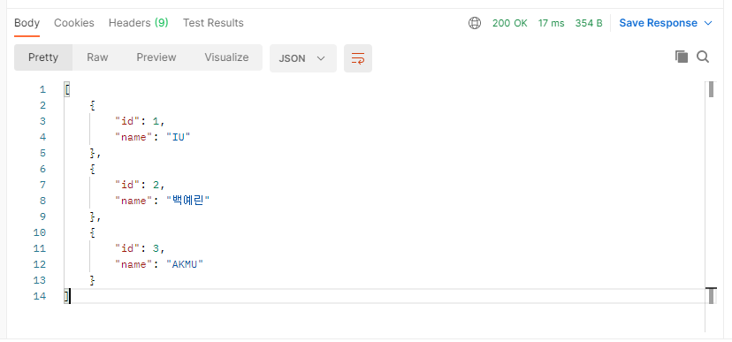
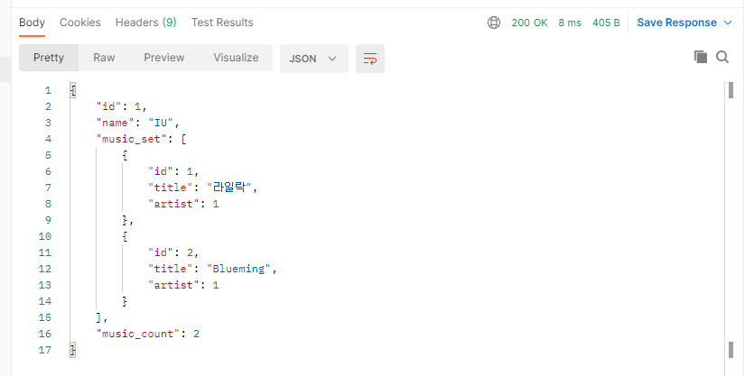
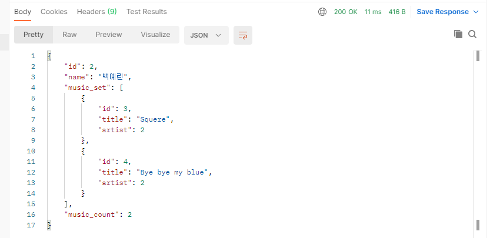
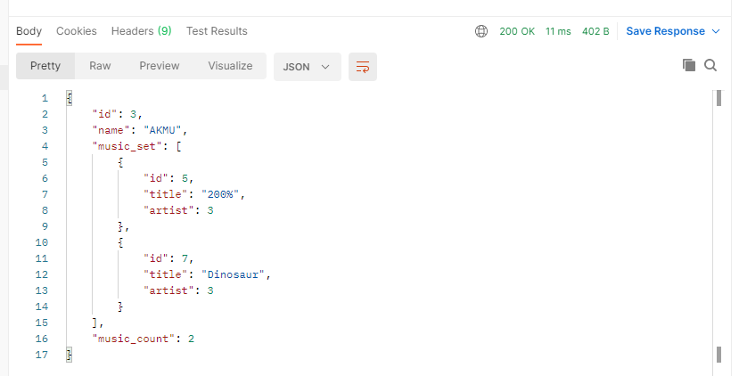
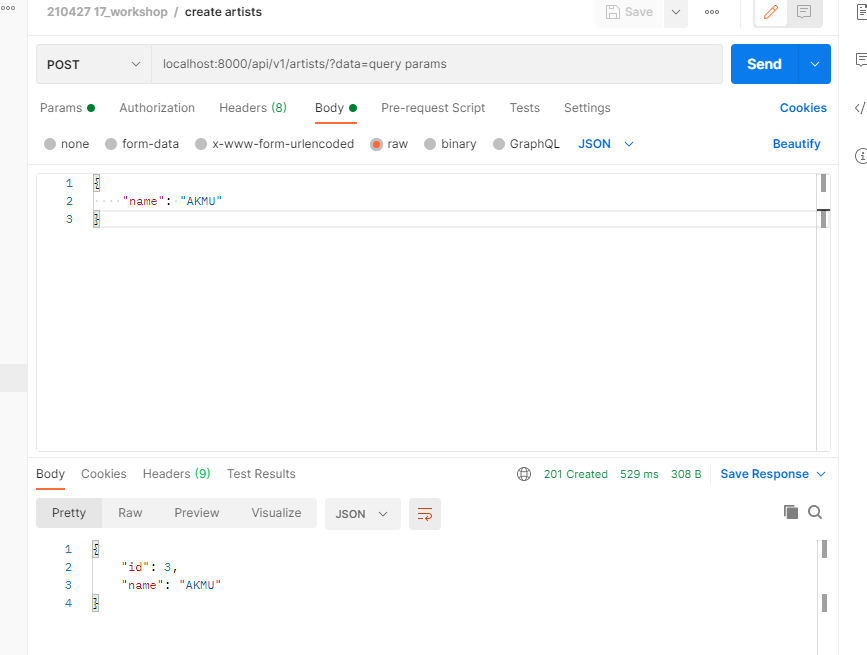
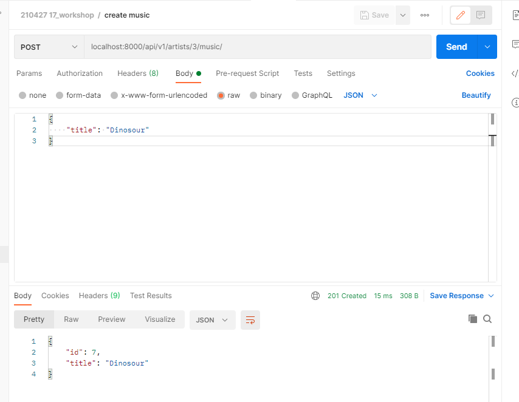
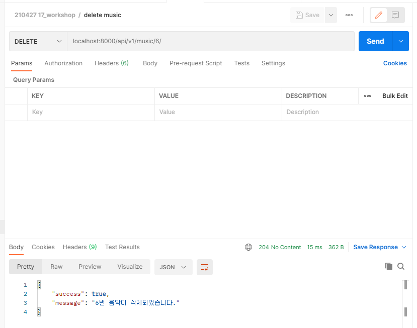
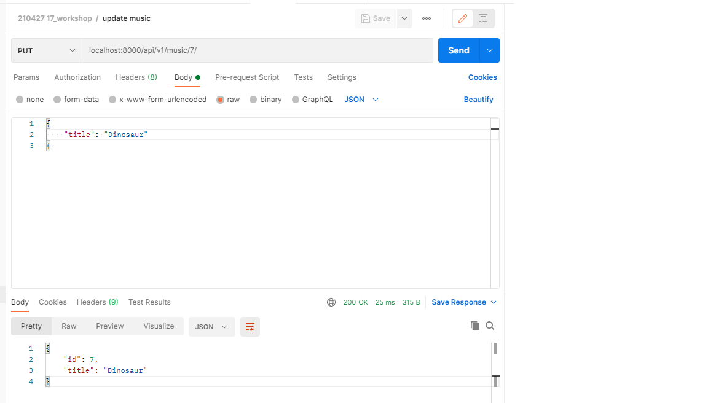

## 17_workshop

### views.py

```python
from django.shortcuts import get_object_or_404
from rest_framework import status
from rest_framework.response import Response
from rest_framework.decorators import api_view
from .models import Artist, Music
from .serializers import ArtistSerializer, ArtistListSerializer, MusicSerializer, MusicListSerializer


@api_view(['GET', 'POST'])
def artist_list_or_create(request):
    if request.method == 'GET':
        artists = Artist.objects.all()
        serializer = ArtistListSerializer(artists, many=True)
        return Response(serializer.data)
    elif request.method == 'POST':
        serializer = ArtistListSerializer(data=request.data)  # 처음에는 ArtistSerializer로 하니까 안 됐었다.
        if serializer.is_valid(raise_exception=True):
            artist = serializer.save()
            return Response(serializer.data, status=status.HTTP_201_CREATED)

    
@api_view(['GET'])
def artist_detail(request, artist_pk):
    artist = get_object_or_404(Artist, pk=artist_pk)
    serializer = ArtistSerializer(artist)
    return Response(serializer.data)


@api_view(['POST'])
def create_music(request, artist_pk):
    artist = get_object_or_404(Artist, pk=artist_pk)
    serializer = MusicListSerializer(data=request.data)
    if serializer.is_valid(raise_exception=True):
        music = serializer.save(artist=artist)
        return Response(serializer.data, status=status.HTTP_201_CREATED)


@api_view(['GET'])
def music_list(request):
    musics = Music.objects.all()
    serializer = MusicListSerializer(musics, many=True)
    return Response(serializer.data)


@api_view(['GET', 'DELETE', 'PUT'])
def update_or_delete_music(request, music_pk):
    music = get_object_or_404(Music, pk=music_pk)

    if request.method == 'GET':
        serializer = MusicListSerializer(music)
        return Response(serializer.data)
    
    elif request.method == 'PUT':
        serializer = MusicListSerializer(data=request.data, instance=music)
        # 여기도 처음에 MusicSerializer로 했었어서 안됐었음.
        if serializer.is_valid(raise_exception=True):
            serializer.save()
            return Response(serializer.data)
    
    elif request.method == 'DELETE':
        music.delete()
        data = {
            'success': True,
            'message': f'{music_pk}번 음악이 삭제되었습니다.',
        }
        return Response(data=data, status=status.HTTP_204_NO_CONTENT)
```

---

### serializers.py

```python
# serializers.py
from rest_framework import serializers
from .models import Artist, Music


class MusicSerializer(serializers.ModelSerializer):
    title = serializers.CharField(max_length=20)
    class Meta:
        model = Music
        fields = ('id', 'title', 'artist')


class ArtistListSerializer(serializers.ModelSerializer):
    name = serializers.CharField(max_length=10)
    musics = MusicSerializer(many=True, read_only=True)
    class Meta:
        model = Artist
        fields = '__all__'


class ArtistSerializer(serializers.ModelSerializer):
    music_set = MusicSerializer(many=True)
    music_count = serializers.IntegerField(source='music_set.count')
    class Meta:
        model = Artist
        fields = ('id', 'name', 'music_set', 'music_count')


class MusicListSerializer(serializers.ModelSerializer):
    title = serializers.CharField(max_length=20)
    class Meta:
        model = Music
        fields = ('id', 'title')
        read_only_fields = ('artist',)
```

### JSON 응답 결과

- artist list



- artist_detail







- create artist



- create music



- delete music



- update music



