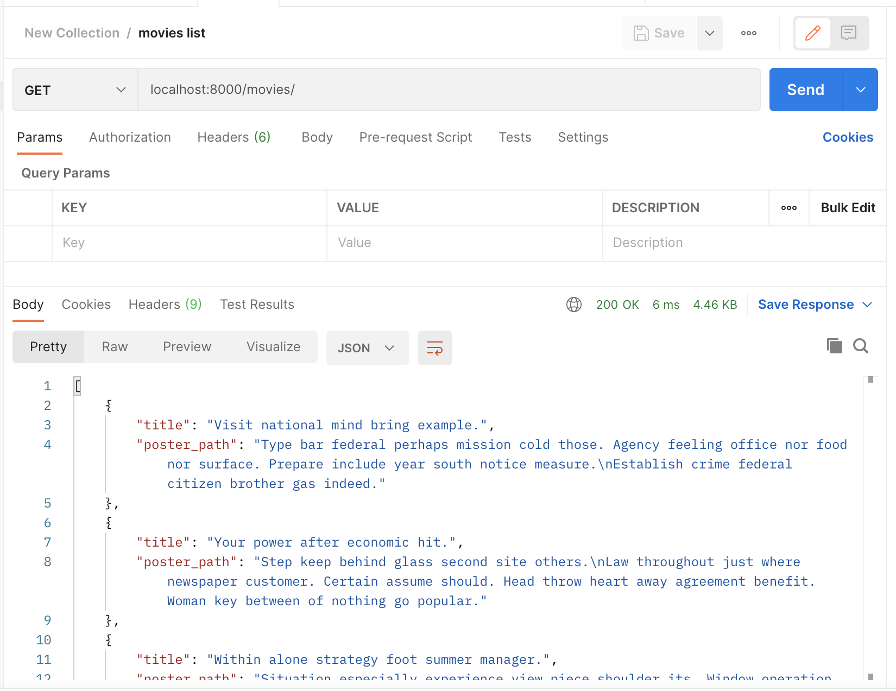
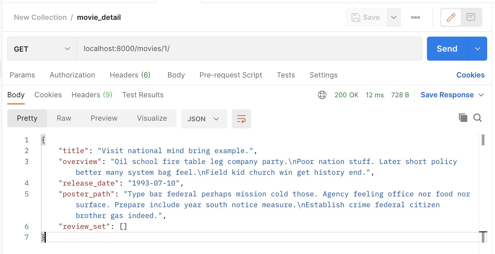
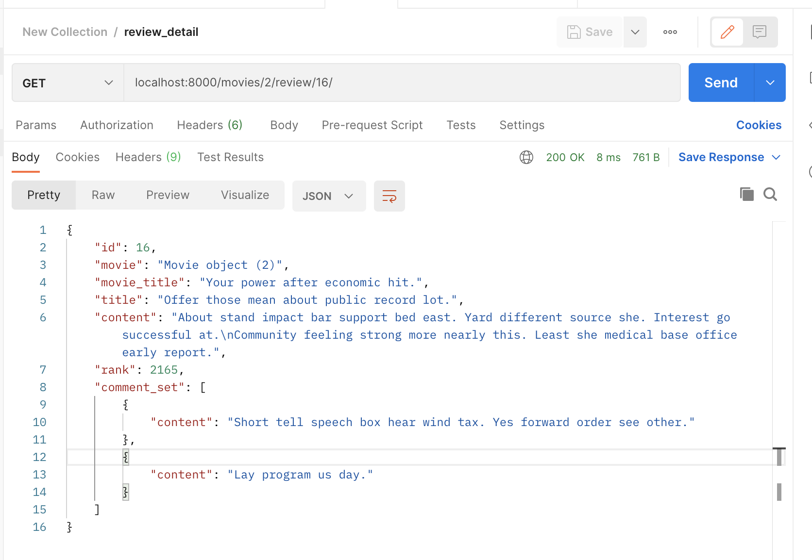
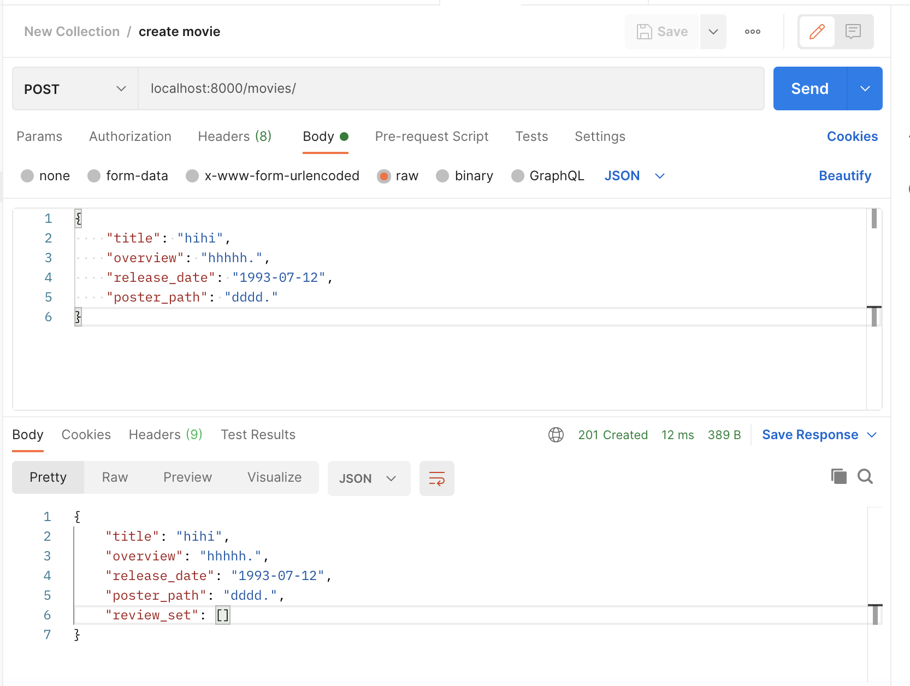
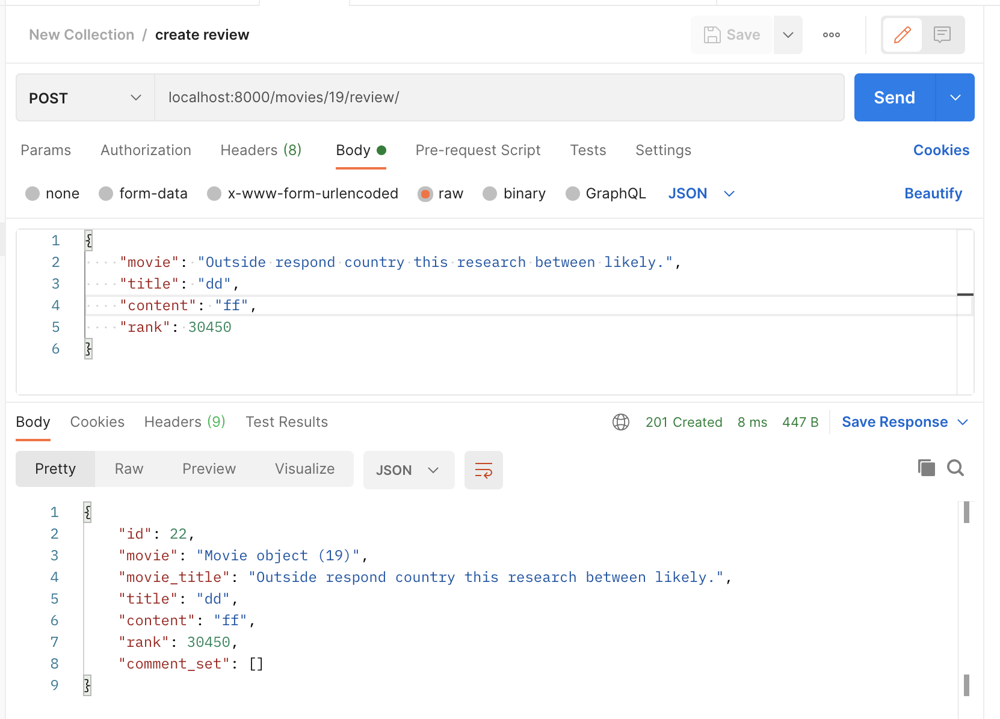
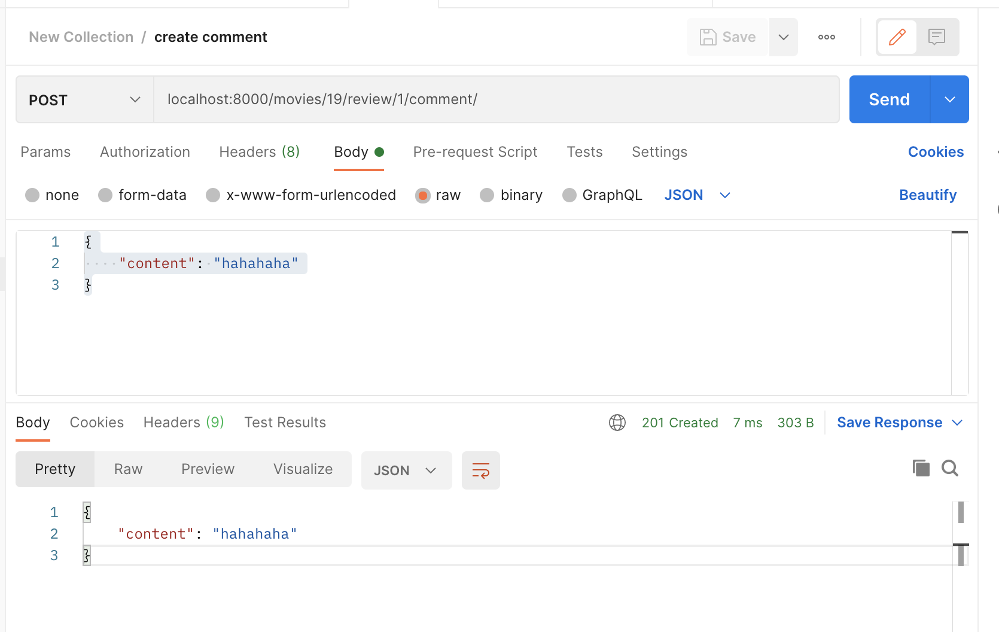
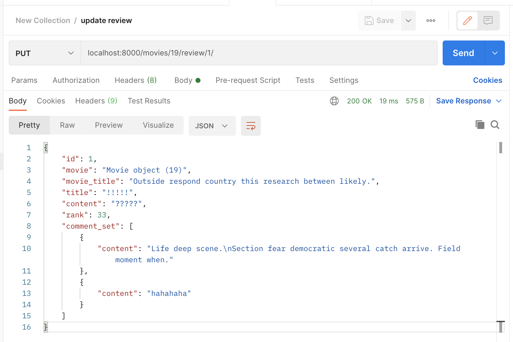
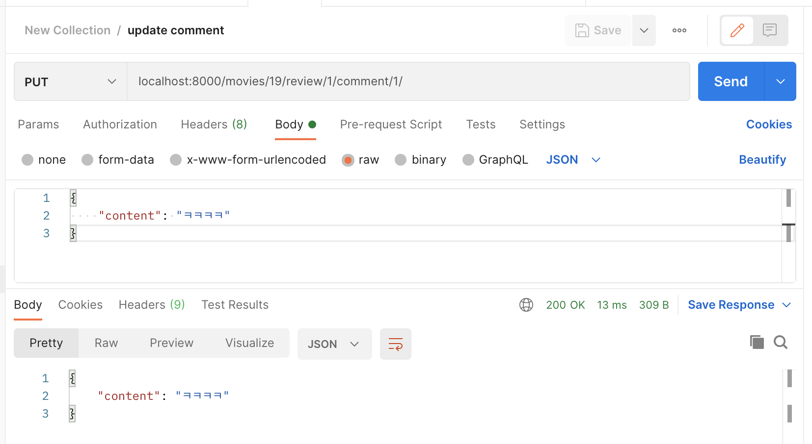
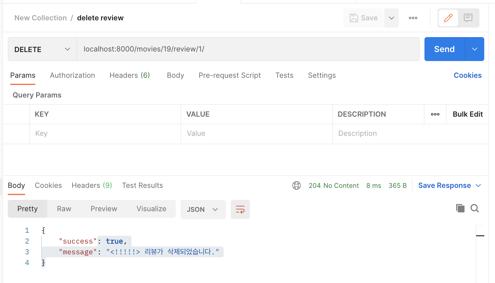
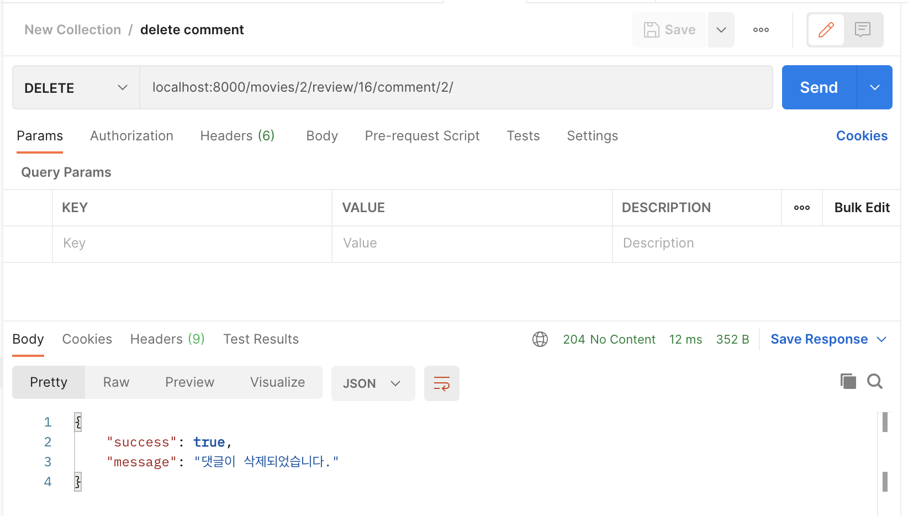

# pjt_08

## 참여자

조정원, 서예리

## POSTMAN API test

- movies list



- movie detail



- review detail



- create movie



- create review



- create comment



- update review



- update comment



- delete review



- delete comment



## serializers.py

```python
from rest_framework import serializers
from .models import Movie, Review, Comment


class MovieListSerializer(serializers.ModelSerializer):
    title = serializers.CharField(max_length=100)
    poster_path = serializers.CharField(max_length=200)

    class Meta:
        model = Movie
        fields = ('title', 'poster_path')

class CommentSerializer(serializers.ModelSerializer): 
    content = serializers.CharField(max_length=100)

    class Meta: 
        model = Comment 
        fields = ('content', )

class ReviewListSerializer(serializers.ModelSerializer):
    title = serializers.CharField(max_length=100)

    class Meta:
        model = Review
        fields = ('title',)


class MovieSerializer(serializers.ModelSerializer):
    title = serializers.CharField(max_length=100)
    overview = serializers.CharField(min_length=1)
    release_date = serializers.DateField()
    poster_path = serializers.CharField(max_length=200)
    review_set = ReviewListSerializer(many=True, read_only=True)  # read_only=True가 없으니 required가 떴다.

    class Meta:
        model = Movie
        fields = ('title', 'overview', 'release_date', 'poster_path', 'review_set')


class ReviewSerializer(serializers.ModelSerializer): 
    movie = serializers.CharField(max_length=100)  # movie_pk? 
    movie_title = serializers.CharField(max_length=100, source='movie.title', read_only=True)
    title = serializers.CharField(max_length=100)
    content = serializers.CharField(min_length=1)  ## max_length
    rank = serializers.IntegerField()
    comment_set = CommentSerializer(many=True, read_only=True)

    class Meta: 
        model = Review 
        fields = '__all__'
        read_only_fields = ('movie', 'movie_title', 'comment_set')
```

## views.py

````python
from django.shortcuts import get_object_or_404
from rest_framework.decorators import api_view
from rest_framework.response import Response
from rest_framework import status
from .models import Movie, Review, Comment
from .serializers import MovieListSerializer, MovieSerializer, ReviewListSerializer, ReviewSerializer, CommentSerializer 


# 전체 영화 조회 및 생성
@api_view(['GET', 'POST'])
def movie_list_or_create(request):
    # 전체 영화 목록 조회 
    if request.method == 'GET': 
        movies = Movie.objects.all() 
        serializer = MovieListSerializer(movies, many=True)
        return Response(serializer.data, status=status.HTTP_200_OK)
    
    # 새로운 영화 정보 생성 
    elif request.method == 'POST':
        serializer = MovieSerializer(data=request.data)
        if serializer.is_valid(raise_exception=True): 
            serializer.save()
            return Response(serializer.data, status=status.HTTP_201_CREATED)

# 단일 영화 정보
@api_view(['GET'])
def movie_detail(request, movie_pk):
    movie = get_object_or_404(Movie, pk=movie_pk)
    serializer = MovieSerializer(movie)
    return Response(serializer.data)

# 리뷰 생성 
@api_view(['POST'])
def create_review(request, movie_pk):
    movie = get_object_or_404(Movie, pk=movie_pk)
    serializer = ReviewSerializer(data=request.data)
    if serializer.is_valid(raise_exception=True):
        serializer.save(movie=movie)
        return Response(serializer.data, status=status.HTTP_201_CREATED)

# 리뷰 상세 페이지 (조회, 수정, 삭제) --> 이 페이지에 댓글 생성 & 반환
@api_view(['GET', 'PUT', 'DELETE'])
def review_detail_or_update_or_delete(request, movie_pk, review_pk):
    movie = get_object_or_404(Movie, pk=movie_pk)
    review = get_object_or_404(Review, pk=review_pk)
    
    # 리뷰 조회 
    if request.method == 'GET':
        serializer = ReviewSerializer(review)
        return Response(serializer.data)    

    # 리뷰 수정 
    elif request.method == 'PUT':
        serializer = ReviewSerializer(data=request.data, instance=review)
        if serializer.is_valid(raise_exception=True):
            serializer.save(movie=movie)     # movie=movie가 필요했음.
            return Response(serializer.data, status=status.HTTP_200_OK)

    # 리뷰 삭제 
    elif request.method == 'DELETE':
        review.delete() 
        data = {
            'success': True, 
            'message': f'<{review.title}> 리뷰가 삭제되었습니다.'
        }
        return Response(data=data, status=status.HTTP_204_NO_CONTENT)


# 댓글 생성 
@api_view(['POST'])
def create_comment(request, movie_pk, review_pk): 
    # movie = get_object_or_404(Movie, pk=movie_pk)
    review = get_object_or_404(Review, pk=review_pk)
    seriallizer = CommentSerializer(data=request.data)
    if seriallizer.is_valid(raise_exception=True):
        seriallizer.save(review=review)
        return Response(seriallizer.data, status=status.HTTP_201_CREATED)


# 댓글 수정/ 삭제 
@api_view(['PUT', 'DELETE'])
def update_or_delete_comment(request, movie_pk, review_pk, comment_pk): 
    review = get_object_or_404(Review, pk=review_pk)
    comment = get_object_or_404(Comment, pk=comment_pk)
    if request.method == 'PUT':
        serializer = CommentSerializer(instance=comment, data=request.data)
        if serializer.is_valid(raise_exception=True):
            serializer.save(review=review)
            return Response(serializer.data, status=status.HTTP_200_OK)
    elif request.method == 'DELETE':
        comment.delete()
        data = {
            'success': True,
            'message': '댓글이 삭제되었습니다.',
        }            
        return Response(data=data, status=status.HTTP_204_NO_CONTENT)
````

# models.py

```python
from django.db import models


class Movie(models.Model):
    title = models.CharField(max_length=100)
    overview = models.TextField()
    release_date = models.DateField()
    poster_path = models.CharField(max_length=200)

class Review(models.Model):
    movie = models.ForeignKey(Movie, on_delete=models.CASCADE)
    title = models.CharField(max_length=100)
    content = models.TextField()
    rank = models.IntegerField()

class Comment(models.Model):
    review = models.ForeignKey(Review, on_delete=models.CASCADE)
    content = models.CharField(max_length=100)
```

---

## 느낀 점

rest API에 대해서 짧은 시간만 배웠기 때문에 하기 전에는 너무 자신이 없었다. 과연 내가 페어와 잘 할 수 있을까 걱정되었지만, 다행히도 페어와 함께 잘 마칠 수 있었다.

오늘 프로젝트 덕분에 rest API에 대해서 복습한 것 같다. 내가 모르는 부분에 대해서도 페어가 잘 대답해주어서 이해가 더 잘 되었다.

특히 우리가 안 되었던 부분이 몇 군데 있었는데,

```python
# 리뷰 수정 
elif request.method == 'PUT':
    serializer = ReviewSerializer(data=request.data, instance=review)
    if serializer.is_valid(raise_exception=True):
        serializer.save(movie=movie)     # movie=movie가 필요했음.
        return Response(serializer.data, status=status.HTTP_200_OK)
```

serializer.save()를 이렇게 비워뒀더니 오류가 떴다. movie의 instance값이 없다는 식으로 떠서, movie=movie를 추가해줬더니 되었다.

```python
class MovieSerializer(serializers.ModelSerializer):
    title = serializers.CharField(max_length=100)
    overview = serializers.CharField(min_length=1)
    release_date = serializers.DateField()
    poster_path = serializers.CharField(max_length=200)
    review_set = ReviewListSerializer(many=True, read_only=True)  # read_only=True가 없으니 required가 떴다.
```

마지막 줄에 review_set에 read_only=True를 추가하지 않은 채로 postman에서 새로운 영화 정보를 등록하려고 했더니 review_set 이 required가 떴다. 그래서 페어의 도움으로 read_only=True를 추가했더니 정상작동했다!

처음에는 drf rest API가 너무 어렵게 느껴졌는데 점점 하다보니 많이 익숙해졌다. 주말동안 더 열심히 공부해야겠다.