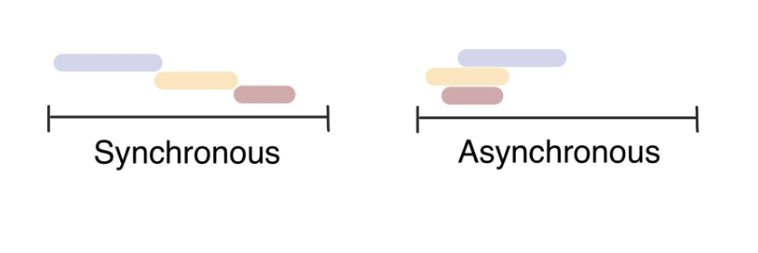

# 0503 TIL

## AJAX

:rabbit: AJAX 란

:carrot: Asynchronous Javascript And XML (비동기식 js와 xml)

:carrot: 서버와 통신하기 위해 XMLHttpRequest 객체를 활용

​	--> XMLHttpRequest는 동기식과 비동기식 통신을 모두 지원

:carrot: 페이지 전체를 reload를 하지 않고서도 수행되는 "비동기성"​

​	--> 사용자의 event가 있으면 전체 페이지가 아닌 일부분만을 업데이트

:carrot: AJAX의 X가 XML을 의미하긴 하지만, 요즘은 더 가벼운 용량과 JavaScript의 일부라는 장점 때문에 JSON을 더 많이 사용​

---

:rabbit: AJAX 배경

:carrot: 2005년 Google Maps & Gmail 등에 활용되는 기술을 설명하기 위해 AJAX라는 용어를 최초로 사용

:carrot: AJAX는 특정 기술이 아닌 기존의 여러 기술을 사용하는 새로운 접근법을 설명하는 용어

​	--> 기존 기술을 잘 활용할 수 있는 방식으로 구성 및 재조합한 "새로운" 접근법

:carrot: Google 사용 예시

​	--> Gmail : 메일의 전송 버튼을 눌러 놓고 다른 페이지로 넘어가고 메일은 알아서 전송 처리됨

​	--> Google Maps : 스크롤하는 행위 하나하나가 모두 요청이지만 페이지는 갱신되지 않음

---

:rabbit: XMLHttpRequest object

:carrot: 서버와 상호작용하기 위해 사용되며, 전체 페이지의 새로고침 없이 URL로부터 데이터를 받아올 수 있음​

:carrot: 사용자가 하는 것을 방해하지 않으면서 페이지의 일부를 업데이트할 수 있도록 해줌

:carrot: 주로 AJAX 프로그래밍에 사용

:carrot: XML 뿐만 아니라 모든 종류의 데이터를 받아오는데 사용 가능(그냥 이름이 XML인 것)

:carrot: 생성자 : XMLHttpRequest()

---

## Asynchronous JS

:rabbit: 동기(Synchronous)와 비동기(Asynchronous)

:carrot: 동기식

​	--> 순차적, 직렬적 태스크 수행

​	--> 요청을 보낸 후 응답을 받아야만 다음 동작이 이루어짐 (blocking)

:carrot: 비동기식

​	--> 병렬적 태스크 수행

​	--> 요청을 보낸 후 응답을 기다리지 않고 다음 동작이 이루어짐 (non-blocking) : 즉, 요청을 보내놓고 다음 태스크로 진행



---

:rabbit: 왜 비동기(Asynchronous)를 사용하는가?

:carrot: 사용자 경험

	- 예를 들어, 데이터를 구동하고 실행되는 앱이 있으며 이 데이터의 크기가 굉장히 크다고 가정
	- 동기식 코드라면 데이터를 모두 로드한 뒤에야 앱이 실행되기 때문에, 로드 되는 동안 우리는 앱을 사용 할 수 없는 상태로​ 얼마나 걸릴지 모르는 로딩 시간을 기다려야 함
	- 즉, 앱이 모두 멈춘 것처럼 보임
	- 이처럼 동기식 요청은 코드 실행을 차단하여 화면이 멈추고 응답하지 않는 사용자 경험을 만듦
	- 때문에 많은 웹 API 기능은 현재 비동기 코드를 사용하여 실행 됨

---

:rabbit: 동기식 예시

:carrot: 버튼 클릭 후 alert 메시지의 확인 버튼을 누를 때까지 문장이 만들어지지 않음

:carrot: 즉, alert 이후의 코드는 alert의 처리가 ​끝날 때까지 실행되지 않음

:carrot: 왜 이런 현상이 발생할까? --> JS는 single threaded(스레드가 하나라서)​

```html
<button>버튼</button>

<script>
  const btn = document.querySelector('button')
  
  btn.addEventListener('click', function () {
    alert('You clicked me!')
    const pElem = document.createElement('p')
    pElem.innerText = 'sample text'
    document.body.appendChild(pElem)
  })
</script>
```

---

:rabbit: 비동기식 예시

:carrot: 요청을 보내고 응답을 기다리지 않고 다음 코드가 실행됨

:carrot: 결과적으로 변수 todo 에는 응답 데이터가 할당되지 않고 빈 문자열이 출력

:carrot: 그렇다면 JS는 왜 기다려주지 않는 방식으로 동작하는가? --> JS는 single threaded

```js
const request = new XMLHttpRequest()
const URL = 'https://jsonplaceholder.typicode.com/todos/1/'

request.open('GET', URL)
request.send()

const todo = request.reponse
console.log(todo)
```


---

:rabbit: Threads

:carrot: 프로그램이 작업을 완료하는데 사용할 수 있는 단일 프로세스

:carrot: 각 thread(스레드)는 한번에 하나의 작업만 수행할 수 있음

:carrot: 예시) Task A -> Task B -> Task C

	- 다음 작업을 시작하려면 반드시 앞의 작업이 완료되어야 함
	- 컴퓨터 CPU는 여러 코어를 가지고 있기 때문에 한번에 여러가지 일을 처리할 수 있음

---

:rabbit: "JS는 single threaded이다."

:carrot: 컴퓨터가 여러 개의 CPU를 가지고 있어도 main thread라 불리는 단일 스레드에서만 작업 수행

:carrot: 즉, 이벤트를 처리하는 Call Stack이 하나인 언어라는 의미

:carrot: 이 문제를 해결하기 위해 JS는 / 즉시 처리하지 못하는 이벤트들을 다른 곳(Web API)으로 보내서 처리하도록 하고, / 처리된 이벤트들은 처리된 순서대로 대기실(Task queue)에 줄을 세워 놓고, / Call Stack이 비면 담당자(Event Loop)가 대기 줄에서 가장 오래 된(제일 앞의) 이벤트를 Call Stack으로 보냄

---

:rabbit: Concurrency model

:carrot: Event loop를 기반으로 하는 동시성 모델(Concurrency model)

1. Call Stack
2. Web API (Browser API)
3. Task Queue (Event Queue, Message Queue)
4. Event Loop

---

:rabbit: Call Stack

:carrot: 요청이 들어올 때마다 해당 요청을 순차적으로 처리하는 Stack(LIFO) 형태의 자료 구조

:rabbit: Web API (Browser API)

:carrot: JavaScript 엔진이 아닌 브라우저 영역에서 제공하는 API

:carrot: setTimeout(), DOM events 그리고 AJAX로 데이터를 가져오는 시간이 소요되는 일들을 처리

:rabbit: Task Queue (Event Queue, Message Queue)

:carrot: 콜백 함수가 대기하는 Queue(FIFO) 형태의 자료 구조

:carrot: main thread가 끝난 후 실행되어 후속 JavaScript 코드가 차단되는 것을 방지

:rabbit: Event Loop

:carrot: Call Stack이 비어있는지 여부를 확인

:carrot: 비어 있는 경우 Task Queue에서 실행 대기 중인 콜백이 있는지 확인

:carrot: Task Queue에 대기중인 콜백이 있다면 가장 앞에 있는 콜백을 Call Stack으로 push

---

```js
console.log('HI')

setTimeout(function goodday (){
    console.log('Have a good day!')
}, 3000)

console.log('Bye')
```

(1)` console.log('HI')` 가 Call Stack으로 들어감

(2) Output에 HI가 출력됨

(3) Call Stack에서 `console.log('HI')`가 나가고 여전히 Output에는 HI가 있음

(4) `setTimeout(function goodday (){
    console.log('Have a good day!')
}, 3000)` Call Stack으로 들어감

(5) Web API에 `function goodday (){
    console.log('Have a good day!')
}, 3000)`가 들어가 있음 (Timer 1초)

(6) `console.log('Bye')`이  Call Stack으로 들어가고, Web API에서는 Timer 2초째

(7) Call Stack과 Web API(Timer 2초)는 그대로. Output에 Hi 가 있는 상태에서 이번에는 Bye가 출력

(8) Call Stack 비워짐. Web API는 Timer 3초째. Output에는 Hi 와 Bye가 그대로 있는 상태.

(9) Timer 끝! Web API 비워짐. Task Queue에  

`function goodday (){
    console.log('Have a good day!')
}, 3000)` 들어가 있음

(10) Event Loop에서 Call Stack이 비어있는지 확인

(11) 비어있으면 Task Queue에 실행 대기 중인 함수 있는지 확인.

(12) 실행 대기 중인 애가 있네! 그럼 Call Stack에 `console.log('Have a good day!')` push!

(13) Output에 Have a good day 출력

(14) Call Stack 비워짐. Output에는 Hi, Bye, Have a good day가 차례대로 있음

---

:rabbit: Zero delays

:carrot: 실제로 0ms 후에 콜백이 시작된다는 의미가 아님

:carrot: 실행은 Task Queue에 대기중인 작업 수에 따라 다르며 해당 예시에는 콜백의 메시지가 처리되기 전에 Hi와 Bye가 먼저 출력 됨

:carrot: 왜냐하면 delay(지연)는 JS가 요청을 처리하는 데 필요한 최소 시간이기 때문 (보장된 시간이 아님)

:carrot: 기본적으로 setTimeout은 setTimeout에 대한 특정 시간 제한을 지정했더라도 대기 중인 메세지의 모든 코드가 완료 될 때까지 대기해야 함​

---

:rabbit: 순차적인 비동기 처리하기

:carrot: Web API로 들어오는 순서는 중요하지 않고, 어떤 이벤트가 먼저 처리 되느냐가 중요 (실행 순서 불명확)

:carrot: 이를 해결하기 위해 순차적인 비동기 처리를 위한 2가지 작성 방식

1. Async callbacks
   - 백그라운드에서 실행을 시작할 함수를 호출할 때 인자로 지정된 함수
   - 예시) addEventListner()의 두번째 인자
2. promise-style
   - Modern Web APIs에서의 새로운 코드 스타일
   - XMLHttpRequest 보다 조금 더 현대적인 버전

---

## Callback Function

:rabbit: Callback Function

:carrot: 다른 함수에 인자로 전달 된 함수

:carrot:외부 함수 내에서 호출되어 일종의 루틴 또는 작업을 완료함

:carrot: 동기식, 비동기식 모두 사용됨

:carrot: 비동기 작업이 완료된 후 코드 실행을 계속하는 데 사용되는 경우 비동기 콜백이라고 함​

---

:rabbit: JS의 함수는 "일급 객체" (First-class object)

:carrot: 일급 객체(일급 함수)

	- 다른 객체들에 적용 가능한 연산을 모두 지원하는 객체(함수)

:carrot: 일급 객체의 조건

	1. 인자로 넘길 수 있어야 함
	2. 함수의 반환 값으로 사용 할 수 있어야 함
	3. 변수에 할당 할 수 있어야 함

---

:rabbit: Callback Function 사용 예시

```js
// JS
const btn = document.querySelector('button')

btn.addEventListener('click', function () {
  alert('Completed!')
})
```

```python
## python
numbers = [1, 2, 3]
def add_one(number):
    return number + 1
print(map(add_one, numbers))
```

```python
## Django
from django.urls import path
from . import views

urlpatterns = [
    path('', views.index),
]
```

---

:rabbit: Async callbacks (비동기 콜백)

:carrot: 백그라운드에서 코드 실행을 시작할 함수를 호출할 때 인자로 지정된 함수

:carrot: 백그라운드 코드 실행이 끝나면 콜백 함수를 호출하여 작업이 완료되었음을 알리거나, 다음 작업을 실행하게 할 수 있음​

---

:rabbit: Why use Callback?

:carrot: 콜백 함수는 명시적인 호출이 아닌 특정 routine 혹은 action에 의해 호출되는 함수

:carrot: Django의 경우 "요청이 들어오면", event의 경우 "특정 이벤트가 발생하면" 이라는 조건 하에서 함수를 호출할 수 있었던 건 'Callback Function' 메커니즘이 있기 때문에 가능​

:carrot: 비동기 로직을 수행 할 때 콜백 함수는 필수

​	--> 명시적인 호출이 아닌 특정 시점에 '알아서' 호출되도록 만들어야 하기 때문이며, 기다려주지 않고 언젠가 처리해야 하는 일은 콜백 함수를 활용

---

:rabbit: Callback Hell

:carrot: 순차적인 연쇄 비동기 작업을 처리하기 위해​ "콜백 함수를 호출하고, 그 다음 콜백 함수를 호출하고, 또 그 함수의 콜백 함수를 호출하고.." 의 패턴이 지속적으로 반복 됨

:carrot: 즉, 여러개의 연쇄 비동기 작업을 할 때 마주하는 상황

:carrot: 이를 Callback Hell(콜백 지옥) 혹은 pyramid of doom(파멸의 피라미드)라 함

:carrot: 위와 같은 상황이 벌어질 경우 아래 사항들을 통제하기 어려움

	- 디버깅
	- 코드 가독성

---

:rabbit: Callback Hell 해결하기

1. Keep your code shallow (코드의 깊이를 얕게 유지)
2. Modularize (모듈화)
3. Handle every single error (모든 단일 오류 처리)
4. <b>Promise way (Promise 방식 사용)</b>

---

## Promise

:rabbit: Promise object

:carrot: 비동기 작업의 최종 완료 또는 실패를 나타내는 객체

	- 미래의 완료 또는 실패와 그 결과 값을 나타냄
	- 미래의 어떤 상황에 대한 약속

:carrot: 성공(이행)에 대한 약속

- .then()

:carrot: 실패(거절)에 대한 약속

- .catch()

---

:rabbit: Promise의 상태

1. 대기 (pending)
   - 이행하거나 거부되지 않는 초기 상태
2. 이행 (fulfilled)
   - 연산이 성공적으로 완료됨
3. 거부 (rejected)
   - 연산이 실패함

---

:rabbit: Promise methods - 1

:carrot: .then(callback)

 - 이전 작업(promise)이 성공했을 때(이행했을 때) 수행할 작업을 나타내는 콜백 함수
 - 그리고 각 콜백 함수는 이전 작업의 성공 결과를 인자로 전달 받음
 - 따라서 성공했을 때의 코드를 콜백 함수 안에 작성

:carrot: .catch(callback)

- .then이 하나라도 실패하면(거부 되면) 동작 (동기식의 'try...except' 구문과 유사)
- 이전 작업의 실패로 인해 생성된 error 객체는 catch 블록 안에서 사용할 수 있음

:carrot: 각각의 .then() 블록은 서로 다른 promise를 반환

- 즉, .then()을 여러 개 사용(chaining)하여 연쇄적인 작업을 수행할 수 있음
- 결국 여러 비동기 작업을 차례대로 수행할 수 있다는 뜻

:carrot: 마찬가지로 .then()과 .catch() 메서드는 모두 promise를 반환하기 때문에 chaining 가능

:carrot: 주의

- 반환 값이 반드시 있어야 함
- 없다면 콜백 함수가 이전의 promise 결과를 받을 수 없음

:carrot: .finally(callback)

- Promise 객체를 반환
- 결과의 상관없이 무조건 지정된 콜백 함수가 실행
- 어떠한 인자도 전달받지 않음
  - Promise가 성공되었는지 거절되었는지 판단 할 수 없기 때문
- 무조건 실행되어야 하는 절에서 활용
  - .then()과 .catch() 블록에서의 코드 중복을 방지

---

:rabbit: Promise 기본 구조

:carrot: 두 개의 콜백 함수를 인자로 받음

:carrot: 하나는 Promise가 이행했을 때, ​

- resolve()

:carrot: 다른 하나는 거부했을 때를 위함

- reject()

```js
const myPromise = new Promise((resolve, reject) => {
    setTimeout(function () {
        resolve('성공!')
    }, 300)
})

myPromise
	.then(function (response) {  // 성공에 대한 약속
    	console.log('Yay!' + response)
})
	.catch(function (error) {    // 실패에 대한 약속
    	console.log('이런 이유로 실패했어요' + error)
})
```

---

:rabbit: Promise가 보장하는 것

:carrot: Async callback 작성 스타일과 달리 Promise가 보장하는 특징

1.  콜백은 자바스크립트 Event Loop가 현재 실행중인 콜 스택을 완료하기 이전에는 절대 호출되지 않음
   - Promise 콜백은 event queue에 배치되는 엄격한 순서로 호출됨
2.  비동기 작업이 성공하거나 실패한 뒤에 .then() 메서드를 이용하여 추가한 경우에도 1번과 똑같이 동작

3. .then()을 여러 번 사용하여 여러 개의 콜백을 추가할 수 있음 (Chaining)

   - 각각의 콜백은 주어진 순서대로 하나 하나 실행하게 됨

   - Chaining은 Promise의 가장 뛰어난 장점 

---

## Axios

:rabbit: Axios

:carrot: Promise based HTTP client for the browser and Node.js

:carrot: 브라우저를 위한 Promise 기반의 클라이언트

:carrot: 원래는 'XHR' 이라는 브라우저 내장 객체를 활용해 AJAX 요청을 처리하는데, 이보다 편리한 AJAX 요청이 가능하도록 도움을 줌

- 확장 가능한 인터페이스와 함께 패키지로 사용이 간편한 라이브러리를 제공

```js
axios.get('https://jsonplaceholder.typicode.com/todos/1/')  // Promise 객체를  return
	.then(..)
	.catch(..)
```

---

:rabbit: Axios 예시

```js
const URL = 'https://jsonplaceholder.typicode.com/todos/1/'

axios.get(URL)
  .then(function (response) {
    console.log(response)
    return response.data
  })
  .then(function (data) {
    return data.title
  })
  .then(function (title) {
    console.log(title)
  })
  .catch(function (error) {
    console.log(error)
  })
  .finally(function () {  // 위에서 에러가 나던 안 나던 무조건 실행됨
    console.log('이건 무조건 실행됩니다.')
  })
```


---

비동기적 :  web api에게 다음 것을 실행하라고 알려주라고 얘기하고, 다음 것을 실행하러 감. 그래서 기다려주지 않는다.

```js
// 1. setTimeout
const sleep3Seconds = function () {
	console.log('잘잤다!')
}

console.log('이제 자야지')
setTimeout(sleep3Seconds, 3000)
// 3초 있다가 sleep3Seconds를 실행한다! X
// webapi -> 3초 있다가 sleep3Seconds를 실행하라고 알려줘라! O
console.log('학교 간다!')
```

```js
axios.get(url)
	.then(할 일)
	.catch(잘못되었을 때 할 일)
```

forEach는 동기적으로 작동

```js
numbers = [1, 2, 3]
newNumbers = []

console.log('hello')
numbers.forEach((num) => {
	newNumbers.push(num+1)
})
console.log('bye')
console.log(newNumbers)

// hello 123 bye 234가 출력된다.
```

