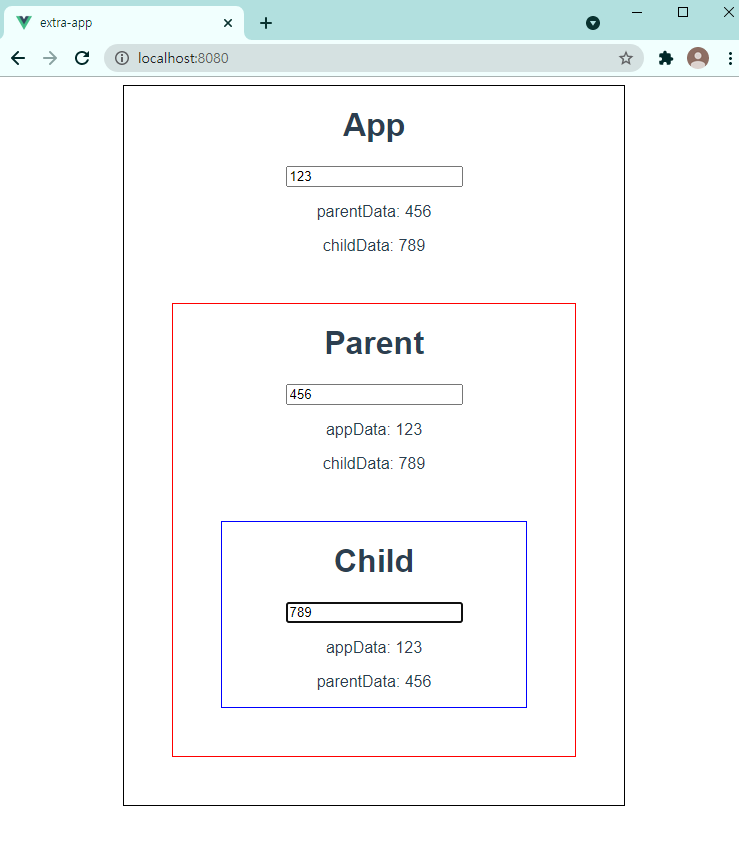

App.vue

`<input type="text" v-model="appData">` -> 

````vue
export default {
  name: 'App',
  data: function() {
    return {
      appData: '',
    }
  },
````

이거 추가

불러오기 `import Parent from '@/components/Parent'`

components에 추가

```vue
 components: {
    Parent
  }
```

templates에 `<Parent />` 추가

```vue
<template>
  <div id="app">
    <h1>App</h1>
    <input type="text" v-model="appData">
    <p>parentData: </p>
    <p>childData: </p>
    <Parent />
  </div>
</template>
```

style 추가하기

```
  width: 500px;
  border: 1px solid black;
  margin: 0 auto;
```

데이터 넘겨주기

`<Parent :appData="appData" />` :는 v-bind

parent.vue로 이동!

name 밑에 props 추가하기

```
props: {  // 일종의 데이터 from 부모
    appData: String,
  },
```

h1 태그 밑에 `<p>appData: {{ appData }}</p>` 추가

child.vue 기본 틀 잡아주기

parent.vue로 다시 넘어와서 child 불러오기

`import Child from '@/components/Child'`

components 추가

```
components: {
    Child,
}
```

위에서 div 안에 `<Child/>`  --> `<Child :appData="appData"/>`

child.vue로 와서 name 밑에 추가

```props: {
props: {
    appData: String,
  },

 h1 태그 밑에 추가 `<p>appData: {{ appData }}</p>`

---

지금까지는 appdata를 parent로 넘기고 그걸 또 child로 넘기는 단방향 데이터

child.vue에 input 태그 만들기 `<input type="text" @input="onInput">`

props 밑에 추가

```
methods: {
    onInput() {
      console.log('됐나요?')
    },
  },
```

제대로 이벤트 들어오는지 console.log로 확인

잘 들어오면 console.log 지워주고 `this.$emit('부모가 듣고 있는 이벤트 이름')` 이런식으로 추가. --> `this.$emit('child-input')` 이렇게! 여기서 this.$emit은 부모가 듣고 있는지 확인하는 식.

parent.vue로 넘어와서 :appdata 밑에  `@child-input="onChildInput"` 추가 --> child-input은 부모랑 자식이랑 약속한 이름이고, onChildInput은 methods에 추가해야 한다.

props 밑에 methods 추가

```
methods: {
    onChildInput() {
      console.log('자식에서 호출!')
    },
  },
```

console.log를 찍어서 child 인풋에 뭔가를 적었을 때 제대로 호출되는지 확인하자!

child.vue에서 methods 안에

```
onInput(event) {
      const userInput = event.target.value
      this.$emit('child-input', userInput)  // 올릴 때!
    },
```

userInput을 선언하고 2번째 인자로 넣어준다.

parent.vue에서 methods 안에

```
onChildInput(childInput) {
      console.log(childInput)
    },
```

child에서 입력했을 때 개발자도구 console에서 값이 잘 뜨는지 확인해보기

이제 child에서 넘긴거 parent에서 출력하면 된다.

parent.vue에서 data 추가

```
data: function() {
    return {
      childInput: '',
    }
  },
```

methods 수정

```
methods: {
    onChildInput(childInput) {
      this.childInput = childInput
    },
  },
```

위에 p 태그 추가`<p>childData: {{ childInput }}</p>`

:exclamation: 여기서 주의할 점이 위에 data에 return에 넣었던 속성 그대로 중괄호 안에 넣어야한다. 그래서 childInput을 넣어야 하는데 내가 계속 childData라고 넣어서 에러가 떴었다... 이 점 주의하기!!

methods에 `this.$emit('child-input', childInput)` 추가

app.vue에서 :appdata 밑에 `@child-input="onChildInput"` 추가하기

methods 추가

```
methods: {
    onChildInput(childInput) {
      this.childInput = childInput
    },
  },
```

data에 childInput 추가하기

```
data: function() {
    return {
      appData: '',
      childInput: '',
    }
  },
```

p태그 수정 `<p>childData: {{ childInput }}</p>` 

---

parentData를 emit으로 app으로 넘겨주기

parent.vue 에 h1 태그 밑에 추가 `<input type="text" @input="onInput">`

data에 `parentInput: '',` 추가하고

methods 안에 추가하기

```
onInput(event) {
      const userInput = event.target.value
      this.parentInput = userInput
      this.$emit('parent-input', userInput)
    },
```

app.vue로 이동

위에 추가하기 `@parent-input="onParentInput"`

methods에 추가하기

​```onParentInput(parentInput) {
onParentInput(parentInput) {
      this.parentInput = parentInput
    },
```

data에 추가하기 `parentInput: '',`

---

parentData를 child로 내리기

parent.vue 에서 `:parentInput="parentInput"` 추가하기

child.vue에서 props에 `parentInput: String,` 추가하기

위에 `<p>parentData: {{ parentInput }}</p>` 추가하기

---

style 넣어주기

parent.vue --> div에 아이디 --> `<div id="parent">`

`<style scoped>` scoped를 주면 app과 child는 이 style을 볼 수가 없음. 고립적인 것.

이렇게 style 넣어주기

```
#parent {
  border: 1px solid red;
  margin: 48px;
}
```

child.vue에서도 이렇게 style 넣어주기

```
<style scoped>
#child {
  border: 1px solid blue;
  margin: 48px;
}
</style>
```

그럼 이렇게 완성된다!!



