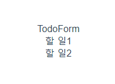

# 0512 TIL

## Vuex

:rabbit: Vuex

:carrot: (statement manegement pattern + library) for vue.js

 - 상태 관련 패턴 + 라이브러리

:carrot: 상태를 전역 저장소로 관리할 수 있도록 지원하는 라이브러리

- state가 예측 가능한 방식으로만 변경될 수 있도록 보장하는 규칙 설정
- 애플리케이션의 모든 컴포넌트에 대한 <b>중앙 집중식 저장소</b> 역할

:carrot: Vue의 공식 devtools와 통합되어 기타 고급 기능을 제공​

---

:rabbit: State

:carrot: state는 data이며, 해당 어플리케이션의 핵심이 되는 요소

:carrot: 각 컴포넌트에서 관리 (.html의 경우 new Vue({}), SFC에서는 .vue에 해당)

:carrot: DOM은 data(state)에 반응하여 DOM을 렌더링​


:exclamation: 그림으로 대체!!!!!!

---

:rabbit: Pass props & Emit event

:carrot: 각 컴포넌트는 독립적으로 데이터를 관리

:carrot: 데이터는 단방향 흐름으로 부모 --> 자식 간의 전달만 가능하며 반대의 경우 이벤트를 통해 전달

:carrot: 장점 : 데이터의 흐름을 직관적으로 파악 가능

:carrot: 단점 : 컴포넌트 중첩이 깊어지는 경우 동위 관계의 컴포넌트로의 데이터 전달이 불편해짐​


---

:rabbit: in Vuex

:carrot: 중앙 저장소에서 state를 모아놓고 관리

:carrot: 규모가 큰 (컴포넌트 중첩이 깊은) 프로젝트에 매우 편리

:carrot: 각 컴포넌트에서는 중앙 집중 저장소의 state만 신경쓰면 됨

:carrot: 이를 공유하는 다른 컴포넌트는 알아서 동기화​


:exclamation: 컴포넌트 간의 중첩을 신경쓰지 않고 있다!

---

## Vuex Core Concept

:rabbit: 단방향 데이터 흐름

:carrot: 상태(state)는 앱을 작동하는 원본 소스 (data)

:carrot: 뷰(view)는 상태의 선언적 매핑

:carrot: 액션(action)은 뷰에서 사용자 입력에 대해 반응적으로 상태를 바꾸는 방법 (methods)​


---

:rabbit: 단방향 데이터 흐름의 단점

:carrot: 공통의 상태를 공유하는 여러 컴포넌트가 있는 경우 빠르게 복잡해짐

:carrot: 예를 들면, 지나치게 중첩된 컴포넌트를 통과하는 prop​

---

:rabbit: 상태 관리 패턴

:carrot: 컴포넌트의 공유된 상태를 추출하고 이를 전역에서 관리하도록 함

:carrot: 컴포넌트는 커다란 뷰가 되며 모든 컴포넌트는 트리에 상관없이 상태에 엑세스 하거나 동작을 트리거 할 수 있음

:carrot: 상태 관리 및 특정 규칙 적용과 관련된 개념을 정의하고 분리함으로써 코드의 구조와 유지 관리 기능 향상​

---

:rabbit: Vuex 구성 요소

1. State
2. Actions
3. Mutations (무언가 값을 바꿈)
4. Getters


초록 점선으로 이뤄진 게 state!!!

---

:rabbit: Vuex 구성 요소 1 - State

:carrot: 중앙에서 관리하는 모든 상태 정보 (data)

:carrot: Mutations에 정의된 메서드에 의해 변경

:carrot: 여러 컴포넌트 내부에 있는 특정 state를 중앙에서 관리

- 이전의 방식은 state를 찾기 위해 각 컴포넌트를 직접 확인
- Vuex를 활용하는 방식은 Vuex Store에서 컴포넌트에서 사용하는 state를 한 눈에 파악 가능

:carrot: state가 변화하면 해당 state를 공유하는 컴포넌트의 DOM은 (알아서) 렌더링​

:carrot: 컴포넌트는 이제 Vuex Store에서 state 정보를 가져와 사용

:carrot: **dispatch()**를 사용하여 Actions 내부의 메서드를 호출​

---

:rabbit: Vuex 구성 요소 2 - Actions

:carrot: Component에서 **dispatch()** 메서드에 의해 호출​

:carrot: Backend API와 통신하여 Data Fetching 등의 작업을 수행

- 동기적인 작업 뿐만 아니라 비동기적인 작업을 포함 가능

:carrot: 항상 **context**가 인자로 넘어옴

- store.js 파일 내에 있는 모든 요소를 접근해서 <u>속성 접근 & 메서드 호출이 가능</u>
- <u>단, (가능하지만) state를 직접 변경하지 않음</u>

:carrot: mutations에 정의된 메서드를 **commit** 메서드로 호출

:carrot: <u>state는 오로지 mutations 메서드를 통해서만 조작</u>

- 명확한 역할 분담을 통해 서비스 규모가 커져도 state를 올바르게 관리하기 위함


:exclamation: component에서 action을 dispatch로 호출하고, action에서 mutation을 commit으로 호출한다.

---

:rabbit: Vuex 구성 요소 3 - Mutations

:carrot: Actions에서 **commit()** 메서드에 의해 호출

:carrot: 비동기적으로 동작하면 state가 변화하는 시점이 달라질 수 있기 때문에 <u>동기적인 코드만 작성</u>

:carrot: mutations에 정의하는 메서드의 첫 번째 인자로 state가 넘어옴​

---

:rabbit: Vuex 구성 요소 4 - Getters

:carrot: state를 변경하지 않고 활용하여 계산을 수행 (computed와 유사)

- 실제 계산된 값을 사용하는 것처럼 getters는 저장소의 상태(state)를 기준으로 계산
- 예를 들어,  state에 todo list의 해야 할 일의 목록의 경우 todo가 완료된 목록만 필터링해서 보여줘야 하는 경우가 있음
- getters에서 completed의 값이 true인 요소가 필터링해서 계산된 값을 담아 놓을 수 있음

:carrot: getters 자체가 state 자체를 변경하지는 않음

- state를 특정한 조건에 따라 구분(계산)만 함
- 즉, 계산된 값을 가져옴

---

:rabbit: Vuex Core Concept (정리)

:carrot: State

- (중앙에서 관리하는) 모든 데이터(==상태)
- data

:carrot: Mutations

- state를 변경하는 로직
- 동기적인 작업
- 첫번째 인자로 항상 state를 받고 commit()을 통해 호출

:carrot: Actions

- state를 직접 변경하지 않고 mutations에 정의된 메서드를 호출해서 변경
- 데이터 fetch 및 처리 & 가공, 비동기 작업
- 첫번째 인자로 항상 context를 받고 dispatch()를 통해 mutations의 메서드를 호출

:carrot: Getters

- 저장소의 상태를 기준으로 계산해야 하는 값
- 실제 상태(data)를 변경하지 않음
- computed와 유사

---

## 실습

뷰 프로젝트 생성하기

폴더 안으로 들어와서 `vue create 프로젝트이름` --> :exclamation: 다 완성됐으면 그 프로젝트 안으로 들어와야 함!!! --> `vue add vuex` 로 vuex 설치해주기!

vuex 구조는 src를 보면 조금은 다른듯하다. src안에 store가 추가됨! index.js를 보면 이렇게 4개가 있음

getter는 처음부터 만들어주지는 않고, 아까 안 배운 modules는 오늘은 사용하지 않음. 이것들로 중앙제어를 할 것이다!

```vue
export default new Vuex.Store({
  state: {
  },
  mutations: {
  },
  actions: {
  },
  modules: {
  }
})
```

---

components에 helloworld 지우고, App.vue에서도 helloworld img랑 msg 지우기! component 등록된 것도 지우기. 로고 등 불필요한 것들 지우기!

컴포넌트는 이런 구조로 만들것이다!


우선 components 폴더 안에 `TodoListItem.vue`와 `TodoList.vue` 만들어주기

기본 구조 갖추고나서 component에 등록!

등록하는 3단계 --> 1. 불러온다.  / 2. 등록한다. / 3. 사용한다.(출력)

TodoList.vue로 이동!

1. `import TodoListItem from '@/components/TodoListItem'`

2. 등록하기

   ```
    components: {
       TodoListItem,
     }
   ```

3. template 안에 출력하기

```
<div>
  <TodoListItem/>
</div>
```

components 폴더에 `TodoForm.vue`도 생성한 후 구조만 잡아주기

App.vue로 이동!

```vue
<template>
  <div id="app">
  // 3. 사용하기
    <TodoForm/>
    <TodoList/>
  </div>
</template>

<script>  // 1. 불러오기
import TodoForm from '@/components/TodoForm'
import TodoList from '@/components/TodoList'

export default {
  name: 'App',
  components: {  // 2. 등록하기
    TodoForm,
    TodoList,
  }
}
</script>
```

서버 켜보기! (`npm run serve`)

제대로 잘 나오는지 확인


---

TodoApp data 작성해보기!

index.js로 이동! --> state에 이렇게 샘플 데이터를 적어주기!

```
state: {
    todos: [
      {
        title: '할 일1',
        completed: false,
      },
      {
        title: '할 일2',
        completed: false,
      }
    ]
  },
```

서버로 이동해서 --> 시계 돌아가는 모양 누르면 Base State라고 있는데 그거 눌러서 


이렇게 state에 추가되었는지 확인하기!

이 상태를 TodoList가 가져간다.

TodoList.vue로 이동!

`  <TodoListItem v-for="(todo, idx) in $store.state.todos" :key="idx"/>`

할 일을 반복문으로 보여줘야 하니까 v-for

배열이기 때문에 키 값을 사용하려면 인덱스값도 적어준다. 이제는 데이터가 저장소에 있기 때문에 `$store`를 붙여줘야 한다. store에 있는 todos에 있는 걸 갖고와야 한다.

이 `$store.state.todos` 를 매번 갖고오는 것 보다는 계산을 해두면 좀 더 쉽게 가져올 수 있다. 이 계산된 역할""을 하는 것이 getter인데 얘는 조금 있다가 사용하고 지금은 원래 사용하던 computed에 적어보자! computed는 호출하는 것이 아닌 계산된 값만 사용하는 것이기 때문에 반드시 return 값이 필요하다!

```
computed: {
  todos: function () {
    return this.$store.state.todos
  }
 }
```

이렇게 해주면 앞으로는 `todos`라는 이름으로 사용할 수 있다.

`<TodoListItem v-for="(todo, idx) in todos" :key="idx"/>` 이렇게!!!

리스트가 바뀌지 않으면 연산을 해주지 않아도 되는데, 리스트 값이 바뀌면 연산해주는 것이 효율적이기 때문에 computed를 사용했다.

서버로 가보면 이렇게 TodoListItem이 2개가 출력이 되어있을 것


todo에 대한 데이터는 하위리스트인 todolistitem이 받아서 사용해야 한다. 데이터를 받아서 사용하는 것은todo를 내려보내야 한다.

그래서 이렇게 `:todo="todo"` 를 추가한다.

```vue
<TodoListItem 
  v-for="(todo, idx) in todos" 
  :key="idx"
  :todo="todo"
/>
```

:exclamation: props를 받는 입장에서(하위 컴포넌트) props에 등록되는 이름은 :ooo="ooo"  왼쪽과 오른쪽 중 무엇인가? --> 왼쪽이다. 장고에서 context를 사용할 때랑 비슷한 개념 ('form': form) 오른쪽 값을 사용하기 위해 왼쪽의 이름을 쓰는 것.

이렇게 내린 것을 todolistitem.vue의 props에서 선언하기. 항상 받는 쪽에서 선언을 해준다.

```vue
props: {
    todo: {
      type: Object,
    }
  }
```

todo의 title도 출력해주기

```vue
<div>
  {{ todo.title }}
</div>
```

그럼 할 일1과 할 일 2가 출력된다.



---

이제는 조작을 해보자! CRUD

created!!

todo를 생성하는 과정. 일반적으로 동작에 대한 것들은 메서드가 담당한다. todoform에서 무언가를 사용자가 입력하면 enter를 눌렀을 때 todo가 추가되도록 로직을 작성해 볼 것.

todoform.vue에서!

input태그와 button태그를 생성해서 input에 대한 값을 enter라는 이벤트를 감지한 다음에 create todo 라는 메서드를 작성해서  작동이 되는지 확인해 볼 것

인풋에 작성되는 값이 data에 양방향 바인딩이 되었으면 좋겠다. vuex를 쓴다고 해서 모든 데이터를 state로 보내는 건 아니다. 

```
data: function () {
    return {
      todoTitle: '',
    }
  }
```

이렇게 데이터를 추가한 뒤 입력한 todoTitle은 input에 추가해준다.

`<input type="text" v-model="todoTitle">` 입력한 후 v-model이 잘 동작하는지 확인하기!


v-model을 사용해서 인풋 창에 입력하면 todoTitle이 실시간으로 반영된다.

이렇게 입력한 값을 할 일 리스트에 추가할 건데, 할 일 리스트는 어디에 있냐? store의 state에 있다. 그래서 저장을 그 쪽으로 보내서 해야한다.

input 태그에 v-model 뒤에 `@keyup.enter="createTodo"` 추가하기. 사용자가 엔터키를 눌렀을 때 createTodo 메서드를 호출한다.

```vue
methods: {
  createTodo: function () {
    console.log('Todo 생성!')
  }
},
```

메서드가 잘 작동하는지 console.log로 확인하기

버튼을 클릭했을 때도 똑같이 작동하기 위해서 `<button @click="createTodo">Add</button>` 버튼에도 메서드를 추가해준다.


입력하고 엔터를 치거나 버튼을 누르면 저장이 되는 것을 확인할 수 있다.

---

createTodo는 무엇을 변경하는가? --> store에서 state의 todos가 변경이 되는 것. 이는 데이터(상태)이다.  --> state, mutations, actions, getter 중 상태를 변경하는 것은? --> mutations이다. 그래서 결국 mutations가 state에 todo를 추가해줘야 하는 것이다. mutations가 특정 메서드를 호출해서 상태를 변경하는 것. 근데 이건 어떻게 호출되는가? --> 커밋에 의해 actions이 mutations를 호출한다.

mutations 작성해보자!

mutations는 첫번째 인자로 항상 state를 받는다.

```
 mutations: {
    CREATE_TODO: function (state) {
      console.log(state)
    }
  },
```

이 또한 제대로 출력되는지 console.log로 확인해봐야 한다. 그리고 왜 이름은 upper_case로 썼는가? --> mutations에 있는 메서드들은 데이터를 수정하는 역할을 갖고 있기 때문에 나중에 코드가 많아졌을 때 대문자로 된 건 데이터를 조작하는 애구나!라는 것을 알 수 있기 때문이다.

원래는 이러면 안되지만 일단은 mutations의 동작을 확인하기 위해서 직접 호출해보자! (지금은 action이 없으니까!)

todoform.vue에서 methods에서 직접 호출해보자.

```
 methods: {
    createTodo: function () {
      this.$store.commit('CREATE_TODO')
    }
  },
```

서버에서 인풋에 입력하고 엔터를 쳤더니 CREATE_TODO라는 mutation이 잘 작동하는 것을 볼 수 있다.


이제는 todo가 진짜로 작성될 수 있도록 로직을 추가해보자. 추가하려면 무언가 새로운 아이템이 필요하다.

아까 그 methods에서 추가하자.

```
const todoItem = {
        title: ,
        conpleted: ,
      }
```

여기서 title에는 사용자가 새로 입력한 값 --> 지금 양방향 바인딩이 되고 있는 todoTitle이다.

completed는 기본값으로 false가 들어간다.

```
const todoItem = {
        title: this.todoTitle,
        completed: false,
      }
```

이렇게!!

아까 서버를 보면 mutation에 payload는 undefined라고 되어있었는데 payload는 추가적인 데이터이다. 추가적인 데이터를 같이 보내주면 mutation에서 이 데이터 값을 받아서 저장해준다.

`this.$store.commit('CREATE_TODO', todoItem)` 이렇게 todoItem을 추가한다.

그리고 저장이 되면 인풋에 입력했던 애들은 초기화가 되어야 하기 떄문에 빈 문자열로 바꿔준다.

`this.todoTitle = ''`

이제 실제로 todos에 추가하는 역할을 하는 mutations로 가보자!

store / index.js로 이동!


아까 console을 확인 안 했었다. 상태를 보면 todos 하나밖에 없다. state가 첫번째 인자로 온다 = state값을 mutations 함수 내부에서 사용할 수 있다는 것.

이제 우리는 배열에 추가할 것이다.  state 다음에 두번째 인자로 todoItem을 작성해주고, 어디에 저장하는가? state에 저장한다. --> 원래는 this를 사용해야 하는데 store 내에서는 바로 저장할 수 있다. `state.todos.push(todoItem)` 배열에 값을 넣는 것은 `push()`! --> 실제로 데이터 조작에 관여하는 코드를 뮤테이션이 담당한다.

동작하는지 할일3을 추가해보자


할 일3가 잘 추가되었고, 배열에도 추가되었음을 볼 수 있다.

---

근데 우리는 지금 action이 없다. mutation을 commit으로 호출하는 action을 추가해보자.

todoform에서 commit을 통해 mutation을 호출할 것.

action의 역할은 dispatch에 의해 호출이 되고, 항상 context가 인자로 넘어온다. 

index.js에서 actions 작성하자!

```
actions: {
    createTodo: function (context) {
      console.log(context)
    }
  },
```

첫번째 인자로 무조건 context가 들어온다고 했다. 이게 뭔지는 모르겠지만 출력해보자! 이 출력을 확인하기 위해서는 todoForm에서 dispatch를 사용해 action을 호출해보자.

todoform.vue --> methods에 `this.$store.dispatch('createTodo')` 추가하기.

서버로 확인!


이게 context! 내용이 많다. 얘도 state가 있다. 아까 mutation은 state밖에 없었는데 action은 왜 이렇게 데이터가 많이 들어있을까? --> action은 모든 속성에 대해 접근이 가능하다고 했기 때문에! 여기에는 state도 포함되어 있다. 그러나 state를 조작하면 안된다!!! --> context에 많은 데이터가 들어있기 때문에 `context.getter...` 이런식으로 사용이 가능하다.

---

commit은 액션에 의해 호출되어야 하는데 우리가 임의로 호출하기 위해 methods에 작성했기 때문에 이거를 바꿔줘야 한다. 

todoform.vue에서 `this.$store.commit('CREATE_TODO', todoItem)` 삭제하기!

그럼 todoItem을 액션으로 호출할 때 넘기기 위해서 dispatch의 추가 인자로 넣어준다. `this.$store.dispatch('createTodo', todoItem)` 이렇게!

이제 index.js로 와서 action이 CREATE_TODO를 호출하게 된다. 호출은 commit으로!  context안에 commit이 들어있다.


그래서 `context.commit(mutation, pay)` 이렇게 호출한다.

actions에 `context.commit('CREATE_TODO', todoItem)` console을 지우고 이렇게 넣는다. 이 context.commit이 mutation의 CREATE_TODO를 호출하고, todoItem은 mutation CREATE_TODO의 기본인자인 state 말고 그 뒤에 todoItem을 호출하는 것이다.

서버로 가서 인풋에 할 일3를 입력하면 제대로 리스트에 추가가 됨을 확인할 수 있고, 시계돌아가는 모양을 클릭하면 CREATE_TODO가 떠서 제대로 동작됨을 확인할 수 있다!!

이제는 state에 있던 더미 데이터는 필요가 없음. 지우자!

---

todoform.vue로 간다.

현재는 인풋에 띄어쓰기로 공백값이 들어가면 그것 또한 추가가 된다. 이를 막아주자!

methods에서 this들 위에 if문으로 trim을 추가한다.

```
if (todoItem.title.trim()) {
  this.$store.dispatch('createTodo', todoItem)
}
```

---

정리!

작성되는 과정이 그 동안과는 다른 점이 있었다.

1. 컴포넌트에서 `dispatch`를 활용해 actions를 호출
2. action에 정의된 메서드는` commit`을 활용해 mutations를 호출
3. mutations에 정의된 메서드는 `state`를 조작한다.

---

+문법적 설명!

index.js에서 actions 부분의 문법을 좀 더 js 스럽게 바꿀 수 있다.

```
createTodo: function ({ commit, state }, todoItem) {
      // context.commit('CREATE_TODO', todoItem)
      commit('CREATE_TODO', todoItem)
    }
```

이렇게!

우리가 context에서 모든 것을 사용하지는 않는다. commit 하나만 사용 중. 이 문법은 context 내부의 속성 중 mutations를 부르기 위한 commit 속성만 해체해서 사용하도록 한 것. --> distructuring이라고 함.

00_distructuring.js 코드로 들어가자!

하나씩 할당 한다면 이렇게 할 수 있다.

```js
//1. 하나 하나 할당
const commit = context.commit
const state = context.state

console.log(commit())
console.log(state)
```

어떻게 찍히는 지 확인해보자! node.js는 자바스크립트를 직접 돌릴 수 있다.

`node 00_destructuring.js` 라고 명령어를 입력하면 이렇게 출력이 된다.


이름으로 바로 가져온다면 이렇게 할 수 있다.

```js
//2. 이름으로 가져온다.
const { commit, state } = context
console.log(commit())
console.log(state)
```

이렇게하면 아까와 결과값은 같다!

한 개만 가져와도 된다.

```js
// 한 개만 가져와도 됨
const { commit } = context
console.log(commit())
```

그래서 우리가 아까와 같이 context에서 commit만 사용한다면 이렇게 하나만 가져와도 되는 것이다.

이를 destructuring assignment(구조 분해 할당)라고 한다. 

---

이제 프로젝트가 제대로 동작하는지 확인해보자!


서버를 돌려서 인풋에 값을 입력하면 이렇게 다 잘 동작되는 것을 알 수 있다!!


오후에는 수정, 삭제, getter를 할 것이다.

---

삭제부터 진행하자!

삭제버튼은 각각의 todolist 옆에 붙을 것. 

todolistitem.vue로 가자. 삭제버튼 추가하기!

```
<span>{{ todo.title }}</span>
<button>Delete</button>
```

이제는 버튼을 누르면 삭제를 할 수 있는 메서드를 호출 --> 그 메서드가 액션을 호출 --> 액션이 mutation을 호출해서 삭제를 시킨다.

1. 버튼을 클릭하면 메서드 호출하기!

`<button @click="deleteTodo">Delete</button>`

```
 methods: {
    deleteTodo: function () {
      console.log('Todo 삭제')
    }
  }
```

제대로 동작하는지 확인해보자


일단 deleteTodo라는 메서드는 잘 동작한다

실제로 삭제할 수 있는 메서드로 작성해보자!

index.js로 이동

actions에서 createTodo 밑에 추가하자

```
deleteTodo: function ({ commit }, todoItem) {
  commit('DELETE_TODO', todoItem)
}
```

아직 todoItem을 넘겨주지 않았지만 미리 작성해보았다. DELETE_TODO도 mutation에 등록하지 않았지만 일단 작성해봄

context.commit이 아니라 commit을 바로 호출해서 DELETE_TODO라고 하는 mutation을 호출하겠다는 뜻.

이제 DELETE_TODO mutation을 만들어보자

```
DELETE_TODO: function (state) {
      console.log(state)
    }
```

최종적으로 DELETE_TODO를 호출하려면 컴포넌트에서 dispatch로 action을 호출하고, action이 commit으로  mutation을 호출할 것. 지금 우리는 action이 commit으로 mutation을 호출하는 과정은 바로 위에서 작성했다. 아직 컴포넌트에서 DELETE_TODO를 호출하지 않아서 이 부분을 할 것이다.

todolistitem.vue로 가자!

methods에 추가하자

```
deleteTodo: function () {
  // console.log('Todo 삭제')
  this.$store.dispatch('deleteTodo', this.todo)
}
```

todolistitem 컴포넌트에서 actions의 deletodo라는 메서드를 호출한다는 뜻

이제 정상 작동하는지 확인해보자! 위에서 `console.log(state)`를 적어줬기 때문에 잘 찍히는지 확인해보자!


삭제 버튼을 눌렀더니 state 객체가 등장했다.

그냥 state가 통째로 출력 되었고, DELETE_TODO라는 동작이 작동 중.

아까 DELETE_TODO에서 에러가 나서 `todoItem`을 빼줬는데 이제는 추가하자!

DELETE_TODO에 이렇게 추가하자.

```
// 1. todoItem이 첫번째로 만나는 요소의 index를 가져옴
const index = state.todos.indexOf(todoItem)
// 2. 해당 인덱스 1개만 삭제하고 나머지 요소를 토대로 새로운 배열 생성
state.todos.splice(index, 1)
```

이렇게 하면 delete 버튼을 누르면 실제로 삭제가 된다.


Load state까지 확인해보면 실제로 삭제되어 배열의 개수 또한 줄어드는 것을 확인할 수 있다.

---

수정하자!!

따로 수정을 위한 버튼을 만들지는 않고, title을 누르면 UPDATE_TODO 하도록!

todolistitem.vue에서 

`<span @click="updateTodo">{{ todo.title }}</span>` 타이틀을 클릭하면 수정하겠다고 적어준다.

그리고 methods에 

```
updateTodo: function () {
      console.log('수정!')
    }
```

추가해서 updateTodo가 잘 작동하는지 확인한다.


제목을 누르면 저렇게 수정! 이라고 뜬다.

이제 updateTodo에서는 수정을 할 수 있는 mutation을 호출하기 위해 그 전에 있는 action을 먼저 호출한다.

`this.$store.dispatch('updateTodo', this.todo)` 추가하기. 얘가 호출할 대상인 action을 호출해보자!

index.js로 이동!!

actions에 추가하자

```
updateTodo: function ({ commit }, todoItem) {
  commit('UPDATE_TODO', todoItem)
},
```

mutations에 추가하기

```
UPDATE_TODO: function (state, todoItem) {
  console.log(state)
  console.log(todoItem)
}
```

commit으로 mutation을 호출한 것이다.

서버를 켜서 인풋에 입력한 후 콘솔을 확인해보면


이렇게 위에는 state, 아래는 선택된 아이템이다. 이렇게 선택이 되었다. 이걸 어떻게 수정할 것인가?

completed가 true가 되면 선이 그어지면서 수정, false이면 다시 돌아오는 것.

completed의 불리언 값을 반대로 해주어야 한다.

---

index.js에서 UPDATE_TODO에 적은 console 지우기

배열을 돌면서 검사해야하니 반복이 돌아야 한다.

for문이 돌면서 완성된 객체가 나와야 한다.

array helper method를 사용한다.

넘어온 todo 아이템과 현재 todos에 있는 todo의 요소가 일치하면 바꿔야 한다.

같으면(`if (todo === todoItem)`) completed의 상태를 변경한 새로운 object를 만들고 끝내야 한다.

```
UPDATE_TODO: function (state, todoItem) {
      state.todos = state.todos.map((todo) => {
        if (todo === todoItem) {
          return { ...todo, completed: !todo.completed }
        }
        return todo
      })
    }
```

저 ...은 무엇인가? spread code이다.

---

오늘 예시 코드인 01_spread_syntax 파일 열기

```js
const todoItem = {
  todo: '첫 번째 할 일',
  dueDate: '2020-12-25',
  importance: 'high',
  completed: false
}

// completed 값만 변경한다고 가정
//1. 첫 번째 방법
const myUpdateTodo ={
  todo: '첫 번째 할 일',
  dueDate: '2020-12-25',
  importance: 'high',
  completed: true
}

console.log(myUpdateTodo)

//2. 두 번째 방법
const myUpdateTodo2 = {
  ...todoItem,
  completed: true,
}

console.log(myUpdateTodo2)

```

이걸 돌려보면

```
$ node 01_spread_syntax.js 
{
  todo: '첫 번째 할 일',
  dueDate: '2020-12-25',
  importance: 'high',
  completed: true
}
{
  todo: '첫 번째 할 일',
  dueDate: '2020-12-25',
  importance: 'high',
  completed: true
}
```

어찌됐든 둘 다 데이터들 중에서 completed의 값만 바꾸고 싶어하는 것. 

첫번째 방법은 그를 위해서 데이터를 다 갖고와서 completed를 바꿔줬는데, 두번째 방법은 스프레드 신택스로 todoItem을 갖고오고 completed만 추가로 붙여줬다.

:question: 그럼 todoItem에 원래 false가 있지 않나요?

지금 우리는 {} 객체로 갖고왔다. 객체로 갖고오면 마지막의 completed의 값이 덮어씌워진 것이다.

중복된 키 값을 허용하지 않기 때문에 덮어씌워진 것이라 중간에 있는 importance 값을 바꾸고 싶어서 completed 밑으로 붙여도 상관이 없다. 순서가 상관 없음.

---

다시 원래 코드로 돌아오면, 객체를 새로 만들기 위해 모든 걸 다 새로 적기 보다는 todo를 갖고와서 completed의 값만 바꿔주는 것이다. 바꿀 것만 들고와서 바꿔주는 것!

수정이 되는지 확인해보자


글자를 누르면 completed의 값이 false, true, false, true 됨을 확인할 수 있다.

UPDATE_TODO가 하는 일은 선택한 todo의 completed 값을 바꾸는 것이다. title이나 내용을 수정하는 것이 아님!!

취소선 넣기!

todolistitem에서 style로 취소선을 넣어보자.

여기에서만 사용할 것이기 때문에 scoped를 적어주자.

```vue
<style scoped>
  .completed {
    text-decoration: line-through;
  }
</style>
```

template 안에 span 태그 안의 값이 바뀌어야 한다.

```vue
<span 
  @click="updateTodo"
  :class="{ completed: todo.completed }"
>{{ todo.title }}</span>
```

completed라는 class 값을 무조건 부여하는게 아니라 todo의 completed 값에 따라서 온 오프가 되는 것이다.


취소선이 생기고 안 생길때마다 completed 값이 있다 사라진다. 데이터가 계속 바뀌고 있는 것이다.

---

getters를 사용해보자!

getters로 무엇을 만들 것인가?

- 완료된 투두 개수
- 진행중인 투두 개수

getters도 왜 첫번째 인자가 state일까? getter는 state(상태 값)을 기준으로 다른 연산을 하는 애이기 때문에! 얘도 값을 사용하는 애여서 return이 필요하다.

filtering 한 다음 filtering 한 배열의 길이를 잴 것이다.

filter의 특징 : 특정 return 조건이 true인 애들만 모아서 배열을 만드는 것.

완료된 애들만 모아서 그 배열을 만들어서 배열의 길이를 재는 것이다.

```js
getters: {
  completedTodosCount: function (state) {
    return state.todos.filter((todo) => {
      return todo.completed === true
    }).length
  }
},
```

그럼 이걸 어디서 사용할 것인가? 최상위 컴포넌트(app.vue)

---

app.vue

```vue
<h1>Todo app</h1>
<h2>Completed Todo: {{ completedTodosCount }}개</h2>
```

근데 지금 `{{ completedTodosCount }}` 이 값을 사용할 수 있을까? 못 사용한다. getter에서 가져와야 한다.

computed를 추가해준다.

```js
computed: {
  completedTodosCount: function () {
     return this.$store.getters.completedTodosCount
  }
}
```

함수명은 아까 getter에서 적었던 것과 같은 것으로 하자.


그럼 이렇게 완료된 것이 count 된다.

---

이번에는 완료되지 않은 것을 카운트하기!

completedtodoscount를 그대로 복사해서 바로 밑에 붙여주고 이름만 변경한다.

```vue
uncompletedTodosCount: function (state) {
  return state.todos.filter((todo) => {
    return todo.completed === true
  }).length
}
```

app.vue로 가서 computed에 있는 애도 복붙해서 이름만 바꿔준다.

```vue
uncompletedTodosCount: function () {
  return this.$store.getters.completedTodosCount
}
```

그리고 맨 위에 출력 되는 부분도 넣어주기

`  <h2>Uncompleted Todo: {{ uncompletedTodosCount }}</h2>`

---

vuex helper

vuex 공식 문서 --> API 래퍼런스 --> 왼쪽에 컴포넌트 바인딩 헬퍼

todolist의 computed

mapstate : computed와 state를 매핑하는 것!

```vue
computed: {
  todos: function () {
    return this.$store.state.todos
  }
}
```

computed가 store.state.todos 로 되어있듯이 store의 state와 연관이 되어있다.

`import { mapState } from 'vuex'` 임포트 받아오기

computed에 todos 함수 지우고, `...mapState(['todos',])` 이걸 추가해준다.

mapstate는 객체를 반환하는데 그 객체를 ...로 풀어서 새로운 오브젝트에 맵핑하는 것이다.`this.$store.state.todos` 를 `todos`로 맵핑!

이게 가능한 이유는 state와 연관이 되어있기 때문이다.

index.js에서 state를 보면,

```js
state: {
    todos: []
}
```

이렇게 연관되어있기 때문에!!

---

mapGetters : computed와 getters에 매핑

app.vue를 바꿔보자!

`import { mapGetters } from 'vuex'` 위에서 임포트 받아온 후에

computed 이하를 주석처리한 후

`...mapGetters(['completedTodosCount', 'uncompletedTodosCount'])` 를 넣어주자.

이름으로만 객체로써 갖고와서 사용하는것.

getters에 등록한 이름과 동일하면 사용 가능하다!

---

mapActions : action과 매핑

todolistitem에서

`import { mapActions } from 'vuex'` 임포트하고,

methods 이하를 주석처리한 후에 바꿔주자.

`  ...mapActions(['deleteTodo', 'updateTodo'])` 이렇게 바꾸면, 원래는 dispatch로 deleteTodo, updateTodo만 넘겨주는게 아니라 `this.todo`로 todo도 같이 넘겨줬었다. 

그래서 위에서 deleteTodo, updateTodo를 @click으로 넘겨줄 때 추가해야 할 부분이 생긴다.

`@click="deleteTodo"` `@click="updateTodo"` 를 ==> `@click="deleteTodo(todo)` `@click="updateTodo(todo)"` 이렇게! 값을 넣어서 호출해야 온전히 전달된다.


이렇게 하면 기능상으로 바뀐 점은 없다. 좀 더 간단하게 문법을 바꿔본 것!

---

새로고침하면 적었던 todo들이 사라진다. 이를 저장하고 싶다!

서버를 끄고, `npm i vuex-persistedstate` 를 설치해준다.

플러그인을 설치해줬으니 얘는 등록을 해야한다.

index.js에서

`import createPersistedState from "vuex-persistedstate"` 먼저 임포트 해온 후에

export default 제일 위에 ` plugins: [createPersistedState()],` 를 추가해 등록해준다.

이렇게 한 후 다시 서버를 켜서 todo를 추가해보면, 새로고침을 해도 사라지지 않는다.

브라우저가 가지고 있는 local storage를 빌려서 저장하기 때문에

---

:rabbit: 그냥 mutations로만 state를 변경하면 안될까?

- "가능하다" 단 저장소의 각 프로퍼티(state, getters, mutations, actions)는 각자의 역할이 존재
- 예를 들어, actions 내부의 로직 활용 시 state를 변경해야 하는 경우가 발생할 때 
  - 직접 바꾼다. --> 가능하지만 mutation이 그럼 왜 존재할까?
- 물론 actions의 로직이 단순한 경우(우리의 todo pjt 처럼) actions를 통해 mutations를 부르고, state를 변경하지 않고 바로 mutation을 호출해 state를 바꾸기도 함
  - 하지만 이 경우는 Vuex 도입의 적절성을 판단해 볼 필요가 있음
- 결과적으로 역할에 맞는 활용을 했을 때 Vuex 라이브러리의 효용을 극대화 할 수 있음

:rabbit: Vuex, 언제 사용해야 할까?

- Vuex는 공유된 상태 관리를 처리하는 데 유용하지만, 개념에 대한 이해와 시작하는 비용이 큼
- 앱이 단순하다면 Vuex가 없는 것이 더 괜찮을 수 있음
- 그러나 중대형 규모의 SPA를 구축하는 경우 Vuex는 자연스럽게 선택할 수 있는 단계까 오게 됨
- 즉, 필요한 순간이 왔을 때 사용하는 것을 권장


