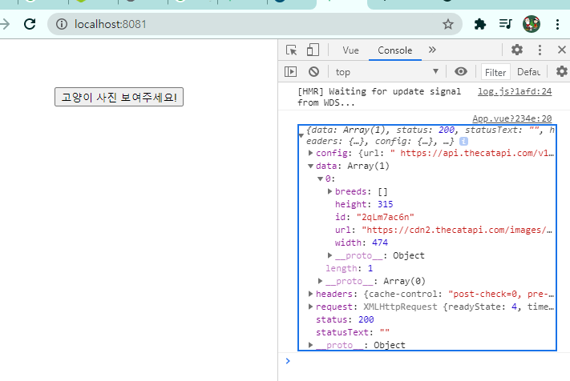
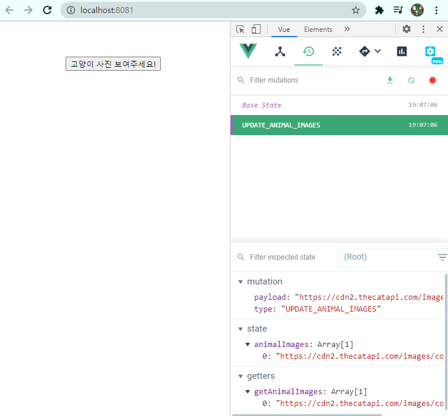
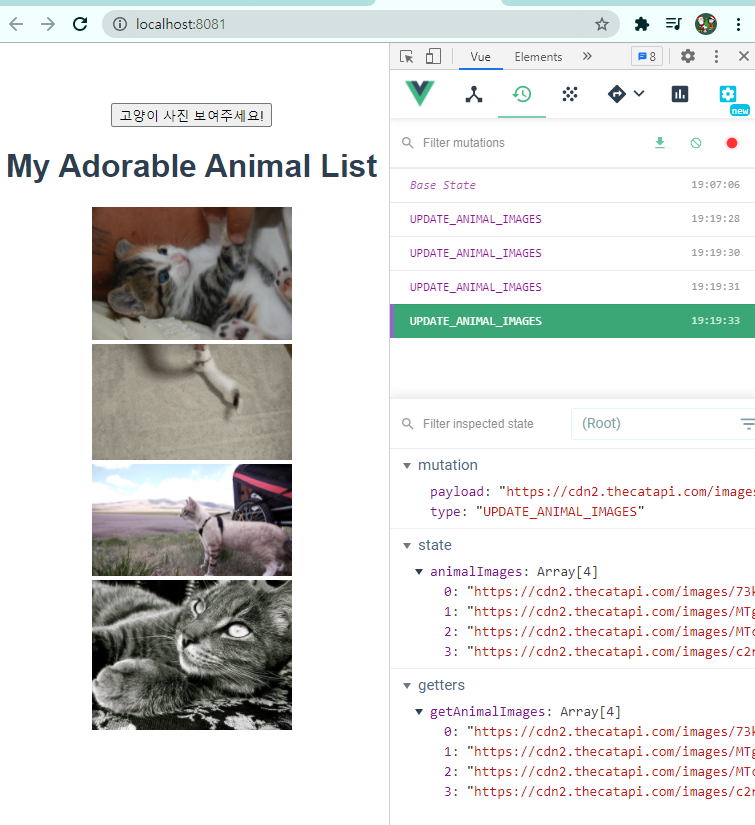

# 0512 보충 TIL

## Vuex Digest

**Vuex를 사용하는 이유?**

컴포넌트가 많아졌을 경우 데이터의 관리가 어려워짐

<u>컴포넌트 간 데이터 공유를 편하기 위하여 사용</u>

### 1. Vuex 구성 요소

- **state** : 데이터
- **getters** : computed와 비슷한 역할
- **mutations** : state를 변경하는 역할(== state를 직접 조작하면 안된다는 뜻. mutation을 거쳐서 변경해야 한다.)
- **actions** : state를 비동기적으로 변경하는 역할
  - (참고) mutations를 통해 "간접적으로" state를 변경한다.

### 2. 컴포넌트에서의 활용법

- state, getters => computed에서 주로 활용

  ```js
  // state
  this.$store.state.키값
  
  //getters
  this.$store.getters.함수명
  ```

  

- mutations, actions => methods에서 주로 활용

  ```js
  // mutations
  // git에서 commit하면? -> 기록.
  // mutations은 state의 변경사항을 기록한다.
  this.$store.commit('함수명', 매개변수)
  
  // actions
  this.$store.dispatch('함수명', 매개변수)
  ```

  

### 3. helpers

- store에 있는 요소들의 등록을 도와주는 함수

  ```js
  // App.vue
  import {mapState} from 'vuex'
  import {mapGetters} from 'vuex'
  import {mapMutations} from 'vuex'
  import {mapActions} from 'vuex'
  
  export default {
      computed: {
          ...mapState(['이름1', '이름2']),
          ...mapGetters(['이름1', '이름2']),
      },
      methods: {
          ...mapMutations(['함수명1', '함수명2']),
          ...mapActions(['함수명1', '함수명2']),
      },
  }
  ```

  

---

vue create 프로젝트이름 --> cd 프로젝트이름 --> vue add vuex

오늘은 axios가 필요하니 설치하고 가자! `npm i axios`

그 다음에 서버 켠 채로 진행하기! `npm run serve`

---

App.vue --> div에 버튼 만들기

```
<div id="app">
    <button>고양이 사진 보여주세요!</button>
  </div>
```

버튼에 추가 ` <button @click="fetchCatImg">` fetcj : 외부에서 가져온다.

components 밑에 추가

```
methods: {
    fetchCatImg() {
      //  이 안에 axios로 불러오기
    },
  },
```

import로 axios 불러오자! `import axios from 'axios'`

그 다음에 fetchCatImg 안에 추가하기

```
const CAT_API_URL = ' https://api.thecatapi.com/v1/images/search'
axios.get(CAT_API_URL)
```

```
.then((response) => {
   console.log(response)
})
.catch((error) => {
   console.error(error)
})
```

제대로 도는지 확인!



여기서 우리가 필요한건? `const catImgUrl = response.data[0].url` data 0번째의 url이 필요하다.

---

이렇게 두고 index.js로 이동

```
 state: {
    animalImageList: [],
  },
```

이 안에 url을 하나하나 저장할 것이다.

mutations에 이렇게 추가하자

```
mutations: {
  UPDATE_ANIMAL_IMAGES(state, imgUrl) {
    state.animalImages.push(imgUrl)
  },
},
```

state 밑에 getters 추가하기

```
getters: {
    getAnimalImages(state) {
      return state.animalImages
    },
```

---

App.vue로 이동!

then 밑에 const 밑에 `     this.$store.commit('UPDATE_ANIMAL_IMAGES', catImgUrl)` 추가하기.

우리가 then을 이용해 호출하면 index.js에서 state에 이미지가 잘 쌓일 것.

그 다음 서버로 확인!



버튼을 클릭하면 UPDATE_ANIMAL_IMAGES가 추가된다.

그러면서 url이 쌓인다. 한번 더 누르면 url이 2개 쌓임.

---

components 폴더에 helloworld 지우고 `AnimalList.vue` 만들기. 구조 잡아주기/

App.vue로 이동

불러오고, 등록하고, 사용하기!

`import AnimalList from '@/components/AnimalList'`

```
components: {
    AnimalList,
  },
```

`  <AnimalList/>`

---

AnimalList.vue로 이동

name 밑에 추가

```
computed: {
    animalImages() {
      return this.$store.getters.getAnimalImages
    },
  },
```

div 안에 img 추가

```

```

이렇게 하면 버튼 누를때마다 고양이 사진이 추가된다.



---

이제 helpers를 써보자!

app.vue에서 `this.$store.commit('UPDATE_ANIMAL_IMAGES', catImgUrl)` 를 바꿔보자

우선 먼저 불러오자 `import { mapMutations } from 'vuex'`

그 다음 methods 바로 밑에 등록하기 `...mapMutations(['UPDATE_ANIMAL_IMAGES']),`

이렇게 불러오면 아까와 같은 this.... 이 코드 쓸 필요 없다. --> `this.UPDATE_ANIMAL_IMAGES(catImgUrl)` 이렇게 바꾸기

이렇게하면 store.commit을 붙일 필요없이 간결해졌다.

서버 보면 정상작동함!!

`...mapMutations(['UPDATE_ANIMAL_IMAGES']),` 이렇게하면 `UPDATE_ANIMAL_IMAGES() {},`와 같이 함수를 만들어주는 것과 같다.

---

AnimalList.vue로 이동!

`import { mapGetters } from 'vuex'` 등록

```
 computed: {
    ...mapGetters(['getAnimalImages']),
    // animalImages() {
    //   return this.$store.getters.getAnimalImages
// },
```

이렇게 바꿔준다.

`...mapGetters(['getAnimalImages']),` 와 

```
animalImages() {
  return this.$store.getters.getAnimalImages
},
```

는 같다.

아까 맨 위 쪽에 img도 바꿔준다. 

```
 `

