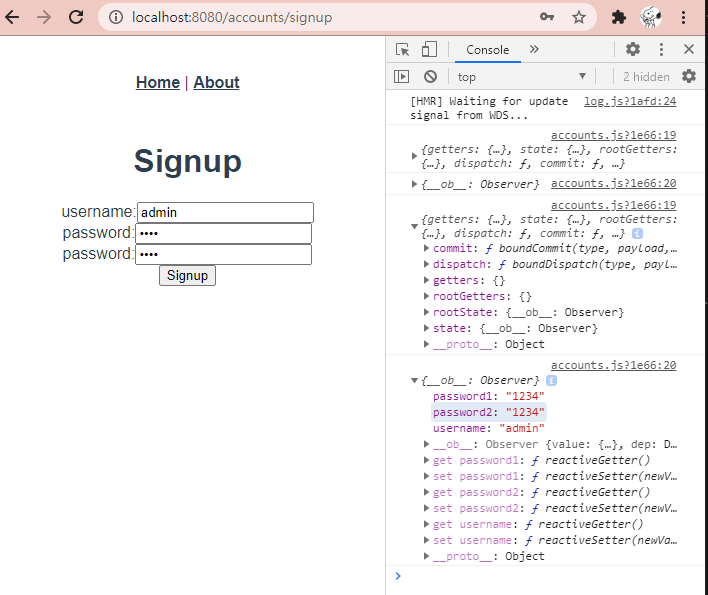
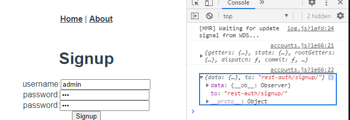
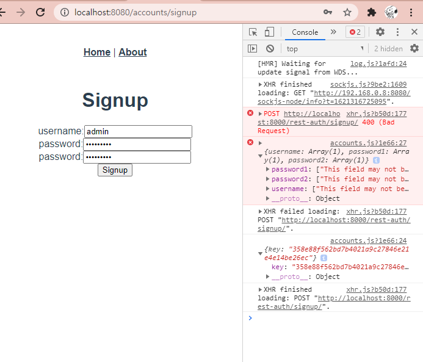

# 0518 TIL

02_board폴더 안에 django_server 폴더 만들기

`python -m venv venv`

`source venv/Scripts/activate`

`touch .gitignore README.md requirements.txt`

`pip install django djangorestframework`

`pip install django-cors-headers django-allauth django-rest-auth`

gitignore.io에서 python, django, venv, visualstudiocode, windows, macOS 넣어서 만들기! 여기서 python은 꼭 넣어줘야 한다.

---

그 다음 02_board로 나와서 깃 배쉬 켜서 

`vue create vue-client`

---

django_server에서 `django-admin startproject django_server .`

`pip freeze requirements.txt`

`python manage.py startapp board`

`python manage.py startapp accounts`


settings.py

INSTALLED_APPS

```python
# local apps
'accounts',
'board',
# 3rd party apps
'rest_framework',
'corsheaders',
```

MIDDLEWARE 맨 위에

```python
'corsheaders.middleware.CorsMiddleware',
```

setting.py 맨 밑에

```python
DEFAULT_AUTP_FIELD = 'django.ad.models.BigAutoField'

AUTH_USER_MODEL = 'accounts.User'
# CORS ALLOW
CORS_ALLOW_ALL_ORIGINS = True
```

---

account/models.py

```python
from django.contrib.auth.models import AbstractUser

# Create your models here.
class User(AbstractUser):
    pass
```

board/models.py

```python
from django.db import models
from django.conf import settings
# Create your models here.
class Article(models.Model):
    user = models.ForeignKey(settings.AUTH_USER_MODEL, on_delete=models.CASCADE)
    title = models.CharField(max_length=100)
    content = models.TextField()
    created_at = models.DateTimeField(auto_now_add=True)
    updated_at = models.DateTimeField(auto_now=True)
```

board/serializers.py

```python
from rest_framework import serializers
from .models import Article
from accounts.serializers import UserSerializer

class ArticleListSerializer(serializers.ModelSerializer):
    class Meta:
        model = Article
        fields = ('id', 'title', 'created_at')

class ArticleSerializer(serializers.ModelSerializer):
    user = UserSerializer(required=False)  # is_valid() 검증 X
    class Meta:
        model = Article
        fields = '__all__'
```

accounts/serializers.py

```python
from django.contrib.auth import get_user, get_user_model
from rest_framework import serializers

User = get_user_model()
class UserSerializer(serializers.ModelSerializer):
    class Meta:
        model = User
        fields = ('id', 'username')
```

---

`python manage.py makemigrations`

`python manage.py migrate`

---

setting.py

INSTALLED_APPS

```python
# 3rd party apps
'corsheaders',

'rest_framework',
'rest_framework.authtoken',
'rest_auth',

#'allauth',
#'allauth.account',
```

master앱의 urls.py

```python
from django.contrib import admin
from django.urls import path, include

urlpatterns = [
    path('admin/', admin.site.urls),

    # rest_auth
    path('rest-auth/', include('rest_auth.urls')),
]
```

`python manage.py migrate` 하기

`python manage.py createsuperuser` 로 user 만들기

`python manage.py runserver` 서버켜고 포스트맨 켜기

---

포스트맨에서

POST -> `http://127.0.0.1:8000/rest-auth/login/` 

raw -> JSON

```
{
    "username": "admin",
    "password": "123"
} // 아까 내가 등록한 user 아이디랑 비번
```

send 하면

```
{
    "key": "3cb63bbc665dc8bdcbb0277314fe13b8e323bbce"
}
```

이렇게 키 값이 나온다.

그럼 SQLITE --> autotoken_token에서 키 값이 적혀있고 그게 user_id 1번이다.

포스트맨에서 새 리퀘스트

POST --> `http://127.0.0.1:8000/rest-auth/logout/`

headers --> key : Authorization / value : 아까 받은 키 값 앞에 Token 붙이기

`Token 3cb63bbc665dc8bdcbb0277314fe13b8e323bbce` 하고 send 하면

```
{
    "detail": "CSRF Failed: CSRF token missing or incorrect."
}
```

이 말이 뜬다. 그럼 세션값을 지워야한다.

---

settings.py에서

```python
# DRF setting
REST_FRAMEWORK = {
    'DEFAULT_AUTHENTICATION_CLASSES': [
        'rest_framework.authentication.TokenAuthentication',
    ]
}
```

rm db.sqlite3

python manage.py migrate

python manage.py createsuperuser

새로 유저 만들기

---

다시 서버 켜고 포스트맨 가서

새로 유저 만든걸로 다시 login 에서 send 하고,

그 키 값으로 logout에서 수정해서 다시 send 하면

```
{
    "detail": "Successfully logged out."
}
```

이렇게 나온다!

저 키 값이 request user를 잡아 올 것.

---

settings.py INSTALLED_APPS

```python
# sign-up 관련 필요한 apps
'rest_auth.registration',
'allauth',
'allauth.account',
# django local apps
'django.contrib.sites',
```

마스터앱 urls.py

`    path('rest-auth/signup/', include('rest_auth.registration.urls'))` 추가하기

settings.py 맨 밑에 추가

```python
# django.contrib.sites에서 사용
SITE_ID = 1
```

`python manage.py makemigrations`

`python manage.py migrate`

포스트맨 새 리퀘스트

POST -> `http://127.0.0.1:8000/rest-auth/signup/`

raw -> JSON

```
{
    "username": "yeri",
    "password1": "qwer1234!",
    "password2": "qwer1234!"
}
```

하니까

키 값 나옴

sqlite3에서도 확인해보면 그 키 값 뜨면서 옆에 user_id 2라고 나온다.

---

마스터 urls.py

`  path('board/', include('board.urls')),` 추가하기

board에서 urls.py 만들기

board / views.py 

```python
from django.shortcuts import get_object_or_404
from rest_framework.decorators import api_view, permission_classes
from rest_framework.response import Response
from rest_framework.permissions import IsAuthenticated
from .serializers import ArticleSerializer, ArticleListSerializer
from .models import Article

@api_view(['GET', 'POST'])
def article_list_or_create(request):
    if request.method == 'POST':
        create_article(request)
    else:
        article_list(request)
    

@api_view(['GET'])
def article_detail(request, article_pk):
    article = get_object_or_404(Article, pk=article_pk)
    serializer = ArticleSerializer(article)
    return Response(serializer.data)

# views in view
def article_list(request):
    articles = Article.objects.all()
    serializers = ArticleListSerializer(articles, many=True)
    return Response(serializers.data)

@permission_classes([IsAuthenticated])
def create_article(request):
    serializer = ArticleSerializer(data=request.data)
    if serializer.is_valid(raise_exception=True):
        serializer.save(user=request.user)
        return Response(serializer.data)
```

board / urls.py

```python
from django.urls import path
from . import views

app_name = 'board'

urlpatterns = [
    path('articles/', views.article_list_or_create),
    path('articles/<int:article_pk>/', views.article_detail),
]
```

---

포스트맨

아까 signup했던 아이디 비번으로 다시 로그인하고

새 리퀘스트에서 POST article list라는 이름에서 `http://localhost:8000/board/articles/` 이 주소 넣어주기

새 리퀘스트에서 POST create article라는 이름에서

`http://localhost:8000/board/articles/` 이 주소 넣고

boay - raw - JSON 에서

```
{
    "title": "hi",
    "content": "lunch time"
}
```

Header에서 키는 Authorization / 밸류는 Token 587d5081b1dc6a3d0a55d640e555f9a8f1e9cf05(아까 로그인해서 나온 키 값) 이렇게 해주고 send하면 됨

---

vue-client에서 코드로 열기

`vue add router`

`vue add vuex`

src / views / home.vue가 메인으로 보여지게 될 것.

views는 component 중에 특별한 애들. router-view로 보여지는 애들이 특별해서, 대표적으로 보여져서 views에서 보여지게 되는 것.

views 폴더 안에 accounts articles 폴더 만들기

accounts 폴더 안에 LoginView.vue LogoutView.vue SignupView.vue 만들기

articles 폴더 안에 CreateView.vue ListView.vue 만들기

view가 붙은 애들은 url을 할당 받은 특별한 애들이다는 뜻

About.vue랑 Home.vue는 지우기

그 다음 vue-client 위치에서 서버켜기(npm run serve)

---

router / index.js

```js
import SignupView from '@/views/accounts/SignupView.vue'
import LoginView from '@/views/accounts/LoginView.vue'
import LogoutView from '@/views/accounts/LogoutView.vue'

import CreateView from '@/views/articles/CreateView.vue'
import ListView from '@/views/articles/ListView.vue'
```

```js
const routes = [
  // accounts
  {
    path: '/accounts/signup',
    name: 'Signup',
    component: SignupView
  },
  {
    path: '/accounts/login',
    name: 'Login',
    component: LoginView
  },
  {
    path: '/accountss/logout',
    name: 'Logout',
    component: LogoutView
  },
  // Article
  {
    path: '/articles',
    name: 'List',
    component: ListView
  },
  {
    path: '/articles/create',
    name: 'Create',
    component: CreateView
  }
]
```

---

store/index.js

state, mutations, actions 지우기

store 안에 modules 폴더 만들고, 그 안에 accounts.js articles.js errors.js 만들기

index.js에 임포트 하기

```js
import accounts from './modules/accounts'
import articles from './modules/articles'
import errors from './modules/errors'
```

account.js랑 articles.js, errors.js 에 틀 만들기

```js


const state = {

}

const getters = {

}

const mutations = {

}

const actions = {

}

export default {
  state, getters, mutations, actions
}
```

index.js 에서 modules  안에 채우기

```js
export default new Vuex.Store({
  modules: { accounts, articles, errors, }
})
```

account.js 채우기

```js
const state = {
  authToken: '',
}

const getters = {
  isLoggedIn: state => !!state.authToken,
}

const mutations = {
  SET_TOKEN(state, token) {
    state.authToken = token
  }
}

const actions = {
  signup() {

  },
  login() {

  },
  logout() {

  },
}
```

SignupView.vue

vue + tabs 로 틀 만들고

div안에 h1 으로 signup 적어주고 그 밑에 이 코드 추가

```vue
<div>
  <label for="username">username:</label>
  <input v-model="signupData.username" id="username" type="text" />
</div>
<div>
  <label for="password1">password:</label>
  <input v-model="signupData.password1" id="password1" type="password" />
</div>
<div>
  <label for="password2">password:</label>
  <input v-model="signupData.password2" id="password2" type="password" />
</div>
```

export default에 추가

```vue
name: 'SignupView',
data () {
  return {
    signupData: {
      username: null,
      password1: null,
      password2: null,
    }
  }
}
```

script 밑에 `import { mapActions } from 'vuex'`

data 밑에  methods 추가

```vue
methods: {
    ...mapActions(['signup'])
}
```

이렇게하면 accounts.js에서 actions의 signup을 불러온다.

 template안에 div태그 맨 아래쪽에 추가

```vue
<div>
  <button @click="signup(signupData)">Signup</button>
</div>
```

---

accounts.js에서 signup 안에 추가

```vue
signup(context, signupData) {
    console.log(context)
    console.log(signupData)
  },
```

서버 켜서 잘 돌아가는지 확인하기

주소창에 accounts/signup을 입력해 들어가자



---

src 안에 api라는 폴더 만들고, 그 안에 drf.js 만들기

drf.js에서

```js
export default {
  URL: 'http://localhost:8000',
  ROUTES: {
    signup: 'rest-auth/signup/',
    login: 'rest-auth/login/',
    logout: 'rest-auth/logout/',
    articles: 'board/articles/',
    article(pk) {
      return `board/articles/${pk}`
    }
  }
}
```

이렇게 추가하면 이제 하드 코딩 안하고 이걸 갖고와서 쓸 수 있다.

axios 설치하고

`npm i axios`

accounts.js에서 임포트 받아오기

```js
// import axios from 'axios'
import DRF from '@/api/drf'
```

actions에 signup에 채우기

```js
signup({ dispatch }, signupData) {
  const info = {
    data: signupData,
    to: DRF.ROUTES.signup
  }
  dispatch('postAuthData', info)
},
```

signup 위에 적기

```js
postAuthData(context, info) {
  console.log(context)
  console.log(info)
},
```

서버켜기



다시 axios 주석 해제하고,

postAuthData 수정하기

```js
postAuthData(context, info) {
    axios.post(DRF.URL + info.to, info.data)
      .then(res => {
        context
        console.log(res.data)
      })
      .catch(err => {
        console.error(err)
      })
  },
```

서버켜면



키 값이 나온다.

postAuthData 수정

```js
postAuthData({ commit }, { to, data }) {
    axios.post(DRF.URL + to, data)
      .then(res => {
        commit('SET_TOKEN', res.data.key)
      })
      .catch(err => {
        console.error(err.response.data)
      })
  },
```

login에 추가하기

```js
login({ dispatch }, loginData) {
    const info = {
      data: loginData,
      to: DRF.ROUTES.login
    }
    dispatch('postAuthData', info)
  },
```

---

loginview.vue에서

signupview.vue를 다 복사해서 이렇게 수정하자

```js
<template>
  <div>
    <h1>Login</h1>
    <div>
      <label for="username">username:</label>
      <input v-model="loginData.username" id="username" type="text" />
    </div>
    <div>
      <label for="password">password:</label>
      <input v-model="loginData.password1" id="password" type="password" />
    </div>
    <div>
      <button @click="login(loginData)">Login</button>
    </div>
  </div>
</template>

<script>
import { mapActions } from 'vuex'
export default {
  name: 'LoginView',
  data () {
    return {
      loginData: {
        username: null,
        password: null,
      }
    }
  },
  methods: {
    ...mapActions(['login'])
  }
}
</script>

<style>

</style>
```

서버 돌리기 (accounts/login 으로 들어가서!) 로그인 하고, f12에서 vue 에서 시계모양 눌르면 키값 알 수  있음

---

accounts.js 에서 router 임포트 받아오기 `import router from '@/router'`

postAuthdata에 `router.push({ name: 'LIST' })` 추가

logoutview.vue에 추가

```js
<template>
  <div>
    URL : Component = 1 : 1
    이 모든 작업은
    vue-router 기준 /logout URL을 구성하기 위함입니다.
  </div>
</template>

<script>
import { mapActions } from 'vuex'
export default {
  name: 'LogoutView',
  methods: {
    ...mapActions(['logout'])
  },
  created() {
    this.logout()
  }
}
</script>
```

---

accounts.js에서 logout 수정

```js
logout(context) {
  const FULL_URL_PATH = DRF.URL + DRF.ROUTES.logout
  const config = {
    headers: {
      Authorization: `Token ${}`
    }
  }
  axios.post(FULL_URL_PATH, null, config)
},
```

3번째 인자는 config는 이렇게 갖고온다.

getters에 config 추가하기

```js
config: state => ({ headers: { Authorization: `Token ${state.authToken}`} })
```

그럼 logout에서 headers 지우고

```js
logout({ getters }) {
  const FULL_URL_PATH = DRF.URL + DRF.ROUTES.logout
  axios.post(FULL_URL_PATH, null, getters.config)
},
```

이렇게 수정하기.

---

app.vue로 이동 --> template에서 수정하기

```js
<RouterLink to="/">Home</RouterLink> |
<RouterLink :to="{ name: 'List' }">Articles</RouterLink> |
<RouterLink :to="{ name: 'Login' }">Login</RouterLink> |
<RouterLink :to="{ name: 'create' }">New Articles</RouterLink> |
<RouterLink :to="{ name: 'Logout' }">Logout</RouterLink> |
```

```js
<RouterLink v-if="!isLoggedIn" :to="{ name: 'Login' }">Login |</RouterLink>
      <RouterLink v-if="isLoggedIn" :to="{ name: 'Create' }">New Articles |</RouterLink>
      <RouterLink v-if="isLoggedIn" :to="{ name: 'Logout' }">Logout</RouterLink>
```

v-if 추가하기

accounts.js에 logout 에 추가

```js
.then(() => { router.push({ name: 'List'}) })
      .catch(err => console.error(err.response.data))
```

logout까지 끝!

근데 나는 새로고침하면 login 폼이 안 뜬다.

교수님 코드와 비교해보자.

---

서버끄고 터미널에

`vue add vue-cookies` ==> N

`npm i vue-cookies`

main.js

`import VueCookies from 'vue-cookies'`

`Vue.use(VueCookies)` // vue-cookies 사용

추가하기

accounts.js에서 postAuthData에서 .then 밑에 commit 밑에 추가하기

`cookies.set('auth-token', res.data.key)`

여기에서 res.data.key, '2d' 이렇게 하면 쿠키에 2일동안 저장된다.

여기서 놓침.. 교수님 코드와 비교ㅠㅠ

const state에서 수정 `authToken: cookies.get('auth-token'),`

logout에서 수정하기

```js
axios.post(FULL_URL_PATH, null, getters.config)
      .then(() => { // Django DB 테이블에서는 삭제 | cookie, state에서는 존재
        cookies.remove('auth-token') // cookie 삭제 | state에서는 존재
        commit('SET_TOKEN', null)  // state에서도 삭제
        router.push({ name: 'List' }) 
      })
      .catch(err => console.error(err.response.data))
  },
```

---

articles.js

```js
// articles.js
import axios from 'axios'
import router from '@/router'
import DRF from '@/api/drf'

const state = {
  articles: [],
}

const getters = {

}

const mutations = {
  SET_ARTICLES: (state, articles) => state.articles = articles
}

const actions = {
  fetchArticles({ commit }) {
    axios.get(DRF.URL + DRF.ROUTES.articles)
      .then(res => commit('SET_ARTICLES', res.data))
      .catch(err => console.error(err))
  },
  createArticle({ getters }, articleData) {
    axios.post(DRF.URL + DRF.ROUTES.articles, articleData, getters.config)
      .then(() => router.push({ name: 'List' }))  // 생성 이후 List로 가면, 새롭게 fetch 함!
      .catch(err => console.error(err))

  }
}

export default {
  state, getters, mutations, actions
}
```

---

CreateView.vue

```js
<template>
  <div>
    <h1>New Article</h1>
    <div>
      <label for="title">title:</label>
      <input v-model="articleData.title" id="title" type="text" />
    </div>
    <div>
      <label for="content">content:</label>
      <textarea v-model="articleData.content" id="content" cols="30" rows="10"></textarea>
    </div>
    <div>
      <button @click="createArticle(articleData)">Submit!</button>
    </div>
  </div>
</template>

<script>
export default {
}
</script>

```

export default에 추가하기

```js
name: 'CreateView',
  data() {
    return {
      articleData: { title: '', content: '' }
    }
  }
```

ListView.vue에는 이거 추가하기

```js
<template>
  <div>
    <h1>Article List</h1>
    <ul>
      <li v-for="article in articles" :key="`article_${article.id}`">
        {{ article.title }}
      </li>
    </ul>
  </div>
</template>
```

---

다시 createView.vue로 와서

script 밑에 import

`import { mapActions } from 'vuex'`

methods 추가

```js
methods: {
    ...mapActions(['createArticle'])
  }
```

---

ListView.vue로 가서 추가하기

```js
<script>
import { mapGetters, mapActions } from 'vuex'

export default {
  name: 'ListView',
  computed: {
    ...mapGetters(['articles'])
  },
  methods: {
    ...mapActions(['fetchArticles'])
  },
  created() {
    this.fetchArticles()
  }
}
</script>
```

---

drf.js 에서 article 수정해야하는데 교수님 코드보고 비교하기

---

router/index.js

export 위에 추가하면

```js
router.beforeEach((to, from, next) => {
  console.log(to, from, next)
})
```

이러면 내가 router를 일일히 간섭하겠다는 뜻. 그래서 지금까지 쓰던 router가 제대로 동작 안 할 것

위에 임포트 받아오자.

`import store from '@/store'`

```js
router.beforeEach((to, from, next) => {
  // 모든 페이지
  // const publicPages = ['List', 'Signup', 'Login']
  
  // Login 해야만 함
  const privatePages = ['Logout', 'Create']
  // Login 안 해야만 함
  const outerPages = ['Signup', 'Login']

  // to.name(가려고 하는 곳)이 privatePages 중에 있다면 로그인해야만 한다.
  const authRequired = privatePages.includes(to.name)
  const guestRequired = outerPages.includes(to.name)
  const isLoggedIn = store.getters.isLoggedIn

  // 로그인 안해야만 함 && 로그인 O
  if (guestRequired && isLoggedIn) {
    next({ name: 'List' })
  }

  // 로그인을 해야만 함 && 로그인 X
  // if (authRequired && !isLoggedIn) {
  //   next({ name: 'Login' })
  // } else {
  //   next()
  // }
  authRequired && !isLoggedIn ? next({ name: 'Login' }) : next()
})
```

---

views / NotFound.js

```js
<template>
  <div>404 여기 오지마</div>
</template>
```

router / index.js

```js
{
    path: '/404', 
    name: 'NotFound',
    component: NotFound
  }
```

```js
import NotFound from '@/views/NotFound.vue'
```

```js
// 없는 곳으로 오려 한다면
  if (!to.name) {
    next({ name: 'NotFound' })
  }
```

---> 공식문서 고급사용법 / 네이게이션 가드로 가면 자세한 설명이 나온다.

