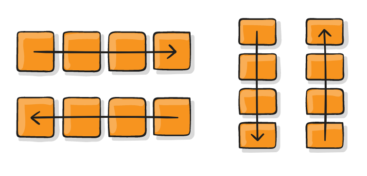
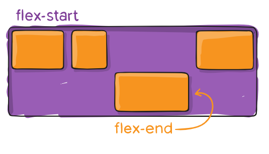

# Grid / Responsive Web

## CSS layout 

- 웹페이지에 포함될 요소들을 취합할 수 있게 해주며, 그들 요소가 일반 레이아웃 대역 상에 기본값 위치 기준과 부모 컨테이너, 또는 메인 뷰포인트 및 메인창과 비례해 어느 위치에 놓일 것인지를 제어한다.

### Float

- > 한 요소가 보통 흐름으로부터 빠져 텍스트 및 인라인 요소가 그 주위를 감싸는 자기 컨테이너의 좌우측을 따라 배치되어야 함을 지정한다.
  >
  > float된 이미지 좌, 우측 주변으로 텍스트를 둘러싸는 레이아웃을 위해 도입되었다.

  - float: none; (기본값)

    

  - float: left; (요소를 왼쪽으로 띄움)

    

  - float: right; (요소를 오른쪽으로 띄움)

    

  - 예시

    ```css
     .box{
          width: 100px;
          height: 150px;
          border: 2px solid black;
          background-color: aquamarine;
          color: black;
          margin-right: 20px;
        }
    .left {
          float: left;
        }
    
        .right {
          float: right;
        }
    ```

    ```html
    <body>
      <div class="box left">float left</div>
      <div class="box right">float right</div>
      <p>lorem</p>
    </body>
    ```

    

- clearfix

  

  - 이렇게 서로 겹치지 않았던 박스들이 float left를 했더니 분홍박스에 민트박스가 겹쳐지게 되었다.

  - float요소와 다른 텍스트가 아닌 block요소간의 레이아웃 깨짐을 막기 위해 다음과 같이 작성한다.

```css
.clearfix::after {
      content: "";
      display: block;
      clear: both;
    }
```

> float 속성을 적용한 요소의 부모요소에 적용한다.
> 부모 태그 다음에 가상 요소(::after)로 내용이 빈(content:"") 블럭(display: block;)을 만든다.
> clear: both;는 이 가상요소는 float left,right(both)를 초기화 한다는 뜻


### Flexbox(CSS Flexible Box Layout)

- > 일명 flexbox라 불리는 Flexible Box module은 flexbox 인터페이스 내의 아이템 간 공간 배분과 강력한 정렬 기능을 제공하기 위한 1차원 레이아웃 모델로 설계되었다.
  >
  > 웹페이지의 컨테이너에 아이템의 폭과 높이 또는 순서를 변경해서 웹페이지의 사용 가능한 공간을 최대한 채우고 이를 디바이스 종류에 따라 유연하게 반영하도록 하는 개념


- 기억할 것은 2가지! 요소와 축!!

  - 요소
    - Flex Container (부모 요소)
    - Flex Item (자식 요소)
  - 축
    - main axis (메인축)
    - cross axis (교차축)
    
    

- Flexbox의 시작

  ```css
  .flex-container {
      display: flex;
  }
  ```

  부모 요소에 display: flex 혹은 inline-flex를 작성하는 것부터 시작한다.

  

1) 부모요소 - Flex Container(배치 방향 설정)


- flex-direction

  

  - row (default) : 요소들을 텍스트의 방향과 동일하게 정렬한다. (가로)
  - row-reverse : 요소들을 텍스트의 반대 방향으로 정렬한다. (가로)
  - column : 요소들을 위에서 아래로 정렬한다.
  - column-reverse : 요소들을 아래에서 위로 정렬한다.

- flex-wrap : 요소들을 한 줄 또는 여러 줄에 거쳐 정렬

  - nowrap : 모든 요소들을 한 줄에 정렬한다.
     - wrap : 요소들을 여러 줄에 걸쳐 정렬한다.
     - wrap-reverse : 요소들을 여러 줄에 걸쳐 반대로 정렬


   - flex-flow : flex-direction과 flex-wrap이 자주 같이 사용되어서 이를 대신한다.

     ```css
     .container {
         flex-flow: column wrap;
     }
     ```

     

  - justify-content : justify(메인축 정렬) + content(여러 줄) = 메인축 기준 여러 줄 정렬


  - align-items : align(교차축 정렬) + items(한 줄) = 교차축 기준 한 줄 정렬


  - align-content : align(교차축 정렬) + content(여러 줄) = 교차축 기준 여러 줄 정렬


> 세로선 상에 여분의 공간이 있는 경우, 여러 줄들 사이의 가격을 지정한다. 
> 단, 한 줄만 있는 경우에는 적용되지 않는다.


2) 자식요소 - Flex items


- order : 기본 값은 0이며, 요소의 순서를 정한다. (양수나 음수로 바꿀 수 있다.)

  

  

- flex-grow : 여분의 공간이 있다면 아이템을 확장(grow) 할 때 사용한다.

  

  

- align-self : 지정된 align-items 값을 무시하고 flex요소를 세로선상에 정렬한다. (개별 지정 가능)

  

Flexbox를 연습하고 싶다면? 

[https://flexboxfroggy.com/#ko]: 


### Bootstrap

- 부트스트랩이란?

  : 반응형 웹 어플리케이션 제작에 특화된 풀스택 웹 프론트엔드 프레임워크

  : 무료로 사용 가능한 오픈 소스 (상업적 용도도 사용 가능)

- 시작할 때

  

Quick start 밑에 CSS 란에 있는 링크를 복사해서 다음과 같이 html 시작전에 넣어준다.
부트스트랩의 css를 사용하겠다는 뜻.


그 밑에 JS Bundle의 링크도 복사해서 마지막 부분에 넣어주면 된다.


맨 마지막 body 바로 위에 넣어준다.

그러면 사용 준비 끝!

- margin / padding

부트스트랩에서는 다음과 같이 마진과 패딩을 넣어줄 수 있다.


```css
.mt-0 {
  margin-top: 0 !important;
}

.ms-1 {
  margin-left: ($spacer * .25) !important;
}

.px-2 {
  padding-left: ($spacer * .5) !important;
  padding-right: ($spacer * .5) !important;
}

.p-3 {
  padding: $spacer !important;
}
```

- Flexbox in Bootstrap

```css
<div class="d-flex justify-content-start">...</div>
<div class="d-flex align-items-star">...</div>
<div class="d-flex">
	<div class="align-self-start">flexbox</div>
</div>
```

이렇게 부트스트랩에서 flexbox를 사용할 수 있다.


---


### 참고문헌

- https://getbootstrap.com/
- https://velog.io/@leeeeunz/TIL-12.-CSS-Flexbox
- https://developer.mozilla.org/ko/docs/Learn/CSS/CSS_layout/Introduction