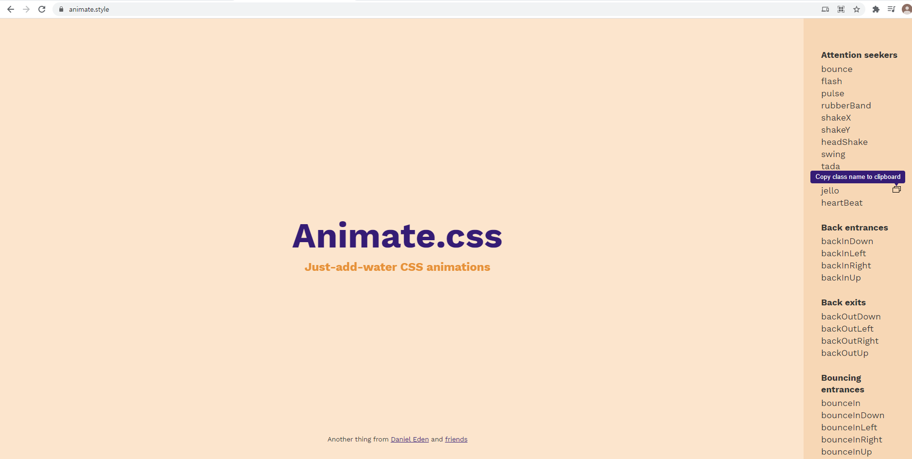
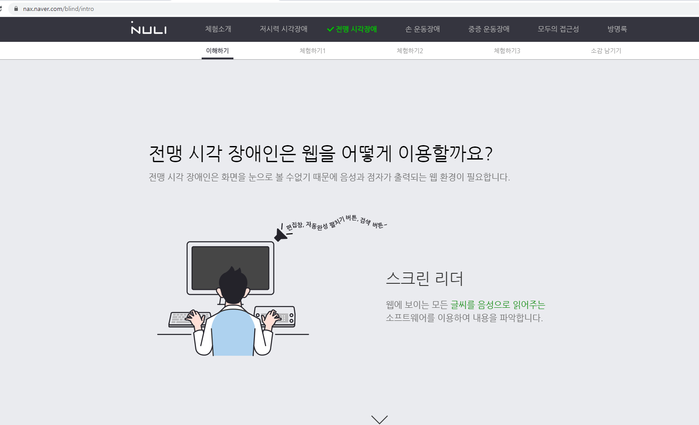
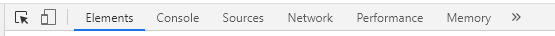
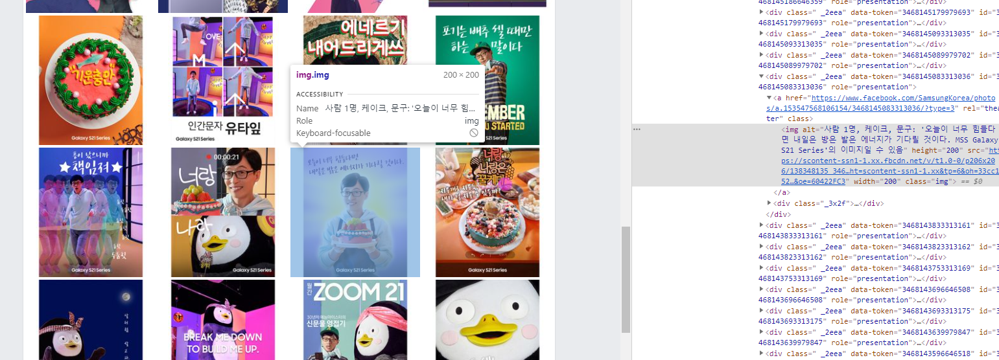

# Plus Css

## 애니메이션

애니메이션을 미디어쿼리 등을 이용해 css로 줄 수 있지만 일일히 하나씩 하는거라 비추..

만약에 애니메이션을 주고 싶다면 https://animate.style/ 에서 다양한 애니메이션을 복사해 붙여넣기 하면 된다!

## 폰트

구글 폰트를 이용하면 다양한 폰트를 적용할 수 있다.

아이콘은 폰트 어썸이나 부트스트랩 내에서도 적용가능!!

## 접근성 (네이버 NULI)

https://nax.naver.com/index

시각장애인 등의 사용자를 위해 웹의 문턱을 낮춰주는 웹 접근성 체험 사이트이다.

이 중 전맹 시각장애를 위한 서비스는 화면 요소를 읽어주는 것인데 이 때 필요한 것이 alt이다.

alt는 보통 img를 넣을 때 부가 설명을 붙이는 것인데, 이를 자세히 입력함으로써 사용자에게 읽어줄 때 alt의 내용을 통해 읽어주는 것이다.

지금 당장 alt를 세세하게 적을 필요는 없지만 이를 알아두면 앞으로 개발할 때 좀 더 생각하며 신경쓰지 않을까?

f12를 누르고 

맨 왼쪽 화살표를 누르면 사진이 선택되는데 그 때 보면 사진에 대한 설명을 알 수 있다.

## PJT

곧 다시 채우기.....!ㅎㅎ

