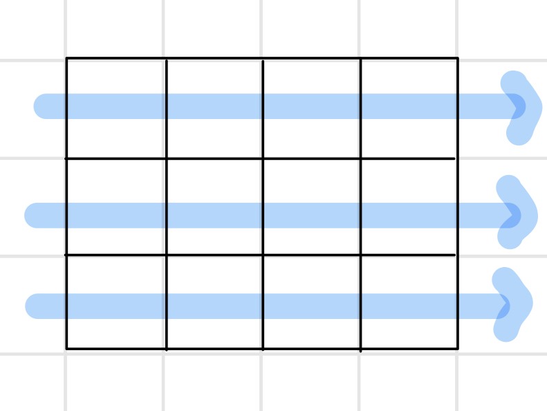
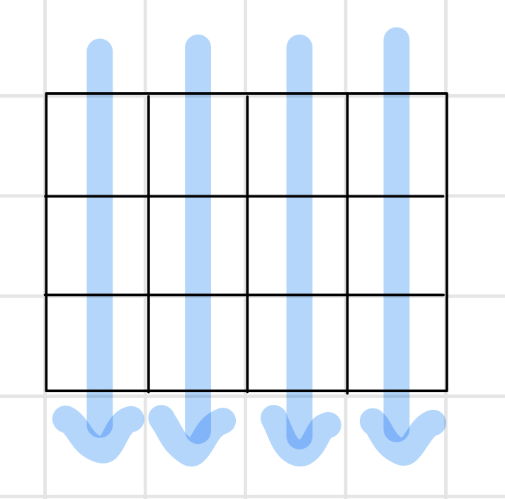
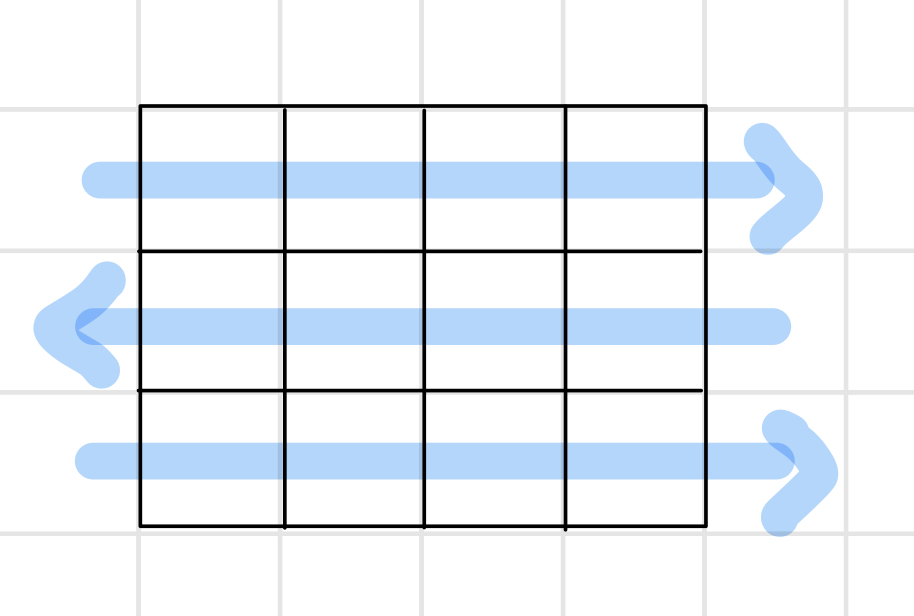

# 알고리즘 List2

## 2차원 배열

### 2차원 배열이란?

: 1차원 리스트를 묶어놓은 리스트

### 2차원 배열의 선언

- 숫자열을 input 받는다면?

  ```python
  arr = [list(map(int, input().split())) for i in range(n)]
  ```

- 0으로 된 2차원 리스트를 만든다면?

  ```python
  arr = [[0]*n for i in range(n)]
  ```

:exclamation: 여기서 n은 행, 열의 크기이다.(행과 열이 같은 길이인 경우)

### 2차원 배열의 접근

- 배열 순회

  : n X m 배열의 n*m개의 모든 원소를 빠짐없이 조사하는 방법

#### 행 우선 순회



```python
# c는 행, r는 열 (column, row)
arr = [[1, 2, 3, 4], [5, 6, 7, 8], [9, 10, 11, 12]]
n = len(arr)
m = len(arr[0])
for c in range(n):
    for r in range(m):
        print(arr[c][r], end=' ')
    print()
```


#### 열 우선 순회



```python
# c는 행, r는 열 (column, row)
arr = [[1, 2, 3, 4], [5, 6, 7, 8], [9, 10, 11, 12]]
n = len(arr)
m = len(arr[0])
for r in range(m):
    for c in range(n):
        print(arr[c][r], end=' ')
    print()
```


#### 지그재그 순회



```python
# c는 행, r는 열 (column, row)
arr = [[1, 2, 3, 4], [5, 6, 7, 8], [9, 10, 11, 12]]
n = len(arr)
m = len(arr[0])
for c in range(n):
    for r in range(m):
        print(arr[c][r + (m - 1 - 2 * r) * (c % 2)], end=' ')
    print()
```


#### 델타를 이용한 2차 배열 탐색

- 2차 배열의 한 좌표에서 4방향의 인접 배열 요소를 탐색하는 방법

  ```python
  # c는 행, r는 열 (column, row)
  arr = [[1, 2, 3, 4], [5, 6, 7, 8], [9, 10, 11, 12], [13, 14, 15, 16]]
  dc = [-1, 1, 0, 0]  # 상하좌우
  dr = [0, 0, -1, 1]
  n = len(arr)
  m = len(arr[0])
  for i in range(n):
      for j in range(n):
          tmp = []
          for k in range(4):
              nc = i + dc[k]
              nr = j + dr[k]
              if nr < 0 or nr >= m or nc < 0 or nc >= m:
              # 리스트의 범위 내에서만 탐색 가능하도록
                  continue
              tmp.append(arr[nc][nr])
          print(tmp)
      print()
  ```

- 한 좌표의 4방향 인접 배열 요소와의 차의 절대값 구하기

  ```python
  # 5 5
  # 4 7 13 5 10
  # 22 14 9 20 17
  # 15 6 11 24 8
  # 2 25 18 3 21
  # 12 1 19 23 16
  
  c, r = map(int, input().split())
  arr = [list(map(int, input().split())) for i in range(c)]
  
  dc = [-1, 1, 0, 0]
  dr = [0, 0, -1, 1]
  
  for i in range(c):
      for j in range(c):
          tmp = 0
          for k in range(4):
              nc = i + dc[k]
              nr = j + dr[k]
  
              if nr < 0 or nr >= r or nc < 0 or nc >= r:
                  continue
              if (arr[nc][nr] - arr[i][j]) < 0:
                  tmp += -1 * (arr[nc][nr] - arr[i][j])
              else:
                  tmp += (arr[nc][nr] - arr[i][j])
  
          print(tmp)
  ```


### 부분집합

#### 부분집합의 수

: 집합의 원소가 n개일 때, 공집합을 포함한 부분집합의 수는 2^n개이다.

 {1, 2, 3}의 부분집합 : 2^3(3은 원소의 수) = 8이 총 부분집합의 수

```python
bit = [0, 0, 0, 0]
for a in range(2):
    bit[0] = a
    # 0번째 원소
    for b in range(2):
        bit[1] = b
        # 1번째 원소
        for c in range(2):
            bit[2] = c
            # 2번째 원소
            for d in range(2):
                bit[3] = d
                # 3번째 원소
                print(bit)
```

#### 비트 연산자

'&' : 비트 단위로 AND  연산

'|' : 비트 단위로 OR  연산

'<<' : 피연산자의 비트 열을 왼쪽으로 이동

'>>' : 피연산자의 비트 열을 오른쪽으로 이동

- << 연산자

  -  1 << n  : 2^n  = 원소가 n개일 경우의 모든 부분집합의 수

  ```python
  print(1<<1)  # 2, 0 0 1 0
  print(1<<2)  # 4, 0 1 0 0 
  print(1<<3)  # 8, 1 0 0 0
  ```

- & 연산자

  - i & (1<<j) : i의 j번째 비트가 1인지 아닌지를 리턴

  ```python
  print(11 & 6)  # 2, 1 0 1 1 & 0 1 1 0 -> 2
  ```

#### 부분집합 생성하기(비트)

```python
arr = [1, 2, 3, 4, 5]
n = len(arr)  # n : 원소의 개수
for i in range(1<<n):  # 1<<n : 부분 집합의 개수
    for j in range(n):  # 원소의 수만큼 비트를 비교
        if i & (1<<j):  # i의 j번째 비트가 1이면 j번째 원소 출력
            print(arr[j], end=" ")
    print()
print()
```

- 10개의 정수를 입력받아 부분집합의 합이 0이 되는 경우

  ```python
  # 5 -7 2 1 4 8 10 -6 -3 9
  
  arr = list(map(int, input().split()))
  n = len(arr)
  
  for i in range(1<<n):
      tmp = []
      total = 0
      for j in range(n):
          if i & (1<<j):
              tmp.append(arr[j])
              a = [tmp[-1]]
              for k in range(len(a)):
                  total += a[k]
      if total == 0:
          print(tmp)
  ```


## 검색

- 저장되어 있는 자료 중에서 원하는 항목을 찾는 작업
- 목적하는 탐색 키를 가진 항목을 찾는 것
  - 탐색 키 : 자료를 구별하여 인식할 수 있는 키

### 검색의 종류

- 순차 검색
- 이진 검색
- 해쉬

#### 순차 검색

- 일렬로 되어 있는 자료를 순서대로 검색하는 방법

- 특징

  :smile: 가장 간단하고 직관적이다.

  :smile: 배열이나 연결 리스트 등 순차구조로 구현된 자료구조에서 원하는 항목을  찾을 때 유용하다.

  :sob: 알고리즘이 단순하여 구현이 쉽지만, 검색 대상의 수가 많은 경우에는 수행시간이 급격히 증가하여 비효율적임

- 코드 구현

  ```python
  # a = 배열
  # n = 배열의 길이
  # key = 찾고자 하는 수
  
  def seq_search_1(a, n, key):
      i = 0  # while에서 쓸 반복 계수 (for문은 없어도 되지만 while에서는 직접 써줘야 한다.)
      while i < n and a[i] != key:
          i += 1
      if i < n:
          return i  # 검색 성공, 인덱스 리턴
      else:
          return -1  # 구현되어있는 함수의 경우, 검색 실패 시 -1을 리턴하는 것이 보편적이다.
  
  def seq_search_2(a, n, key):
      i = 0
      while i < n and a[i] < key:
          i += 1
      if i < n and a[i] == key:
          return i
      else:
          return -1
  
  arr = [3, 2, 6, 10, 34, 21, 8]  # 정렬되어 있지 않은 경우, 모든 원소를 탐색해야 한다.
  print(seq_search_1(arr, len(arr), 10))
  print(seq_search_1(arr, len(arr), 5))
  arr2 = [1, 2, 3, 4, 5, 6, 7, 8]  # 정렬되어 있는 경우, 원소의 키 값이 검색 대상의 키 값보다 크면 검색 종료.
  print(seq_search_2(arr2, len(arr2), 6))
  print(seq_search_2(arr2, len(arr2), 9))
  ```

#### 이진 검색

- 자료의 가운데에 있는 항목의 키 값과 비교하여 다음 검색의 위치를 결정하고 검색을 계속 진행하는 방법

- 특징

  :smile: 목적 키를 찾을 때까지 이진 검색을 순환적으로 반복 수행함으로써 검색 범위를 반으로 줄여가면서 보다 빠르게 검색을 수행한다.

  :exclamation: 이진 검색을 하기 위해서는 자료가 정렬된 상태여야 한다.

- 검색과정
  - 자료의 중앙에 있는 원소를 고른다.
  - 중앙 원소의 값과 찾고자 하는 목표 값을 비교한다.
  - 목표 값이 중앙 원소의 값보다 작으면 자료의 왼쪽 반에 대해서 새로 검색을 수행하고, 크다면 자료의 오른쪽 반에 대해서 새로 검색을 수행한다.
  - 찾고자 하는 값을 찾을 때까지 1~3의 과정을 반복한다.

- 코드 구현

  ```python
  # a = 배열
  # key = 찾고자 하는 수
  
  def bin_search(a, key):
      start = 0
      end = len(a) - 1  # 검색 범위의 시작점과 종료점을 이용하여 검색을 반복 수행한다.
      while start <= end:
          middle = (start + end) // 2
          if a[middle] == key:  # 검색 성공
              return True
          elif a[middle] > key:
              end = middle - 1
          else:
              start = middle + 1
      return False  # 검색 실패
  
  arr = [1, 3, 4, 6, 7, 8, 10, 15, 23]
  print(bin_search(arr, 8))
  ```

## 선택 정렬(Selection Sort)

- 주어진 자료들 중 가장 작은 값의 원소부터 차례대로 선택하여 위치를 교환하는 방식
- 과정
  - 주어진 리스트 중에서 최소값을 찾는다.
  - 그 값을 리스트의 맨 앞에 위치한 값과 교환한다.
  - 맨 처음 위치를 제외한 나머지 리스트를 대상으로 위의 과정을 반복한다.

- 코드 구현

  ```python
  def selec_sort(a):
      for i in range(0, len(a)-1):  # 마지막 원소는 비교할 필요 없다.
          min = i  # 최소값의 인덱스를 저장
          for j in range(i + 1, len(a)):  
          # 탐색해야 하는 구간 내 최소값의 인덱스 찾기
              if a[min] > a[j]:
                  min = j
          a[i], a[min] = a[min], a[i]  # 탐색 구간의 가장 앞과 최소값을 바꾼다.
  
  arr = [9, 2, 14, 6, 3]
  selec_sort(arr)
  print(arr)
  ```

