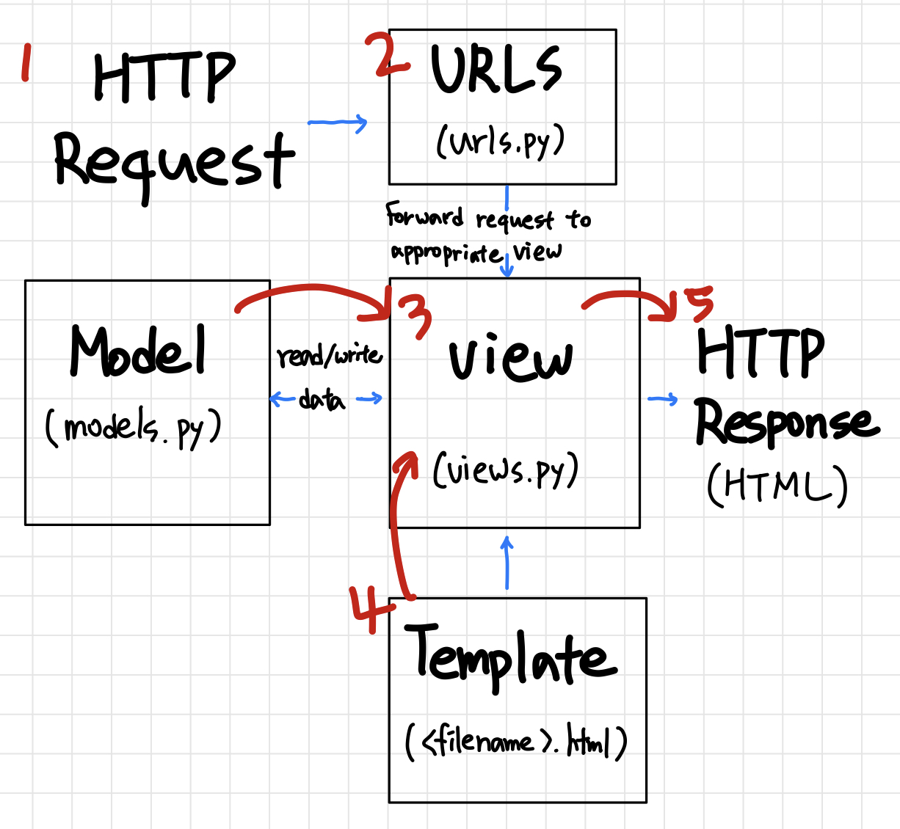
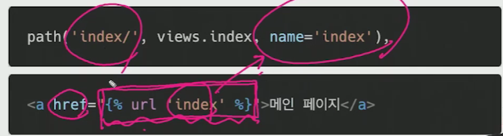

# 0308 TIL(django_intro)

:bear: 웹의 전반적인 흐름

클라이언트가 요청(request)하면 서버가 응답(response)을 보내줌. 우리는 서버쪽에서 운영되는 것을 장고(django)로 서버 구축을 한다.

:bear: 웹 개발을 하는 것 == 카페를 창업한다 라고 생각한다면

개인카페 : A-Z 모두 직접하기(가격설정, 홍보, 레시피, 거래처...)

프랜차이즈카페 : 다 해줌. = 프레임워크를 사용한다.

:bear: 장고 : 파이썬으로 작성된 웹 프레임워크

장고를 왜 배워야 하는가? : 쓸데없는 시간 낭비를 하지 말고 앱을 작성하는데 집중할 수 있도록 도와줄게!라고 말하고 있음.

MVC : 모델 - 뷰 - 컨트롤러 : 소트트웨어 공학에서 사용되는 소프트웨어 디자인 패턴(일반적으로 사용함)

근데 장고에서는 MTV(모델-템플릿-뷰)이다. 

모델 : 데이터베이스 관리 / 템플릿 : 레이아웃(화면) / 뷰 : 중심 컨트롤러(중간 관리자)



도식화하자면 이렇게 할 수 있다.

응답을 하기 위해서는 1)요청이 와야 함. 요청이 장고로 옴. 2)urls에서 요청을 받아서 어떤 요청인지 방향을 잡아줌 3)뷰가 모델로 부터 데이터를 받고 잘 처리해서 4)템플릿으로부터 받아서 5)응답을 해줌(우리가 받는 결과물)

이 디자인 패턴을 절대로 깨지 않는다. 이 그림 잘 이해하기!

vscode에서 django extension 설치하고 설정하기(노션에 있음!)

---

:bear: 이제부터 시작!!

1))빈 폴더 만들기

2)) vscode에서 패키지 설치하기. `pip install django` 

3)) `pip list`를 쳐서 django가 잘 설치되었는지 확인(3.1이상)

4)) 장고는 하나의 큰 프로젝트를 가지고 있어서 우리가 프로젝트를 생성해야함. `django-admin startproject 프로젝트이름(예를들면 firstpjt)` 3등분으로 이루어져 있음.

5)) 만든 프로젝트 폴더 안으로 들어오기. =>  `python manage.py runserver ` 명령어 입력.(서버켜는 명령어) (이 때 manage.py가 자동완성되어야 우리가 manage.py와 같은 위치에 있다는 것. 같이 있어야 실행할 수 있다.) => 서버가 뜸 'http://127.0.0.1/8000' 이거 누르면 로켓이 뜸. 이러면 정상적으로 서버가 잘 열리는 것. 항상 로켓 먼저 확인하고 그 다음 단계 진행하기! => ctrl+c로 서버끄기
:exclamation: 프로젝트 명으로 써서는 안되는 것들 : python이나 장고에서 쓰는 기본적인 키워드(test, request, 함수명..), -(하이픈)도 안됨.(_언더바로 대체)

6)) 폴더를 열어보면.. => `__init__.py`이거는 빈 파일. 안에 코드가 작성되어 있으면 안됨. 이 디렉토리를 하나의 패키지로 인식할 수 있도록 해주는 기능.  / `asgi.py` 장고3에서 신생된 파일. 지금은 따로 우리가 건들 일 없음. / `settings.py` 장고 웹사이트의 모든 설정을 포함. 제일 중요! 이거는 우리가 수정도 많이 할 것  / `urls.py` 사용자 요청을 가장 먼저 만나는 py. 사이트에 url 내부 연결을 해줌. / `wsgi.py` 배포할 때 도움을 줌. 지금은 우리가 안 씀.

7)) 이 프로젝트는 하나의 큰 개념. 그 안에서 목적을 갖고 동작하는 것은 어플리케이션이라는 개념이다. 이제 이걸 만들어야 함. `python manage.py startapp 앱이름(지금 우리는 articles)` => articles라는 새로운 폴더가 생겼다. 

8))  articles에 들어가보면 =>`migration`폴더에 `__init__.py`있음. 아까랑 같다. / `admin.py` 관리자 페이지를 커스텀하는 곳 / `apps.py` 앱에 대한 정보인데 건드릴 일 없음 / `models.py` 디자인패턴 3대장 mtv 중에 하나. 중요함!! / `tests.py` 테스트코드를 작성하는 곳 / `views.py` 디자인패턴 3대장 mtv 중에 하나. 중간 관리자의 역할을 함  
:exclamation: .py 3대장 1)urls.py 2)views.py 3)models.py 이 3개 기억하기

9)) 현재 앱과 프로젝트가 동일 선상에 만들어짐. 장고는 앱이 만들어져도 프로젝트 입장에서는 앱이 만들어졌는지 알수가 없음. 그래서 프로젝트에 나 앱 만들었어!라고 등록해줘야한다. => project폴더의 `settings.py` => `INSTALLED_APPS`에서 등록해준다. => 기존에 있는 리스트에 우리가 만든 `'articles',`라고 등록. 보통은 맨 밑에 추가하는데 장고는 앱오더의 순서를 1)local apps 2)3rd-party apps 3)django apps(기본앱) 이렇게 작성을 한다. => 그래서 `articles`앱은 로컬앱이니까 위에 작성하기.

10)) 맨 마지막 값에서 콤마가 있다.(trailing comma) 값이 여러개라면 다 있다. 장고에서만 권장되는 사항. 안써도 상관은 없지만 콤마를 추가해주는게 좋다.

:exclamation: 여기서 중요한 점

1. app 이름은 복수형으로
2. 출생신고는 app 생성(startapp) 후 등록해야한다.


--앱 생성하고 등록까지 끝!!--

11)) `settings.py` 맨 마지막쪽 가보면 `LANGUAGE_CODE`를 'ko-kr'로 바꾸고 서버를 켜보면 로켓페이지가 한국어로 나옴. / `TIME_ZONE` : 데이터베이스에 연결된 시간을 나타냄. `Asia/Seoul`로 바꾸면 서버켤 때 연결시간이 한국시간으로 나옴.

-- 설정 끝 --

12)) 요청을 가장 먼저 만나는 곳 : urls.py => 프로젝트의 `urls.py`로 간다. => 이미 `path('admin/', ...)`이 적혀있음. 우리는 url을 만든적이 없는데 기본값으로 들어있다. 서버url의 뒤쪽에(8000뒤) /admin을 하면 admin 사이트가 나온다. => 이게 프레임워크의 강력한 기능 중 하나(장고에서) => 아까 `settings.py`에 장고 기본앱에 이미 들어가있었다.(참고) => 이제 `path('admin/', ...)` 이거 아래로 작성해준다. path 함수를 사용해 url 작성하기. 메인페이지로 들어오기 위한 url : `path('index/<엔드슬래시항상입력>', <어떤view함수를 실행시킬거냐->메인페이지인 index를 보여주는 view함수를 호출할것->근데 아직 뷰함수 안만들어서 views.py에 만들어줄 것>)`=> views.py는 articles앱에 있다. 프로젝트에 없음!

13)) views.py에서 def index라는 함수 선언. `def index(request):`=>  view 함수의 첫번째 인자는 반드시  request여야 한다. 사용자요청이 여기 `request`로 들어온 것.

14)) 함수는 반환값이 있어야 함. 당장 조합할 문서가 없으니 뷰 함수가 하나의 문서를 보여주고 싶어함. 위에보면 기본적으로 render라는 함수가 import되어있다. 말그대로 렌더링하겠다는 것(잘 포장해서 보여주겠다). 이게 템플릿을 보여줄 것이다. => `return render(request, '템플릿경로')` -> 이 render함수의 첫번째 인자도 request, 두번째 인자로는 템플릿의 경로(지금 템플릿이 없으니 일단은 이렇게 작성)

15)) 지금 아직 우리가 url 작성을 끝내지 못한 상황 : 아까는 뷰함수가 없었기 때문... => 이제는 있으니까 다시 `urls.py`로 돌아가기(프로젝트)

16)) 다시 작성하기! 여기에 인덱스 뷰함수를 호출해야함. 근데 뷰함수는 프로젝트가 아니라 앱에 있음. 즉 다른 위치에 있다.(`__init__.py`를 통해서 하나하나 패키지로 접근 가능하다.) => 그럼 우리는 articles앱에 있는 views.py에 있는 index 뷰 함수를 갖고와야 함. => urls.py에서 위에 `from articles import views`를 갖고오기.(이게 패키지처럼 접근한 것) => 이렇게 views를 가져와서 `path('index/', views.index),`  path 안에 views의 index파일을 넣는다. (사용자의 요청이 index라는 주소값으로 들어온다면  urls.py가 그 url을 인식을 해서 '어 메인페이지네? 난 'views.index'-> 이 뷰함수를 호출을 할거야'라는 뜻) => 그럼 이게 views.py의 `def index`를 호출한 것이다.

--템플릿 작성하기--

17)) 템플릿은 앱에 작성한다. `templates`라는 폴더 안에 위치해야 함.(s가 빠지면 장고는 템플릿 경로를 인식 못함.) => `templates` 폴더에 `index.html` 파일 생성 => ! + tab키로 기본적인 html 틀 만들어주기 => body안에 한 문장 아무거나 쓰기

18)) 아까 미완성인 부분 있었다. views.py에서 index함수의 render의 두번째 인자. => 템플릿 경로 작성하기 => 장고는 templates 안에 있는 것을 인식한다. = 장고는 templates까지는 경로를 알고 있다. 그래서 우리는 이 이후의 경로만 작성하면 된다. => `'index.html'`을 적는다. 단순히 파일을 적은게 아닌 경로를 적은 것.(현재는 이 이후의 경로가 없기 때문) => 여기서 아까 했던 약속 : render 함수의 첫번째 인자는 request이다.

19)) 이 쯤에서 적용되는 지 확인! 현재 우리의 메인페이지는 index이니까 127.0.0.1/8000/index/로 들어가면 아까 템플릿인 index.html의 body안에 적었던 문장이 나올 것.

-- 기본적인 한 사이클을 돌았음!!! --

:bear: 템플릿 : 데이터 표현을 제어하는 도구이자 표현에 관련된 로직(우리에게 보여지는 화면을 표현하는)
:bear: django template language(dtl) : 파이썬처럼 일부 프로그래밍 구조(if, for 등)를 사용할 수 있지만, 이것은 python 코드로 실행되는 것이 아니다.

우리는 오늘 urls , view, template 순서로 작성할 것이다.

:bear: DTL Syntax 실습

​	:honey_pot: 변수(variable)

1)) 프로젝트 urls.py에서 새로운 페이지를 만들 것. 새로운 주소가 필요. path('greeting/', <그리팅이라는 요청이 왔을 떄 어떤 뷰함수를 만들것이냐> views.greeting), => 일단 구조가 만들어졌으니 다음 단계로 이동 

:exclamation: 지금 이 단계에서 서버를 돌리면 오류뜸 : greeting이라는 뷰함수가 아직 없어! 라는 뜻. 

2)) views.py로 이동 => 2번째 뷰함수 입력 => def greeting(request): => return render(request, 'greeting.html') => 뭔가를 렌더링 할건데 우선 request를 적어주고, 하나의 문서를 보여줄 것. 이것도 'greeting.html'로 할 예정 => 아까 index와 다른 점은, dtl syntax에서 변수를 쓰기로 했으니 템플릿의 변수가 전달이 되어야 한다. 그 값들을 context라고 함. 3번째 인자로 들어감 => {'name': 'Harry'} 이는 딕셔너리 형태로 들어감 => 뷰함수가 하나의 템플릿을 만들건데 context가 템플릿으로 같이 들어가서 만들어짐.

3)) 앱의 템플릿 폴더 안에 greeting.html 파일 만들기 => 바디에 내용입력(예) 인삿말) => 변수 입력 : {{ 변수 }} => dot(.)를 사용해 변수 속성에 접근 가능(6번에 등장) => 키 밸류와 같이 딕셔너리 형태로 넘겨준다. 여기서 정의한 키에 해당하는 문자열이 변수명이 된다. => html 파일에 `안녕하세요. 저는 {{ name }} 입니다.`라고 적고 => 웹페이지 url에 /greeting/을 추가해서 들어가면 `안녕하세요. 저는 Harry 입니다.`라고 뜸.

4)) 뷰.파이에서 값을 더 늘려보자! => 그리팅함수에`foods = ['apple', 'banana', 'coconut',]`추가 => 근데 이렇게 하면 context 값이 food도 넘겨줘야 하는데 계속 딕셔너리 형태로 하면 양이 방대해지면 힘들어 진다. => 그래서 context라는 딕셔너리 생성 => `context = {'name': 'Harry', 'foods': foods,}` => 그 다음 render의 3번째 인자에 context로 변수만 넘겨주기

5)) name도 딕셔너리로 요소를 바꿔보자 => `info = {'name': 'Harry'}` => context에는 `'info': info,` 로 수정 => 키 밸류는 웬만하면 같은 단어로 맞추는게 일반적 => 위에 밸류의 info가 따옴표가 없는 이유는 요소이기 때문

6)) greeting.html로 가서 이제 {{ name }}은 안됨. name을 info라는 요소로 바꿨기 때문 => {{ info.name }}으로 바꾸자 => 페이지 새로고침하면 출력은 아까와 같다. 접근방식이 달라졌을 뿐. => 그 다음 `제가 좋아하는 음식은 {{ foods }} 입니다` 라고 추가하면 페이지에 foods 자리에 리스트가 생김 => foods에서 하나만 갖고오고 싶으면 `{{ foods.0 }}` 이라 하면 foods에서 가장 첫번째 값인 apple이 온다.(dot(.)를 사용해 변수 속성에 접근 가능)

​	:honey_pot: 필터(filters)  : 단독으로 사용불가. 변수와 세트이다. -> 표시할 변수를 수정할 때 사용한다.

변수 뒤에 파이프라인 필터 이름을 작성 => {{ variable|filter }}
예시) {{ name|lower }} -> name 변수를 모두 소문자로 출력함(60개의 필터가 있음-공식문서확인(django built in filters라고 검색하면 뜬다.))
나열이 되는 필터라면 나열도 가능하고, 변수 뒤에 : 콜론으로 인자를 받기도 한다.
예시) {{ variable|truncatewords:30 }} -> 변수를 30자까지만 받아오겠다는 뜻

1)) 3번째 뷰함수를 만들어보자 => 프로젝트 urls.py에서 `path('dinner/', views.dinner),`이라 적기 => 뷰함수는 디너로 만들 예정

2)) views.py에서 3번째 뷰함수 만들기 => `def dinner(request):` => `foods = ['족발', '피자', '햄버거', '초밥',]` => 이 중 하나를 랜덤으로 뽑아보자 => 맨 위에 import random 을 적어서 random으로 뽑는 걸 갖고오기 => 다시 dinner 함수로 돌아와서 `pick = random.choice(foods)`랜덤.초이스라는 함수로 만들고 => context로 결과값 만들기 `context = {'pick': pick, 'foods': foods,}` => `return render(request, 'dinner.html', context)` 템플릿 경로인 dinner.html을 미리 작성하고, context 넘겨주기

3)) 템플릿에 dinner.html 생성 => body에 `오늘 저녁은 {{ pick }}` => 필터 써보기 : `{{ pick }}은 {{ pick|length }}` 를 적으면 => 페이지에 저녁 메뉴 중 하나가 뜨고 그 메뉴의 글자수가 같이 뜬다.

4)) 쉽게 왔다갔다 할 수 있도록 메인페이지(index)에 링크 만들어 놓기! => index.html에 a태그를 사용해서 링크 만들기! `<a href="/greeting/">greeting</a>` 이런식으로. 디너도 똑같이 링크 추가!

​	:honey_pot: 태그(tags)

 : 출력 텍스트를 만들거나 제어흐름을 만드는 등 변수보다 복잡한 일들을 한다.
 : 여는 태그만 있거나 여는태그&닫는태그 같이 있는애 이렇게 2가지 종류가 있음
템플릿 태그는 24개가 있음(공식문서에서 확인 가능)

1)) foods라는 리스트를 반복문을 이용해 하나하나 음식을 뽑아내고 싶다. `<li>{{ food }}</li>` 여기서 % 달린 애는 태그이고, {{ }} 얘는 변수. => 이렇게 하면 웹페이지에 음식 리스트 4개가 순서대로 출력 => 이렇게 장고를 사용하면 예전에 부트스트랩 이용해서 카드 만들었을 때 여러개 일일히 안 만들어도 되고, 반복문을 이용해서 만들면 간단하다.

​	:honey_pot: 주석(comments)

{# 어쩌구... #} : 이건 장고 템플릿에서 줄의 주석을 표현하기 위해 사용. 한 줄 주석에만 사용 가능. 줄바꿈이 허용 안 됨
여러 줄 주석은 와  사이에 입력

1)) dinnner.html에 작성해보자 => {# 이것은 주석입니다 #} 주석을 사용하면 자동으로 초록색으로 바뀜.

---

:bear: 템플릿 상속
템플릿 상속은 기본적으로 코드의 재사용성에 초점을 맞춤.

:question: 상속을 왜 해요? : 부트스트랩 사용했을 때를 생각해보자. 부트스트랩을 사용하기 위해서는 CDN이 필요했었음. 이거를 모든 페이지 앞 뒤로 붙여줘야 했었다. 그걸 페이지 수만큼 반복... 너무 귀찮아....! -> 상속을 하면 부모 템플릿에 부트스트랩 CDN을 붙여놓고, 자식 템플릿에서는 자기들거 내용추가/수정만 하면 됨! -> 공통적인 것은 부모템플릿에게 해버릴 수 있다!

:honey_pot:  : 자식 템플릿이 부모 템플릿을 확장한다는 것을 알림. 반드시 템플릿 최상단에 작성되어야 함

:honey_pot:  : 하위 템플릿에서 재지정할 수 있는 블록을 정의. 즉, 하위 템플릿이 채울 수 있는 공간 -> 그래서 오전 라이브때는 각 html 페이지마다 ! + tab키 눌러서 기본 틀을 갖춰야 했는데 -> 상속을 하면 부모 템플릿에서만 기본 틀 갖춰놓고, 자식 템플릿에서는 기본 틀 필요없이 바로 을 사용해서 내용만 넣었다!!!!!(복습하니까 이제 이해됨ㅎㅎ)

1)) 가장 기본이 되는 base 템플릿을 만들자(부모 템플릿) -> 부트스트랩 cdn 갖고있는 애 => base를 한 앱만 쓰는게 아닌 다른 앱들도 사용하게 만들고 싶으니, 앱에다 만드는게 아니라 프로젝트에 만들자 => 프로젝트에 templates라는 폴더를 만들어 거기에 base.html을 만들었다.

2)) 부트스트랩 cdn 갖고와서 base.html에 넣기(이건 예전에 했어서 아니까 생략)

3)) 모든 페이지에 네비게이션바를 넣고 싶다면 => 부모 템플릿인 base.html에 넣기 (이거 구성은 지금 귀찮으니.... 주말에 코드에서 복붙 해오장...)

4)) base.html에서 블락태그의 역할 : 여기서 어느 부분을 자식에게 내줄거냐. 만약 자식이 상속을 받으면 블락태그를 제외한 나머지는 기본적으로 들고 간다. => ``을 만들면 이 자리는 자식 템플릿이 내용을 채울 곳이야 라고 알려주는 것. 지금 이 문서에서는 `<div class="container"></div>` 이렇게 디브태그를 이용해 컨테이너로 감싸주어서 자식템플릿의 내용이 가운데로 오도록 설정해주었다(양끝에 공백이 생김). 

5)) 여기서 block에 이름을 붙이는데 이름을 붙이는 이유는 자식 템플릿에서 여러개의 블락을 쓸 수 있기 때문. 예를 들면 ``이라고 하면 이 자리는 제목이 올 거고, ``라고 하면 이 자리는 내용이 올거야 라고 구역을 나눠주는 것.

6)) 이제 index.html을 상속을 받는 태그로 변경해보자! 우리가 필요한 내용인 body 태그 안에 있던 내용 빼고는 다 지워준다. => 맨 위에 를 작성한다. 장고는 templates까지는 읽을 수 있다고 했다. base.html이 있는 곳을 보니 templates이후에는 아무것도 없고, base.html만 있다. => 그럼 바로 ``을 index.html 최상단에 적어준다.

7)) 이제 block 선언을 해준다. 아까 base.html에서 ``라고 구역을 정해줬기 때문에 ``사이에 아까 작성해둔 내용을 넣는다. -> 코드를 재정의 해준 것! 

8)) 적용되었는지 확인! 서버를 켜서 index로 들어갔더니.... 에러가 뜬다ㅠ => 에러 왈: base.html이 내가 아는 경로에 없어요ㅠ => 아까 장고는 templates까지 읽을 수 있다고 했는데 더 정확히 말하자면, app폴더/templates/까지 알고 있다. 근데 base는 프로젝트폴더/templates에 있으니 지금 장고 입장에서는 프로젝트/templates는 전혀 모르는 경로임. => 그럼 여기에도 템플릿 경로가 있어! 라고 경로를 추가해줘야 한다.

9)) 이를 위해 settings.py로 가서 50번대로 가면 `TEMPLATES` -> `'DIRS'`에 추가 경로를 작성해준다. => 바로 밑에 `'APP_DIRS': True,`는 기본적으로는 앱폴더/templates까지는 경로를 알고있다는 뜻.(이 경로가 기본값) => 근데 이외의 템플릿의 경로는 위에 작성해줘야 함. => `'DIRS': [BASE_DIR / '프로젝트이름' / 'templates'],` 이걸보면 베이스디렉토리안에 프로젝트디렉토리안에 템플릿디렉토리까지 경로를 만들어준 것. 이 이후의 템플릿 경로를 인식하여라 라는 뜻 => 베이스디렉토리가 뭐야? 자동완성이 된 걸 보면 여기 있다는 건데.. : settings.py의 16번쯤 보면 BASE_DIR의 경로가 있다. 아래쪽에서 어차피 추가 경로를 작성해줘야하는 일들이 많다 보니까 장고가 경로를 만들어주었다. => 베이스 디렉토리는 프로젝트, 앱, manage.py 까지 다 포함한 전체 폴더를 말한다. 

:exclamation: 여기서 라이브교수님은 base.html이 들어있는 templates 폴더를 프로젝트 안에 넣어줘서  `'DIRS': [BASE_DIR / '프로젝트이름' / 'templates'],`를 한건데, 웹엑스교수님은 base.html이 들어있는 templates 폴더를 프로젝트랑 같은 위치에 놔주었다. 즉, 프로젝트 안이 아닌 프로젝트루트에 저장한 것. 그래서  `'DIRS': [BASE_DIR / 'templates'],` 이렇게 하셨다. 이렇게 하라고 하심.

10)) 이제 다시 웹페이지를 새로고침 해보면 웹페이지가 나온다!!! 이제는 장고가 프로젝트폴더/templates/그 이후 까지 경로를 읽어줄 수 있는 것!! 

11)) 나머지 dinner랑 greeting도 이런식으로 수정하면 된다!(이건 알아서 수정하여라!!)

 

:bear: 장고 템플릿 시스템에서 장고의 설계 철학

:honey_pot: 표현(template)과 로직(view)을 분리하라. 

- 템플릿 시스템은 표현을 제어하는 도구이자 표현에 관련된 로직일 뿐. 즉, 템플릿 시스템은 이러한 기본 목표를 넘어서는 기능을 지원하지 말아야 한다.

중복을 배제하라.

:honey_pot: 대다수의 동적 웹사이트는 공통 header, footer, navbar 같은 사이트 공통 디자인을 갖는다. 장고 템플릿 시스템은 이러한 요소를 한 곳에 저장하기 쉽게 하여 중복코드를 없애야 한다. 이것이 템플릿 상속의 기초가 되는 철학이다.


:bear: HTML form

웹에서 사용자 정보를 입력하는 여러 방식을 제공하고, 사용자로부터 할당된 데이터를 서버로 전송하는 역할.

:honey_pot: 핵심 속성 - action : 입력 데이터가 전송될 url 지정 / method : 입력 데이터 전달 방식 지정

:honey_pot: input 태그 : 핵심 속성 - name(데이터의 키 역할) 이 name이 서버가 접근하는 방식이다. name이라는 이름에 설정된 값을 넘겨서 값을 가져올 수 있다.

HTTP request method - GET
서버로부터 정보를 조회하는 데 사용 / 데이터를 가져올 때만 사용해야 한다.

:honey_pot: view가 2개 필요 : 데이터 받을 template 출력하는 애 / 보내진 데이터 받는 애
그럼 템플릿도 2개 필요함

:honey_pot: 보내는 거

1))프로젝트의 urls.py `path('throw/', views.throw),`

2))views.py에서 

```python
def throw(request):
    return render(request, 'throw.html')
```

이라고 작성 후 templates에 throw.html 생성

3)) block 안에 사용자 데이터를 받기 위해서 form태그를 사용

```
<form action="#" method="GET">
	# <input type="text"> 이것은 벨류이다. 네임인 키 값이 꼭 있어야 한다.
	<label for="message">Throw: </label> 한 김에 라벨까지 하자. 라벨을 만들어 주는게 좋다.
	<input type="text" name="message" id="message"> 
	<input type="submit"> submit이 있어야 저장이 된다.
</form>
```

이렇게 한 후 페이지를 실행해보자. 입력란에 글씨(안녕)를 쓰고 제출 버튼을 누르면 url 주소가 /throw/?message=안녕# 이라고 바뀐다. 여기서 아직 action에 주소를 안 넣어줘서 페이지가 변하지는 않는다.

---

이제는 받아서 다시 클라이언트로 되돌리는 거 하기

1)) 항상 시작은 프로젝트의 urls.py로 간다. => `path('catch/', views.catch),`

2)) views.py 에서

```python
def catch(request):
	return render(request, 'catch.html') 이라고 일단을 틀을 만들어 주기.
```

return 전에 `message = request.GET`를 하고 서버를 돌려서 입력후 제출해도 페이지가 넘어가지 않는다. 왜? 아까 throw.html에서 폼태그의 액션에 아무 값을 안 줬기 때문에. 그래서 action="/catch/"라고 넣는다. 

이 상황에서 서버를 다시 돌리고 '안녕하세요!!!'라고 입력 후 제출을 눌러보면, 에러가 뜬다.(아직 catch.html을 안 만들어줘서 당연!) `print(message)`라고 적고, 터미널에 데이터를 보면 `<QueryDict: {'message': ['안녕하세요!!!']}`라 뜬다. 키 밸류 형태이고, Dict이다. 우리는 'message'까지 접근해야 '안녕하세요!!!' 라는 값까지 갈 수 있다. => 그래서 views.py 에서 catch 함수에 `message = request.GET.get('message')`로 한다. (딕셔너리이기 때문에 get으로 접근한다.) => 그 다음 다시 서버를 돌리고 텍스트를 입력하면 터미널에서 그 텍스트를 바로 확인가능하다. '안녕'이라 적으면 바로 '안녕'이라고 터미널에서 확인 가능

print 지우고, `context = {'message': message,}`라고 적기.  `return render(request, 'catch.html', context)`라고 context를 추가해준다. 그럼 html에서 저 변수를 출력해줄 수 있다.

3)) templates에서 catch.html 생성
block 안에 `여기서 {{ message }}를 받았어!!!`라고 적어본 후 서버를 돌려서 throw를 돌려서 텍스트(안녕)를 적어서 제출하면 catch 사이트에 '여기서 안녕를 받았어!!!'라고 뜬다.

4)) index.html에 a태그에 링크 만들기! `<a href="/throw/">throw</a>` 추가

---

:bear: Django URL

발송자로서의  url. 웹 어플리케이션은 url을 통한 클라이언트의 요청에서부터 시작됨. 그래서 urls.py에 첫번째로 작성했다.

app url mapping
app의 view 함수가 많아지면서 사용하는 path()또한 많아지고, app도 많아지기 때문에 프로젝트의 urls.py에서 모두 관리하는 것은 좋지 않다.
이제는 각 app에 urls.py를 작성하게 된다. 그 동안에는 app에는 없었고, 프로젝트에서 urls.py가 있었다.

두번째 앱을 만들어보자 (pages라는 앱)

1)) settings.py에 등록하기 (installed_apps에) => 그 다음 평소처럼 프로젝트 urls.py에 가서 `from pages import views` 라고 등록을 해주면, 아까 articles에서도 views를 사용하기 때문에 같이 사용할 수가 없다. 둘 중에 하나를 바꾸던지 둘 다 바꾸던지 해야한다. 그래서 `import views`  뒤에 `as articles_views` / `as pages_views`를 하고 밑에 path에서도 views를 다 저렇게 바꿔줘야 한다. 근데 이건 좀 아닌 것 같다.. 그래서 앱을 분리하는 것!!!

2)) articles 앱에 urls.py를 만든다. => `from django.urls import path`라고 적은 후 urlpatterns 안에 프로젝트 urls.py에 있던 path들을 admin만 빼고 다 갖고 오기 => 이렇게 되면 views의 경로도 다 바뀜 => 그래서 위에 `from . import views`현재 디렉토리에 views를 갖고올거야 라고 명시적 상대경로표현을 사용한다.

3)) 두번째 앱인 pages도 자기만의 urls.py를 만들어 주고, `from django.urls import path`라고 만들어준다. => 주소가 없어도 반드시 urlpatterns는 만들어줘야한다.

4)) 이제 프로젝트 url에서 articles의 url / pages의 url로 쪼개졌는데, 아직 프로젝트 url의 역할이 사라진게 아니다. 처음 요청이 들어왔을 떄 articles url로 보낼지 pages url로 보낼지 결정한다.

5)) 그래서 프로젝트 url에 첫번째 앱으로 가는 길과 두번째 앱으로 가는 길을 만들어 준다. => include함수를 사용해 다음 url경로로 포함시켜준다. `from django.urls import path`에 include를 추가시켜준다. => `from django.urls import path, include`

6)) urlpatterns에 `path('articles/', include('articles.urls')),`  / `path('pages/', include('pages.urls')),`라고 적어준다.  이렇게 하면, articles/.../ 라는 요청이 들어오면 include를 사용해 articles로 보내!라고 하는 것. => 이제 기존에 쓰던 메인페이지(8000/index/)라 하면 404가 뜬다. => 이제는 8000/articles/index/라고 해야하는 것. -> `articles/index/`라고 하면 articles까지는 프로젝트 url이 판단한다. 그 다음은 articles.url로 보내서 index부터는 app의 url이 판단하는 것이다. => 이걸 앱 url 매핑이라고 한다. 이렇게 새로 경로를 바꿔주는 걸 매핑이라고 함.

---

이제는 url 자체를 입력값에 따라 바뀌는 것을 표현하고 싶다. 
이걸 variable routing이라 한다. : 주소 자체를 변수처럼 사용해서 동적으로 주소를 만드는 것

1)) articles urls.py에 `path('hello/<str:name>/', views.hello),`  (여기서 str은 생략 가능, int는 불가능)

2)) views.py에 가서

``` python
def hello(request, name): 변수값이 추가된다. 이제는 데이터를 저 두번째 인자값을 통해 받는 것이다.
	context = {'name': name,}  이제는 get으로 안 갖고 와도 됨.
    return render(render, 'hello.html', context)
```

 3)) templates에 hello.html 생성. 만나서 반가워요 {{ name }}님!이라고 적은 후 서버에 `/articles/hello/김싸피/`라고 하면 '만나서 반가워요 김싸피님!'이라고 페이지에 뜬다.

---

naming url patterns : 링크에 url을 직접 작성하는 것이 아니라, path() 함수의 name 인자를 정의해서 사용한다.



이렇게 사용 가능!

지금 우리가 articles의 urls.py를 만들어줘서 경로를 옮겼기 때문에 기존과 같이 주소 사용이 불가하다. 그렇게 되면 원래 `/dinner/`, `/greeting/`이라 적었던 주소를 `articles/dinner/`, `articles/greeting/` 이라 일일히 수정해줘야함..

그래서 이제는 url 이름을 바꿀 것이다. url  태그를 이용해서!
1)) articles urls.py에 가서 name='index'와 같이 별명을 다 만들어준다.(앞으로는 처음부터 name 만들어주기)

2)) html에 가서 a태그의 href에서 url태그를 사용한다. `` 이렇게 바꾼다. => 이제는 이름만 알고 있으면 간편히 링크를 만들 수 있다.


