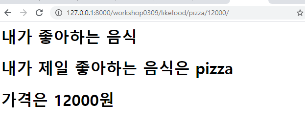
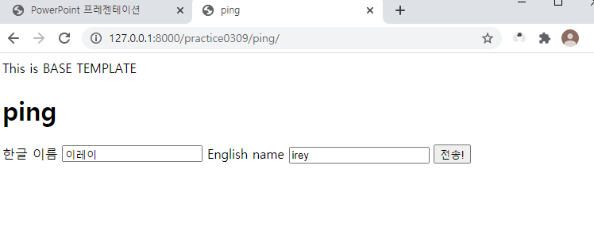
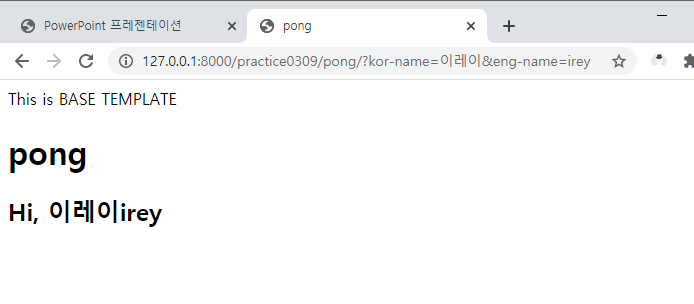

# 0309 TIL

오늘은 장고에 대해 좀 더 활용하는 법을 배웠다. 분명 교수님은 양이 별로 없다고 하셨지만.. 너무 휘몰아쳐서 정신이 없다.

일단 오늘 한 걸 좀 정리해봤는데 이게 맞는지.. 내가 제대로 정리한건지 조차 잘 모르겠다.

장고 어렵다...;;


:smile: django 프로젝트 만드는 순서

1. 프로젝트를 생성하려는 디렉토리에서 `git bash`
2. 빈폴더(프로젝트 Root)를 만든다.
   1. `.gitignore `생성
   2. `$ git init` 으로 REPO 초기화 (init 까먹음.. 다시 알아보기:sob: )
   3. `.README.md` 생성
   4. 원격 저장소 생성 후 연결
   5. `add` => `commit` => `push`
3. 해당 폴더로 이동해서 `$ python -m venv venv` 명령어를 통해 가상독립환경 폴더를 만든다.
4. 가상독립환경을 활성화(`$ source venv/Scripts/activate`)한다. (or vscode로 열기)
5. `$ pip install django (+ a)` 를 통해 필요한 패키지들을 설치한다.
6. `$ django-admin startproject <PROJECT NAME> .` 명령어를 통해 프로젝트 초기화
7. 프로젝트를 vscode로 열어서 진행


:smile: 프로젝트 독립환경 설정

1. `ctrl` + `shift` + `p`
2. `>python: Select Interpreter` 입력
3. 자동으로 가상환경 폴더(`venv/`)안의 python을 잡지 못한다면
   1. `Enter interpreter path` => `find` => `venv/Scripts/python`을 선택
4. 완료 이후 좌하단에 `Python 3.8.x 64-bit('venv')` 문구를 확인
5. 터미널 프롬프트에 `(venv)` 반드시 확인 후 진행


:smile: 새로운 앱을 만들 때!

- `$ django-admin startapp <app name>` 명령어를 통해 앱을 만든 후 제일 먼저 해야하는 일은 바로 출생신고이다!!

  :exclamation: 출생신고 : settings.py에 들어가서 INSTALLED_APPS에서 제일 위에 'app name', 을 적어서 등록한다.

  장고는 html 파일을 찾을 때 특정 앱 안에 templates 안에 디렉토리를 찾는 것
  여기서 특정 앱을 settings.py 에서 INSTALLED_APPS에서 찾는다.(출생신고 하는 곳)
  그렇기 때문에 INSTALLED_APP에 출생신고를 해야 그 안에 파일들을 찾아줄 수 있는 것.
  출생신고 시 무조건 앱을 먼저 만든 다음에 신고해야 한다. 미리 신고 불가

- 랭귀지 코드도 바꾸기 
  LAGUAGE_CODE = 'ko-kr'


:smile: 본격적으로 장고를 이용해 웹 페이지에 정보 나타내기!

- intro/urls.py에 들어가서 `from django.urls import path, include`를 적고, 
  urlpatterns에 `path('likefood/', include('likefood.urls')),`를 적어서 /likefood/에서 'likefood.urls'로 갈 수 있도록 한다.

- 그 다음에 내가 할 새로운 앱(여기서는 'likefood')의 urls.py로 가서 아까와 같이 한다.
  `from django.urls import path` / `from . import views`를 적는다.
  우리는 현재 자리인 . 에 views의 정보를 갖고올 것이기 때문이다.
  그 다음에 `urlpatterns = [path('likefood/', views.likefood),]`를 적어 views의 likefood라는 함수의 정보를 갖고와 url로 사용한다(?)는 의미.

- /likefood/views.py로 이동!
  likefood의 함수를 적어 실제 웹 페이지에 어떤 데이터가 나올지 적는다.

```python
def likefood(request):  # 함수의 첫번째 인자는 무조건 request이다.
	return render(request, 'likefood.html')  
	# render의 첫번째도 무조건 request. 두번째는 html주소이다.
```

- 'likefood'에 'templates'라는 폴더를 만들고 그 안에 'likefood.html'파일을 만든다.
  거기에는 실제 웹페이지에 보일 내용을 적는데, 내용을 적기 위해서는 `나는 abc 초콜렛`을 이용한다.

이게 가장 기본이다.

:smiley: 여기서 좀 더 깊이 들어가보자면, 내가 하고 싶은 것은 url 주소에 입력하는 대로 웹 페이지에 결과가 나오는 것이다. 예를 들면, `likefood/pizza/12000/`이게 url 주소라면 실제 웹 페이지에도 pizza, 12000 이라는 결과가 나오도록 하는 것이다.

- 그렇게 하기 위해서는 likefood의 urls.py에

```python
urlpatterns = [
    path('likefood/<str:menu>/<int:price>/', views.likefood),
]
```

이렇게 적는다. str은 문자가 온다는 뜻, int는 정수가 온다는 뜻이다. 저 자리에는 내가 적고 싶은 걸 적으면 된다. 이게 Variable Routing이다.

- 이제 views.py로 가서 이렇게 적는다.

```python
def likefood(request, menu, price):  # request 다음에 variable routing의 menu와 price를 넣는다.
    context = {
        'menu': menu,
        'price': price,
    }
    return render(request, 'likefood.html', context)  # render값에 마지막으로 context를 넣으면 해당 데이터가 웹 페이지에 나온다.
```

:exclamation:  여기서 내가 likefood.html을 templates 안에 workshop0309라는 폴더 안에 있게 했더니(아까는 그렇게 안 했음) `return render(request, 'likefood.html', context)` 이게 아니라 `return render(request, 'workshop0309/likefood.html', context) `이렇게 해야 에러가 안 났다.
계속 에러가 뜨길래 도대체 뭐가 문제일까 했는데... 정확히 왜 그런지는 교수님이 설명해주셨지만 이렇게 적으려고 하니까 잘 모르겠고.. 애초에 왜 templates 안에 또 폴더를 만들어 거기에 html파일을 넣는지 잘 모르겠다:sob:

- 그 다음 templates/likefood.html에 이렇게 적을 수 있다.

```html

  <h1>내가 좋아하는 음식</h1>



  <h1>내가 제일 좋아하는 음식은 {{ menu }}</h1>
  <h1>가격은 {{ price }}원</h1>

```

html안에 variable routing 값을 나타내기 위해서 {{ }} 중괄호 두번을 사용한다.

- 이렇게하면 이런 결과가 나온다.




:smile: form 사용하기

우리는 ping이라는 곳에서 <form>으로 사용자 입력을 받고, pong이라는 곳에서 그 결과를 보여줄 것이다.

- 먼저, 해당 앱의 urls.py로 가서, 이렇게 적어준다.

```python
urlpatterns = [
	path('ping/', views.ping, name='ping'),
	path('pong/', views.pong, name='pong'),
]
```

여기에서 왜 name='ping'이라고 별명을 붙였는지는 후에 html 파일에서 얘기하겠다.
아까와 다른 건 별명을 붙여줬다는 것 말고는 없다.

- 이제 views.py로 간다.
  ping의 역할은 사용자가 입력할 form & input 용 html을 제공하는 것 밖에는 없다.

```python
def ping(request):
	return render(request, 'abc/ping.html')
```

이렇게만 적어주면 된다. 
pong은 적을게 좀 많은데... 찬찬히 보자면

```python
def pong(request):
	request.GET  # GET요청방식으로 받겠다는 것.(html에서 자세한 설명)
	kr_name = request.GET['kor-name']
	en_name = request.GET['eng-name']
	fullname = kr_name + en_name
	context = {
		'fullname': fullname,
	}
	return render(request, 'abc/pong.html', context)
```

:exclamation: 여기서 `en_name = request.GET['eng-name']`은 `en_name = request.GET.get('eng-name')`이라고도 쓸 수 있다.
:question: 그렇다면 왜 GET과 get이 같이 있지? : GET요청방식으로 들어온 애 중에서 'eng-name'이라는 애를 뽑겠다는 뜻.
즉, 이 둘은 같은게 아니라 GET 방식으로 어떤 걸 갖고오겠냐는 물음에 대괄호로 갖고오는 방법과, get으로 갖고오는 방법 2가지가 있는 것이다.

적고나니까 html을 먼저 적었어야 하나보다....

- ping.html로 가면

```html

<!-- extends는 project_root(전체를 다 아우르는 폴더) 안 templates에 있는 base.html을 확장시켜 갖고왔다는 뜻이다.(base.html은 마지막에 갖고오겠다.) -->

ping


<h1>ping</h1>

<!-- 
  action => 수신인(목적지)
  method => 공개/비공개 여부
    - GET: 모든 데이터가 (url에) 공개되어 전송
    - POST: 데이터가 url에 공개되지 않음
-->
<!-- <form action="/practice0309/pong/" method="GET"> -->
<form action="" method="GET"> 
<!-- 왜 아까 urls.py에서 별명을 붙였는가? 이렇게 pong이라고 별명으로 바꿔주려고. 이렇게 하면 url만 바꿔놓으면 나머지도 다 바뀌니깐.-->
  <label for="kor-name">한글 이름</label>
  <input type="text" name="kor-name" id="kor-name">
  <!--현재 input의 id는 kor-name. kor-name이라는 인풋의 제목이 '한글 이름'이라는 의미이다. label과 input의 관계를 잘 알아두자 -->

  <label for="eng-name">English name</label>
  <input type="text" name="eng-name" id="eng-name">

  <input type="submit" value="전송!">
  <!--input type을 submit으로 하면 제출되는 버튼이 생긴다. 저 버튼을 누르면 이제 pong으로 데이터가 가는 것. 웹페이지에서 나타나는 이름은 전송!으로 바꿨다. -->
</form>

```

:exclamation: 여기서 form은 크게 생각하면 A4용지, label은 포스트잇 이름, input은 글씨를 적을 수 있는 포스트잇이다. 이 포스트잇은 A4용지가 없으면 의미를 잃어버리는 느낌...? 아무튼 form이 꼭 있어야 한다. 그래야 label과 input이 있을 수 있음.

이렇게 하면 웹 페이지에서 한글 이름과 영어 이름은 직접 입력 받을 수 있다. 이렇게 입력 받은 데이터를 이제 pong에서 나타나게 할 것이다.

```html

pong


<h1>pong</h1>
<h2>
  Hi, {{ fullname }}
</h2>

```

- 이렇게 나타날 것이다. fullname 에는 한글이름과 영어이름이 같이 나오게 할 것.



ping에 입력을 받으면



이렇게 pong에 입력받은 이름이 나오게 된다. 위에 url주소를 잘 보면, kor-name=이레이&eng-name=irey라고 ping에서 입력받은 데이터가 주소로 나오게 된다.

:exclamation: 이게 아까 views.py에서 했던 GET 요청방식이다. 그리고 ping.html에서도 method=GET이라고 했는데 이렇게 url 주소에 데이터가 공개되어 전송되는 것을 말한다.


끝....!