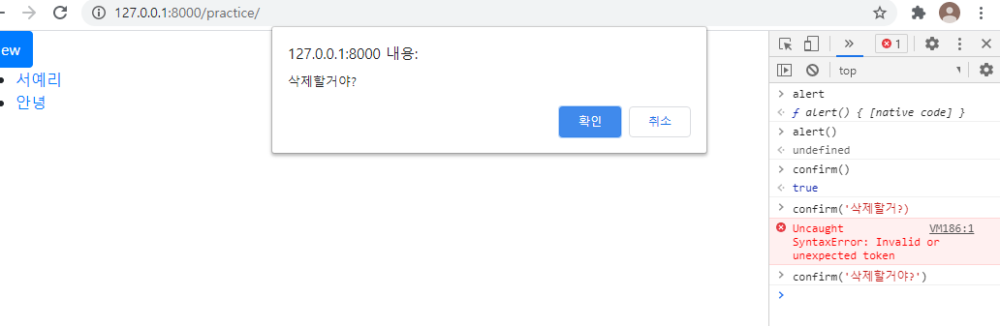
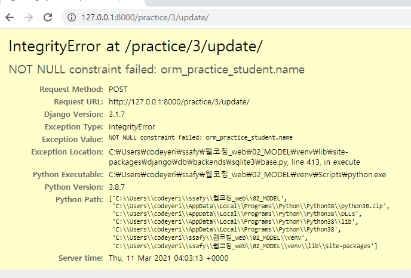

# 0311 TIL

CRUD 하는 구체적인 순서 기록하기!

어제 오류 :  articles의 detail로 갈 때 필요한 id값을 인자로 넘겨주지 않고 있다!

restful api 찾아서 읽어보기


u

조회를 먼저!

In [5]: s = Student.objects.get(pk=1)

In [6]: s
Out[6]: <Student: Student object (1)>

나이 수정

In [7]: s.age
Out[7]: 27

In [8]: s.age = s.age // 2

In [9]: s.age
Out[9]: 13

In [10]: s.save()

끝!


d 삭제

마지막꺼를 지우고 싶을 때

In [12]: s = Student.objects.last()

In [13]: s
Out[13]: <Student: Student object (5)>

In [14]: s.delete()
Out[14]: (1, {'orm_practice.Student': 1})

In [15]: s
Out[15]: <Student: Student object (None)> 응? 근데 s 왜 남아있음?

세상은 python의 세상과  db의 세상이 있다.

s.delete()는 python의 세상(메모리)에는 영향이 없고, db(하드디스크)의 세상에 영향이 있다.(db조회해보면 없음) 메모리는 자고 일어나면 책상이 다 치워져있듯 사라짐. 영구보존을 하고 싶으면 책장에 놔둬야함(하드)

python에서는 아직 살아있음.

In [16]: s = 0

이렇게하면 메모리에서도 사라짐.


urls.py에

 \# practice/1/edit/ => 기존의 데이터를 수정할 HTML 제공

  path('<int:pk>/edit/', views.edit),

  \# practice/1/update/ => 실제 사용자 입력 데이터 처리

  path('<int:pk>/update/', views.update),

  \# practice/1/delete/ => 데이터 삭제

  path('<int:pk>/delete/', views.delete),


views.py에 함수 틀만 만들어 놓기

\# Update

\## 수정용 HTML 제공

def edit(request):

  return render(request, 'orm_practice/edit.html')


\## 실제 수정

def update(request):

  return redirect()


\# Delete

def delete(request):

  return redirect()

pk를 인자로 받아오니까 request 뒤에 pk 추가
그래서 student = Student.objects.get(pk=pk) 추가(pk를 쓸거니까!)


삭제파트는 \# Delete

def delete(request, pk):

  student = Student.objects.get(pk=pk)

  student.delete()  # 이거 추가로 끝!

  return redirect() 

ulrs.py에 name='edit' 추가! 이제는 처음에 path 쓸 때부터 네임 만들어주기

return redirect('index') # 삭제했으니 전체목록 보여주기  - 여기까지 삭제 끝!


new.html의 block body 안에 있는 내용을 edit.html에 복사

서버 켜보면 edit 페이지가 나오는데 불편한 점 : 이전에 썼던 내용이 안 나오고 백지가 나옴.

\# Update

\## 수정용 HTML 제공

def edit(request, pk):

  student = Student.objects.get(pk=pk)

  context = {'student': student}  # 이렇게 학생 정보를 갖고오면 된다.

  return render(request, 'orm_practice/edit.html', context)


edit.html에 value="{{ student.name }}" 이렇게 벨류값 추가
여기서 textarea는 종료태그에 있으니까 사이에 넣어준다. 이렇게하면 이전 값이 나온다.

여기서 value에 placeholder를 넣으면 기존에 써있던 것을 가이드라인으로 보여줌. 실제 데이터가 있는게 아님. 대신 이렇게 하면 한글자 오타를 고치기 위해 전체를 다시써야함. 혹은 hobby를 고치려고 그거만 고치고 다른 곳은 놔두면 거기에는 써있는거처럼 보이지만 사실은 비어있는거라서 비어있는 대로 제출하게 됨. 그러니 value가 낫다.(절대 쓰지 말자! 질문에 나와서 나온 내용ㅎㅎ)

form의 액션을 update로 바꿔야 함. 원래 create였는데 그러면 계속 새로 생성되니까 update로 변경!

```<form action="" method="GET">```

:exclamation: 두번째 인자로 student.pk도 넣어준다.  urls.py에 보면 update에는 반드시 pk가 있어야 하기 때문에. 이거 없으면 바로 에러 뜸. index.html에서도 디테일로 갈건데 id가 없으면 못 가니까 적어준것. 
```<form action="practice/{{ student.pk }}/update"></form>```과 같다. 저 사이에 pk가 있어야 하기 때문에.


views.py에서 업데이트 함수에서 

```
	student.name = request.GET.get('name')
    student.age = request.GET.get('age')
    student.major = request.GET.get('major')
    student.hobby = request.GET.get('hobby')
    student.save()
```

추가하기.

`return redirect('detail', pk=student.pk)`로 변경. 수정하고 디테일 페이지로 이동할거니까!


detail.html에서 밑에 버튼 추가하기!

```
<a href="" class="btn btn-secondary">Edit</a>
<a href="" class="btn btn-danger">Delete</a>
```

url 뒤에 student.pk 안 넣어줬더니 에러가 떴다. 저걸 넣어줘야 pk에 해당하는 데이터를 수정하고 삭제가 가능하기 때문에 꼭 넣어줘야함!! 왜 넣어주는지 생각하면 쉽다!



삭제할 때 크롬에서 f12 눌러서 콘솔로 가서 confirm()을 사용하면 저렇게 뜬다. 이건 파이썬의 역할이 아니라 이 브라우저의 역할. 
detail.html에` onclick="return confirm('삭제할거?')"`를 추가하자.


현재 cud가 위험. 누구나 접근해서 지우고 수정하고 생성할 수 있다...;; 이를 해결하기 위한 방법은?

GET : 달라! / POST : 보내라!

new.와 edit.에 method를 POST로 바꿈.
edit.html에  를 넣어서 위조 방지.(new.html에도) 이거는 form 태그의 method가 post일때만 사용



이렇게 하고 런서버 돌리면 이런 에러가 뜬다.
이건 저장하는 시점(.save())에 에러가 난 것이다. 
views에서 GET을 썼는데 None(값이 비어있다)이다? 그럼 에러. 이래서 에러가 뜬 것이다.

그래서 views에서 GET을 POST로 바꾸면 된다. 다 바꾸면 해결

views.py에서 create에서 if request.method == 'POST':를 추가.(update랑 delete에도)
리퀘스트 메서드가 포스트일때만 아래 사항을 실행하기.
그게 아니라 GET으로 오면 redirect로 보내버리기

POST 요청은 폼에서 자동으로 갈 때 들어간다. 내가 폼에서 수정하고 수정버튼 눌러서 자동으로 디테일 화면으로 넘어갈 때는 POST요청. form태그의 메서드가 post인거 말고는 그 외에는 다 GET요청. 내가 url주소를 직접 입력하면 자동으로 GET요청으로 들어가게 된다.

이렇게 하면 좀 더 튼튼한 사이트가 되었다.

detail.html에 이렇게 추가.

```
<form action="" method="POST"> 
    <input 
      type="submit" 
      class="btn btn-danger" 
      onclick="return confirm('삭제할거?')"
      value="Delete"
    >
  </form>
```

이렇게 하면 이것도 실제로 요청들어온거 보면 POST이다.


### 복습 매우 필요........