# 210114 파이썬

## 숫자, 글자, 불리언


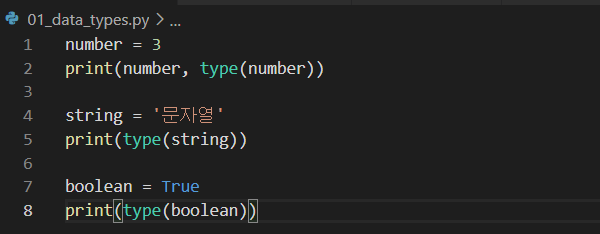

```python
number = 3
print(number, type(number))

string = '문자열'
print(type(string))

boolean = True
print(type(boolean))
```

- 숫자
  - 숫자는 ' ' 없이 그냥 적어야 한다.
- 글자
  - 반드시 ' '가 있어야 문자열로 인식한다.
  - 만약 '3'이라 적으면 숫자 3이 아닌 문자 3으로 인식.
- 불리언
  - 반드시 첫글자는 대문자로 적어야 한다.
  - True, False

## 문자열 출력(string interpolation)

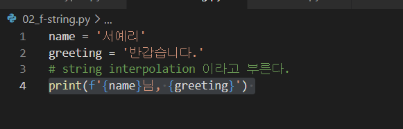

```python
name = '서예리'
greeting = '반갑습니다.'

print(f'{name}님, {greeting}') 
```

- 문자와 값을 섞어서 출력하고 싶다면,

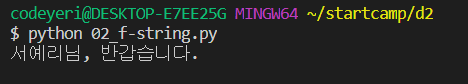

​       이렇게 출력된다.

## List

피자, 치킨, 햄버거가 들어간 음식 리스트를 만들고 싶다면

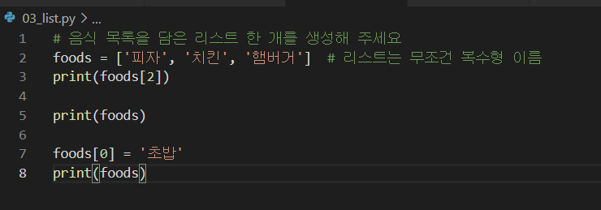

```python
foods = ['피자', '치킨', '햄버거']
print(foods[2])

print(foods)

foods[0] = '초밥'

print(foods)
```

-  이 중 내가 햄버거가 먹고 싶어 print(foods[2])를 출력한다면

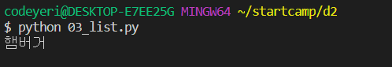

- print(foods)를 출력한다면

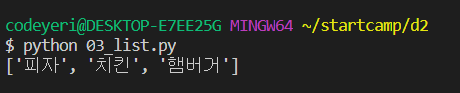

- 피자를 초밥으로 바꾸고 싶다면
  - foods[0] = '초밥'을 입력하고 print(foods)를 출력

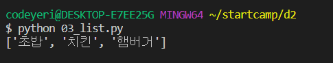

### List 작성 시 주의사항

- 리스트는 무조건 복수형 이름으로 저장해야 한다. (복수형으로 쓰면 다들 list인 줄 알 것)
- 리스트 속 문자열은 무조건 ' '으로 저장
- 쉼표 뒤에는 띄어쓰기!

- 변수이름으로 list는 쓰면 안된다! 
  - 이미 list라는 이름이 쓰이고 있다. (덮어씌워짐)
  - 너무 모호하다. 

## dictionary

- dictionary는 표(table)의 행(row)을 코드로 옮기기 위한 것이다.

  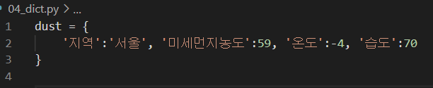

  ```python
dust = {
   '지역':'서울', '미세먼지농도':59, '온도':-4, '습도':70
}
  ```

  : 쉼표로 항목이 4개로 나눠져 있지만 표의 한 행인 서울의 데이터이기 때문에 단수인 dust이다.

- 서울, 부산, 대구의 날씨정보를 list로 다 쓴다면 이렇게 나타낼 수 있다.

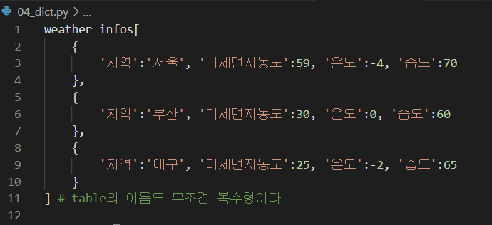

```python
weather_infos[
      {
         '지역':'서울', '미세먼지농도':59, '온도':-4, '습도':70
      },
      {
         '지역':'부산', '미세먼지농도':30, '온도':0, '습도':60
      },
      {
         '지역':'대구', '미세먼지농도':25, '온도':-2, '습도':65
      }
]
```

- 이를 다시 dictionary로 한다면

  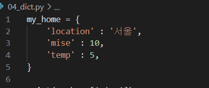

  ```python
  my_home = {
        'location' : '서울',
        'mise' : 10,
        'temp' : 5,
  }
  ```

- 출력할 때

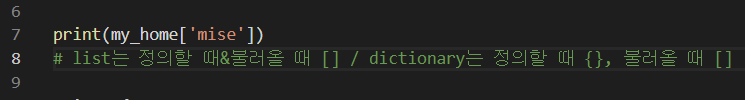

```python
print(my_home['mise'])
```

### 예제

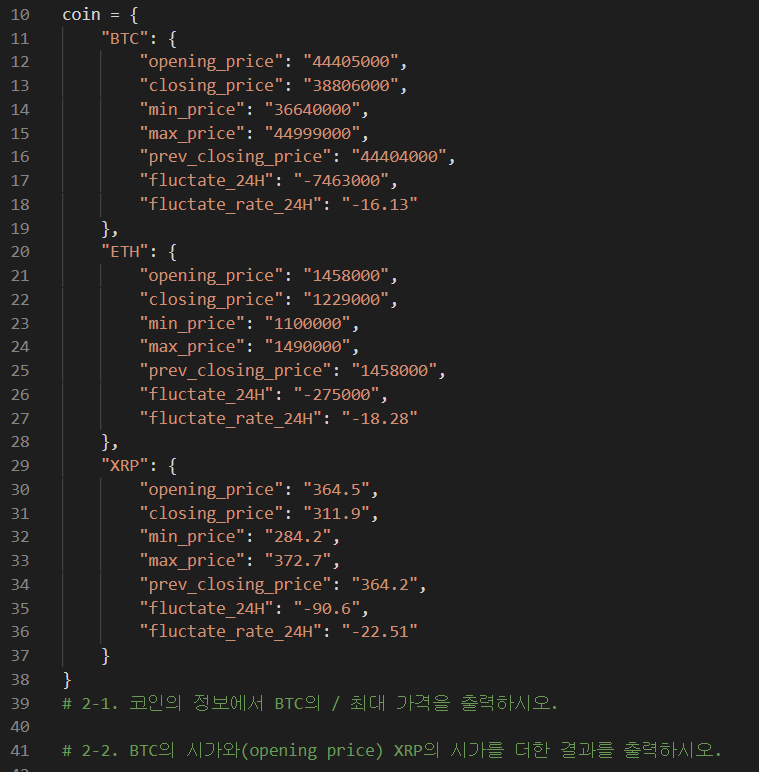

```python
coin = {
	"BTC": {
		"opening_price": "44405000",
		"closing_price": "38806000",
		"min_price": "36640000",
		"max_price": "44999000",
		"prev_closing_price": "44404000",
		"fluctate_24H": "-7463000",
		`"fluctate_rate_24H": "-16.13"
	},
	"ETH": {
		"opening_price": "1458000",
		"closing_price": "1229000",
		"min_price": "1100000",
		"max_price": "1490000",
		"prev_closing_price": "1458000",
		"fluctate_24H": "-275000",
		"fluctate_rate_24H": "-18.28"
	},
	"XRP": {
		"opening_price": "364.5",
		"closing_price": "311.9",
		"min_price": "284.2",
		"max_price": "372.7",
		"prev_closing_price": "364.2",
		"fluctate_24H": "-90.6",
		"fluctate_rate_24H": "-22.51"
	}
}
```

- 2-1. 코인의 정보에서 BTC의 최대 가격을 출력하시오.
  
```python
    print(coin['BTC']['max_price'])
```
coin은 dictionary이기 때문에 불러올 때는 []을 사용한다.

'BTC' 안에 있는 'max_price'는 그 사이에 쉼표를 사용하지 않고 바로 []로 이어쓴다.

- 2-2. BTC의 시가와(opening price) XRP의 시가를 더한 결과를 출력하시오.

```python
  print(
        int(coin['BTC']['opening_price'])
        +
        float(coin['XRP']['opening_price']))
```
'BTC'의 시가는 44405000이라 정수, 'XRP'의 시가는 364.5이라 실수이다. 그래서 앞에 정수를 의미하는 int, 실수를 의미하는 float를 붙여서 출력하였다.

- 잘못된 예

```python
print((coin['BTC']['opening_price'])
     +(coin['XRP']['opening_price']))
```
정수와 실수를 의미하는 int, float를 빼고 이렇게 출력한다면 44405000364.5로 출력이 된다. 이를 숫자가 아닌 문자로 인식했기 때문이다.  그러니 반드시 숫자로 출력하라는 int나 float가 필요하다.

## 실제 데이터 추출

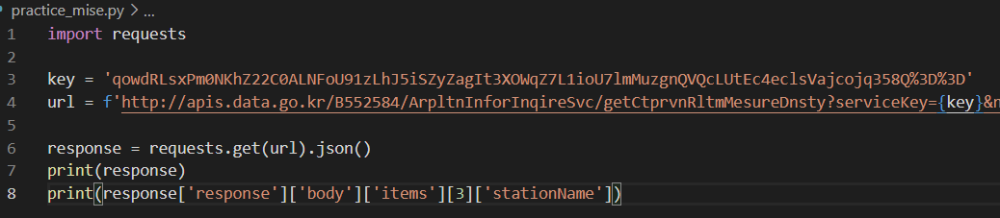

```python
import requests

key = 'qowdRLsxPm0NKhZ22C0ALNFoU91zLhJ5iSZyZagIt3XOWqZ7L1ioU7lmMuzgnQVQcLUtEc4eclsVajcojq358Q%3D%3D'
url = f'http://apis.data.go.kr/B552584/ArpltnInforInqireSvc/getCtprvnRltmMesureDnsty?serviceKey={key}&numOfRows=5&pageNo=1&sidoName=서울&ver=1.0&returnType=json'

response = requests.get(url).json()
print(response)
print(response['response']['body']['items'][3]['stationName'])
```

- url에서 {key}부분에 위 줄의 실제 키를 입력하면 미세먼지 데이터가 나온다.
- 그 데이터에서 직접 값을 추출한 것.
- dictionary 이름이 response이고, 그 다음 항목도 response, 그 다음은 body... 등 해서 저렇게 출력하면 '신촌로'가 출력된다. 
- items의 이름으로 된 항목이 5개가 있었는데, 그 중 4번째 항목의 'stationName'을 찾기 때문에 [3]을 입력한 것이다.

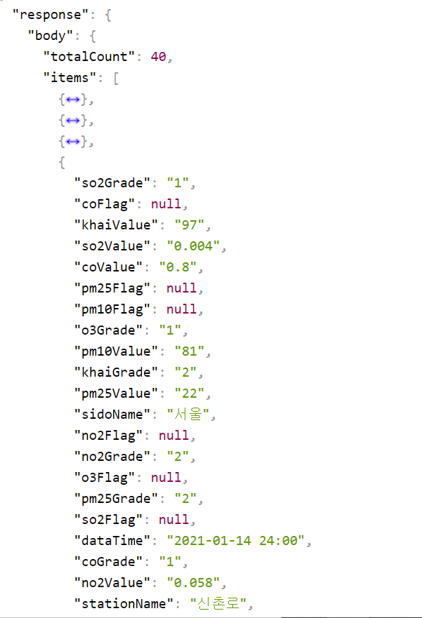

