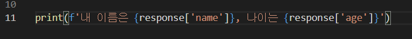
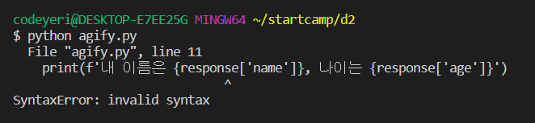
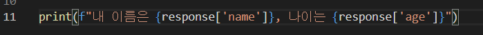
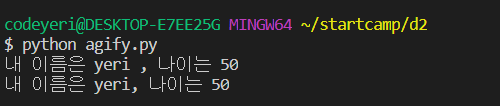
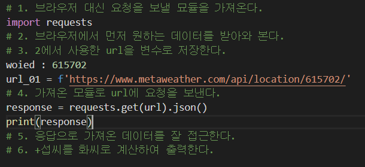
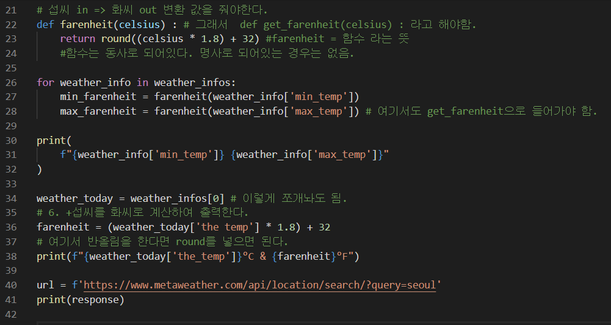
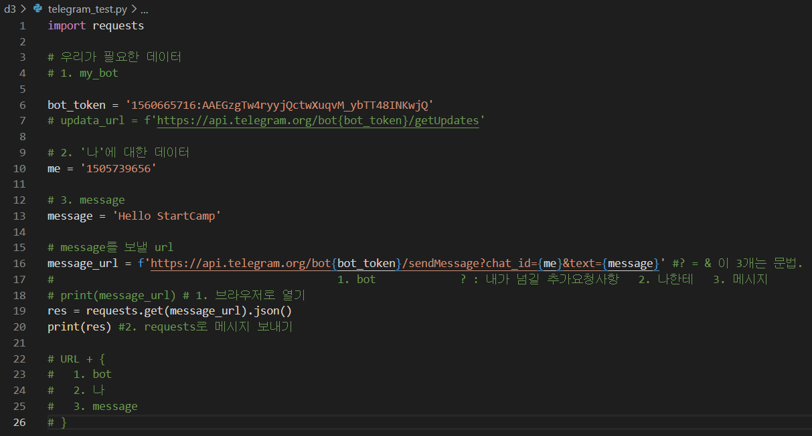
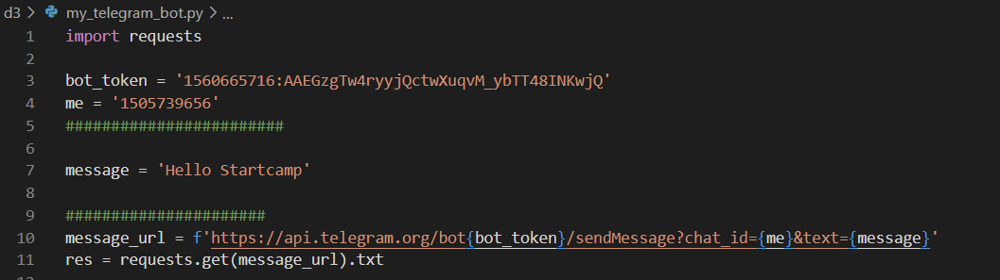
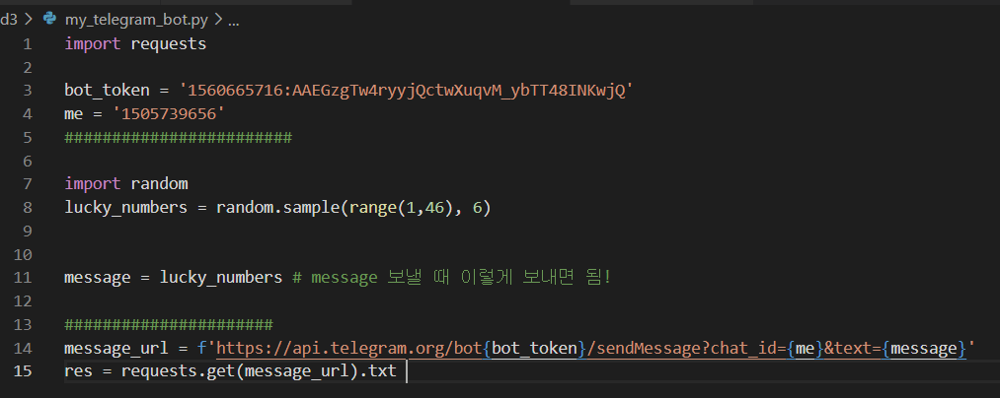
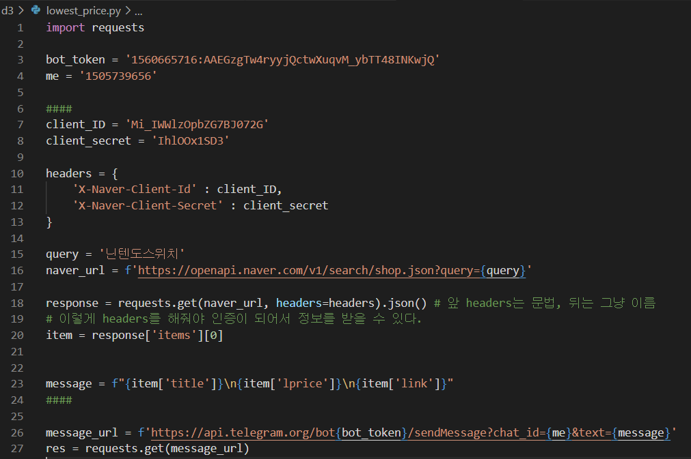

# 파이썬 복습

## 숙제

### 영화

```python
movie = {
  'movieInfo': {
    'movieNm': '광해, 왕이 된 남자',
    'movieNmEn': 'Masquerade',
    'showTm': '131',
    'prdtYear': '2012',
    'openDt': '20120913',
    'typeNm': '장편',
    'nations': [
      {
        'nationNm': '한국'
      }
    ],
    'genres': [
      {
        'genreNm': '사극'
      },
      {
        'genreNm': '드라마'
      }
    ],
    'directors': [
      {
        'peopleNm': '추창민',
        'peopleNmEn': 'CHOO Chang-min'
      }
    ],
    'actors': [
      {
        'peopleNm': '이병헌',
        'peopleNmEn': 'LEE Byung-hun',
        'cast': '광해/하선'
      },
      {
        'peopleNm': '류승룡',
        'peopleNmEn': 'RYU Seung-ryong',
        'cast': '허균'
      },
      {
        'peopleNm': '한효주',
        'peopleNmEn': 'HAN Hyo-joo',
        'cast': '중전'
      }
    ]
  }
}
```

```python
movie_data = movie['movieInfo'] 
\# movie의 movieInfo까지는 계속 반복이니까 이렇게 정리해서 적용할 수 있다.

\# 1. 영화의 제목을 출력하시오.(하)
print(movie['movieInfo']['movieNm']) # 내가 낸 답안
print(movie_data['movieNm']) # 이렇게!

\# 2. 영화 감독의 영어 이름을 출력하시오.(중)
print(movie['movieInfo']['directors'][0]['peopleNmEn']) # 내가 낸 답안
\# directors는 배열이 list이기 때문에 index가 와서 [0]이 온다.
print(movie_data['directors'][0]['peopleNmEn']) 

\# 3. 영화 배우의 인원을 출력하시오. (상)
print(len(movie['movieInfo']['actors']))
\# actors라는 list 안에 dictionary가 3개인 것.
print(len(movie_data['actors'])) #len 안에 이렇게 list를 넣어주면 자동으로 세어주는 것.
```

### api

api : 외부사이트에 있는 정보를 갖고오는 것.

```python
import requests
url = 'https://api.agify.io?name=yeri'
response = requests.get(url).json()
 \# 내 이름은 yeri, 나이는 50 을 나타내시오.
print('내 이름은',response['name'],',','나이는',response['age']) # 내가 낸 답안
print(f"내 이름은 {response['name']}, 나이는 {response['age']}") # 교수님 정답
```



이렇게 적으면 다음과 같이 에러가 난다.



그 이유는 f 다음에 처음과 끝을 ' '으로 묶어서 이다. 리스트 또한 ' '으로 묶어주기 때문에 출력시 혼동이 온 것.



그래서 이렇게 f 다음에 " "으로 묶어줘야 제대로 출력이 된다.



위는 내가 처음에 정답이라고 생각해서 낸 출력 결과. 밑에가 정답.

## 날씨 정보



이건 내가 한 파리의 날씨 정보 갖고오기.

- print(response)를 해보고 잘 되면 이거 지우고 다음 단계 진행.

  print는 중간에 잘 진행되는지 확인하기 위한 것. (디버깅할 때)

```python
\# 2. 브라우저에서 먼저 원한느 데이터를 받아와 옵낟.
\# a. location으로 woeid를 가져온다.
\# b. location을 사용자 입력으로 받아온다.
location = input('도시명을 영어로 입력하세요 1)seoul, 2)busan: ')
\# location in => info out

  get_woeid_url = f'https://www.metaweather.com/api/location/search/?query={location}'
  response = requests.get(get_woeid_url).json()
  woeid = response[0]['woeid']
\# location의 키워드만 바꿔주면 그 데이터를 갖고온다.
\# 3. 2에서 사용한 URL을 변수로 저장한다.
\# a. 가져온 woeid로 URL을 완성한다.
  get_weather_url = f'https://www.metaweather.com/api/location/{woeid}/'
\# 4. 가져온 모듈로 URL에 요청을 보낸다.  
  response = requests.get(get_weather_url).json() # .이 붙어있음 메소드, ()가 붙어있음 함수.
\# 5. 응답으로 가져온 데이터를 잘 접근한다.  
  weather_infos = response['consolidated_weather']

\# 6. +섭씨를 화씨로 계산하여 출력한다.
for weather_info in weather_infos
  farenheit = (weather_today['the_temp']*1.8) + 32
  print(f"{weather_today['the_temp']}°C & {farenheit}°F")
```

이건 수업 때 진행한 것.

그럼 여기서 모르겠는 for 문에 대해서 알아보자!

### for

- for문의 기본 구조

  for문의 기본 구조는 다음과 같다.

```
for 변수 in 리스트(또는 튜플, 문자열):
    수행할 문장1
    수행할 문장2
    ...
```

	리스트나 튜플, 문자열의 첫 번째 요소부터 마지막 요소까지 차례로 변수에 대입되어 "수행할 문장1", "수행할 문장2" 등이 수행된다.

- 예제를 통해 for문 이해하기

  for문은 예제를 통해서 살펴보는 것이 가장 알기 쉽다. 다음 예제를 직접 입력해 보자.

  1. 전형적인 for문

```
>>> test_list = ['one', 'two', 'three'] 
>>> for i in test_list: 
...     print(i)
... 
one 
two 
three
```

​		`['one', 'two', 'three']` 리스트의 첫 번째 요소인 'one'이 먼저 i 변수에 대입된 후 `print(i)` 문장을 수행한다. 
​		다음에 두 번째 요소 'two'가 i 변수에 대입된 후 `print(i)` 문장을 수행하고 리스트의 마지막 요소까지 이것을 반복한다.

​			2. 다양한 for문의 사용

```
>>> a = [(1,2), (3,4), (5,6)]
>>> for (first, last) in a:
...     print(first + last)
...
3
7
11
```
​		위 예는 a 리스트의 요솟값이 튜플이기 때문에 각각의 요소가 자동으로 (first, last) 변수에 대입된다.

​			3. for문의 응용

​		for문의 쓰임새를 알기 위해 다음을 가정해 보자.

```
"총 5명의 학생이 시험을 보았는데 시험 점수가 60점이 넘으면 합격이고 그렇지 않으면 불합격이다. 합격인지 불합격인지 결과를 보여 주시오."
```
​		우선 학생 5명의 시험 점수를 리스트로 표현해 보았다.
```
marks = [90, 25, 67, 45, 80]
```
​		1번 학생은 90점이고 5번 학생은 80점이다.
​		이런 점수를 차례로 검사해서 합격했는지 불합격했는지 통보해 주는 프로그램을 만들어 보자. 역시 IDLE 에디터로 작성한다.

```
# marks1.py
marks = [90, 25, 67, 45, 80]

number = 0 
for mark in marks: 
    number = number +1 
    if mark >= 60: 
        print("%d번 학생은 합격입니다." % number)
    else: 
        print("%d번 학생은 불합격입니다." % number)
```
​		각각의 학생에게 번호를 붙여 주기 위해 number 변수를 사용하였다. 점수 리스트 marks에서 차례로 점수를 꺼내어 mark라는 변수		에 대입하고 for문 안의 문장들을 수행한다. 우선 for문이 한 번씩 수행될 때마다 number는 1씩 증가한다.

​		이 프로그램을 실행하면 mark가 60 이상일 때 합격 메시지를 출력하고 60을 넘지 않을 때 불합격 메시지를 출력한다. 명령 프롬프트 		창을 열어 실행해 보자.
```
C:\doit>python marks1.py
1번 학생은 합격입니다.
2번 학생은 불합격입니다.
3번 학생은 합격입니다.
4번 학생은 불합격입니다.
5번 학생은 합격입니다.
```

출처 : https://wikidocs.net/22

그 다음에 섭씨 화씨 변환과 최저 기온, 최고 기온 등을 이렇게 하셨는데.. 솔직히 모르겠다... 일단 이렇게 기록만...ㅠ



사실 이거 출력하면... 에러떠서... 뭐가 맞는지 모르겠다... 따라가기 벅참...ㅠ 일단 적어두기만 합니다...ㅠ

## 텔레그램 챗봇



텔레그램의 봇을 만드는 방법은 인터넷에도 있겠지...

우리가 텔레그램 챗봇을 만들어 메시지를 보낼 때 필요한 데이터는 1. 봇에 대한 데이터, 2. 나에 대한 데이터. 3. 메시지 내용이 있다.



실제 챗봇에게 메시지를 보낼 때 쓰는 것이다. 

print(res) 를 출력하면 내 텔레그램 챗봇에게 자동으로 메시지가 전송된다.


여기서 내가 단순한 텍스트만이 아닌 좀 더 의미있는 것을 보내고 싶다면?

- 로또번호 자동 생성기 보내기!



이렇게 보내면 된다! 여기서 로또 번호 생성기 문법은 구글링으로 알았음...ㅎ 

메시지 보낼 때도 되게 고미했는데 생각보다 단순했다ㅋㅋㅋ 그냥 message = lucky_numbers 이렇게 보내면 끝!


그 다음은 텔레그램 챗봇에게 자동으로 네이버 쇼핑 최저가가 전송되게 하는 것을 해보았다.

네이버  developers에 들어가서 저 정보를 가져올 수 있는 권한을 신청하는건 교수님꺼 보고 그냥 따라했기 때문에 다시 복기 불가능...ㅎ



이렇게 하고 또 무슨 프로그램 써서 자동으로 전송되게 하는 걸 했는데 그것도 복기 불가능...ㅎ

암튼 이렇게 코드 짰다는 거만 기록해두는 것이다...ㅎ